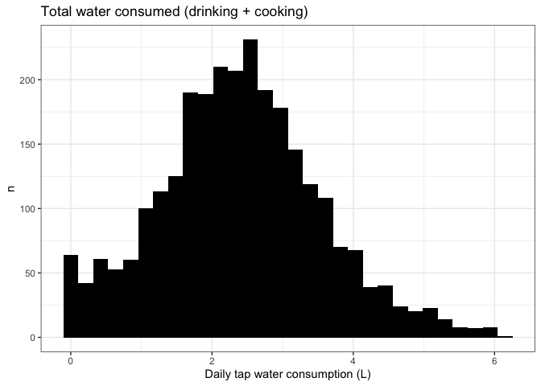

**Water Questionnaire 1 - deriving consumption rate**
================
Daniel Schillereff and Ruth CE Bowyer
2025-08-06

- [**0. About**](#0-about)
- [**1. Data**](#1-data)
- [**2. Estimate water consumed daily through
  drinking**](#2-estimate-water-consumed-daily-through-drinking)
- [**3. Estimate water consumed daily via
  cooking**](#3-estimate-water-consumed-daily-via-cooking)
- [**4. Filter drinking + cooking
  data**](#4-filter-drinking--cooking-data)
- [**5. Total consumption, drinking +
  cooking**](#5-total-consumption-drinking--cooking)

## **0. About**

This script is to clean and derive estimates of water consumption
TwinsUK Water Consumption Questionnaire

``` r
library(tidyverse)
library(ggplot2)
library(readxl)
library(ggpubr)
library(rstatix)
library(FSA)
library(halfmoon)
```

## **1. Data**

``` r
write.csv.date <- function(x, y){
  date <- Sys.Date()
  date <- gsub("-", ".", date)
  fn <- y
  rd <- rd
  csvFileName <- paste(rd,"/",fn,".",date,".csv",sep="")
  write.csv(x, file=csvFileName, row.names = F)}
```

``` r
## Define the data directory -- actual directory omitted for security
#dd <- ~/path/to/data

## Responses
df.q <- read_xlsx(paste0(dd,"/DS00070_WaterConsumptionStudy_Questionnaire/WaterConsumptionStudyQuestionnaire_Data.xlsx"))

#Response codes 
Responses <- read_xlsx(paste0(dd,"/DS00070_WaterConsumptionStudy_Questionnaire/WaterConsumptionStudyQuestionnaire_Data.xlsx"), sheet=2)
```

``` r
## Create a df with q code - row names qcode 
Qframe <- as.data.frame(t(df.q[1,]))
## Add col index for easy referencing
names(Qframe) <- "Question"
Qframe$col_index <- 1:ncol(df.q)

##Clean up df.q to remove these rows
df.q <- df.q[-1,]
df.q <- as.data.frame(df.q)
```

## **2. Estimate water consumed daily through drinking**

``` r
qs <- df.q[c("q2_a", "q2_b", "q2_d", "q2_e")]


qs3 <- as.data.frame(apply(qs,2,function(x){
  x <- ifelse(x>90000, NA,x)
  as.numeric(x)
}))

#For later match
row.names(qs3) <- df.q$ParticipantID

qs3$s.glass.ml <- qs3$q2_a*200
qs3$l.glass.ml <- qs3$q2_b*500
qs3$s.mug.ml <- qs3$q2_d*250 
qs3$l.mug.ml <- qs3$q2_e*375

s.glass.median <- median(qs3$s.glass.ml, na.rm = T)
s.glass.mean <- mean(qs3$s.glass.ml, na.rm = T)

total.drink.ml <- rowSums(qs3[c("s.glass.ml", "l.glass.ml", "s.mug.ml", "l.mug.ml")], na.rm=T)

total.drink.L <- total.drink.ml/1000

qs3$total.drink.L <- total.drink.L
```

## **3. Estimate water consumed daily via cooking**

``` r
qs33 <- df.q[c("q3_a", "q3_b", "q4")]

qs33 <- as.data.frame(apply(qs33,2,function(x){
  x <- ifelse(x>90000, NA,x)
  as.numeric(x)
}))

#For later matching
row.names(qs33) <- df.q$ParticipantID


#Convert the Q4 coding to the percentage of food eaten by the respondent. 
qs33$q4.perc <- qs33$q4
qs33$q4.perc[qs33$q4 == 1] <- 0.125
qs33$q4.perc[qs33$q4 == 2] <- 0.25
qs33$q4.perc[qs33$q4 == 3] <- 0.5
qs33$q4.perc[qs33$q4 == 4] <- 0.75
qs33$q4.perc[qs33$q4 == 5] <- 1


qs33$s.cooking.ml <- qs33$q3_a*1000 #Our water q states "0.5 - 1.5 L" 
qs33$l.cooking.ml <- qs33$q3_b*2000 ##Our water q states "2L +" 

#Then need to account for how much water was absorbed. Pasta = 1.25x weight of dry food; rice = 1x. 

total.cooking.ml <- rowSums(qs33[c("s.cooking.ml", "l.cooking.ml")], na.rm=T)

#MULTIPLE HERE BY 0.1 to account for portion size 
qs33$total.cooking.ml <- total.cooking.ml * 0.1

qs33$total.cooking.ml.individual <- qs33$total.cooking.ml * qs33$q4.perc

total.cooking.L <- qs33$total.cooking.ml.individual/1000

qs33$total.cooking.L <- total.cooking.L
```

## **4. Filter drinking + cooking data**

``` r
# Subset to remove drinking and cooking that are >3 sd from the mean
remove.outliers.twocol <- function(df, col1, col2) {
  # Calculate means and standard deviations
  mean_col1 <- mean(df[, col1], na.rm = TRUE)
  sd_col1 <- sd(df[, col1], na.rm = TRUE)
  mean_col2 <- mean(df[, col2], na.rm = TRUE)
  sd_col2 <- sd(df[, col2], na.rm = TRUE)
  
  # Define lower and upper bounds for both columns
  lower_bound_col1 <- mean_col1 - 3 * sd_col1
  upper_bound_col1 <- mean_col1 + 3 * sd_col1
  lower_bound_col2 <- mean_col2 - 3 * sd_col2
  upper_bound_col2 <- mean_col2 + 3 * sd_col2
  
  # Filter the dataframe (rows within both columns' bounds)
  filtered_df <- df[
    (df[, col1] >= lower_bound_col1 & df[, col1] <= upper_bound_col1) &
    (df[, col2] >= lower_bound_col2 & df[, col2] <= upper_bound_col2),
    ]
  
  # Return the filtered dataframe
  return(filtered_df)
}
```

``` r
study_no=df.q$ParticipantID

total.L <- cbind(qs3, qs33, study_no)

total.L.reorder <- total.L %>%
  select(total.drink.L, total.cooking.L, everything())
total.L.reorder <- data.frame(total.L.reorder)
total.L.reorder$total.L <- total.L.reorder$total.drink.L + total.L.reorder$total.cooking.L
  
total.L.filter <- remove.outliers.twocol(total.L.reorder, "total.drink.L", "total.cooking.L")
```

``` r
total.drink.L <- total.L.filter$total.drink.L

quantile(total.L.filter$total.drink.L, probs = c(.90), na.rm = T)
```

    ##  90% 
    ## 3.75

``` r
drinking.median <- median(total.L.filter$total.drink.L, na.rm = T)
drinking.mean <- mean(total.L.filter$total.drink.L, na.rm = T)
drinking.sd <- sd(total.L.filter$total.drink.L, na.rm = T)

#Calculate percentage of respondents who drink less than 1 litre per day 
sum(total.L.filter$total.drink.L < "1", na.rm=TRUE)
```

    ## [1] 316

``` r
316/2881*100
```

    ## [1] 10.96841

``` r
#Calculate hot drinks
total.hot.drink.ml <- rowSums(total.L.filter[c("s.mug.ml", "l.mug.ml")], na.rm=T)
total.hot.drink.L <- total.hot.drink.ml/1000

hot.drink.median <- median(total.hot.drink.L, na.rm = T)
hot.drink.mean <- mean(total.hot.drink.L, na.rm = T)
hot.drink.sd <- sd(total.hot.drink.L, na.rm = T)
quantile(total.hot.drink.L, probs = c(.90))
```

    ##   90% 
    ## 2.375

``` r
hot.drink.mean / drinking.mean * 100
```

    ## [1] 52.79625

``` r
#Calculate cold drinks
total.cold.drink.ml <- rowSums(total.L.filter[c("s.glass.ml", "l.glass.ml")], na.rm=T)
total.cold.drink.L <- total.cold.drink.ml/1000

cold.drink.median <- median(total.cold.drink.L, na.rm = T)
cold.drink.mean <- mean(total.cold.drink.L, na.rm = T)
cold.drink.sd <- sd(total.cold.drink.L, na.rm = T)
quantile(total.cold.drink.L, probs = c(.90))
```

    ## 90% 
    ## 2.2

``` r
cold.drink.mean / drinking.mean * 100
```

    ## [1] 42.99731

``` r
total.cooking.L <- total.L.filter$total.cooking.L
total.cooking.L.df <- data.frame(total.cooking.L)

cooking.median <- median(total.cooking.L, na.rm = T)
cooking.mean <- mean(total.cooking.L, na.rm = T)
cooking.sd <- sd(total.cooking.L, na.rm = T)
cooking.min <- min(total.cooking.L, na.rm = T)
cooking.max <- max(total.cooking.L, na.rm = T)
quantile(total.cooking.L, probs = c(.90), na.rm = T)
```

    ## 90% 
    ## 0.2

``` r
#Plot histogram of cooking consumption
ggplot(total.cooking.L.df, aes(total.cooking.L)) + geom_histogram(fill="black", bins = 10) + theme_bw() + 
  ylab("n") + xlab("") + 
  xlab("Daily tap water consumption from cooking (L)") +
  ylab("Number of respondents") +
  ggtitle("Water consumed during cooking")
```

    ## Warning: Removed 119 rows containing non-finite outside the scale range
    ## (`stat_bin()`).

<!-- -->

## **5. Total consumption, drinking + cooking**

total.L \<- cbind(total.drink.L, total.cooking.L) total.L \<-
rowSums(total.L\[,c(“total.drink.L”, “total.cooking.L”)\]) total.L.df
\<- data.frame(total.L)

\#Then use filtered values total.L.filt \<- merge(qs3.filtered,
qs33.filtered, by=“row.names”, sort=F) total.L.filt \<-
total.L.filt\[c(“Row.names”, “total.drink.L”, “total.cooking.L”)\]
names(total.L.filt)\[1\] \<- “study_no” total.L.filt.df \<- total.L.filt

\#Calculate total consumption total.L.filt \<-
rowSums(total.L.filt\[,c(“total.drink.L”, “total.cooking.L”)\])

total.L.filter

``` r
total.consump.L <- total.L.filter$total.L 

total.median <- median(total.L.filter$total.L, na.rm = T)
total.mean <- mean(total.L.filter$total.L, na.rm = T)
total.sd <- sd(total.L.filter$total.L, na.rm = T)
total.min <- min(total.L.filter$total.L, na.rm = T)
total.max <- max(total.L.filter$total.L, na.rm = T)
quantile(total.L.filter$total.L, probs = c(.90), na.rm = T)
```

    ##  90% 
    ## 3.85

``` r
total.L.filter.df <- data.frame(total.L.filter)

#Plot histogram of total consumption
ggplot(total.L.filter.df, aes(total.L)) + geom_histogram(fill="black") + theme_bw() + 
  ylab("n") + xlab("") + 
  #geom_vline(xintercept = 2.7, linetype="dashed")  + geom_vline(xintercept = 3.7, linetype="dotted") + 
  xlab("Daily tap water consumption (L)") +
  ggtitle("Total water consumed (drinking + cooking)")
```

    ## `stat_bin()` using `bins = 30`. Pick better value with `binwidth`.

<!-- -->

``` r
study_no_filter=total.L.filter$study_no #Subset ParticipantID to the filtered 3SD data points

### Create a R object with all of the data here for ease, specific objects and a df to be shared back to team etc 
water.consump.filter <- data.frame(total.drink.L = total.drink.L, total.cooking.L = total.cooking.L, total.consump.L = total.consump.L, total.hot.drink.L = total.hot.drink.L, study_no=study_no_filter) 

#water.consump <- data.frame(total.drink.L= total.drink.L, total.cooking.L = total.cooking.L, total.consump.L = total.L, #total.hot.drink.L = total.hot.drink.L, study_no=df.q$ParticipantID) #original

rd = dd
#write.csv.date(water.consump ,  "water.consump")

write.csv.date(water.consump.filter,  "water.consump.filter")
```
