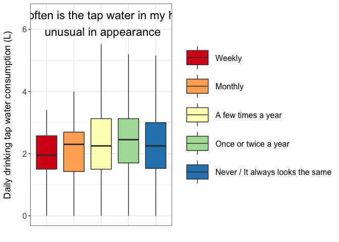

**Water Questionnaire 2 - Cleaning - Descriptives - Analysis**
================
Daniel Schillereff and Ruth CE Bowyer
2025-08-06

- [**0. About**](#0-about)
- [**1. Data**](#1-data)
- [**2. Descriptives - by question**](#2-descriptives---by-question)
  - [**2a. Figure of amount consumed in
    general**](#2a-figure-of-amount-consumed-in-general)
  - [**2b. Behaviour around water
    filtering**](#2b-behaviour-around-water-filtering)
  - [**2c. Water consumption by age**](#2c-water-consumption-by-age)
  - [**2d. Plotting drinking consumption by sex and
    ethnicity**](#2d-plotting-drinking-consumption-by-sex-and-ethnicity)
  - [**2e. Plotting consumption from cooking by
    sex**](#2e-plotting-consumption-from-cooking-by-sex)
  - [**2f. Plotting total consumption by
    sex**](#2f-plotting-total-consumption-by-sex)
  - [**2g. Water consumption for drinking by
    age**](#2g-water-consumption-for-drinking-by-age)
  - [**2h. Water consumption for drinking by sex and
    age**](#2h-water-consumption-for-drinking-by-sex-and-age)
  - [**2i. Do people who like the taste of their water drink more?
    (Question
    8)**](#2i-do-people-who-like-the-taste-of-their-water-drink-more-question-8)
  - [**2j. Do people who consider tap water to be good for health drink
    more? (Question
    7)**](#2j-do-people-who-consider-tap-water-to-be-good-for-health-drink-more-question-7)
  - [**2k. Unusual visual appearance**](#2k-unusual-visual-appearance)

## **0. About**

This script is to clean and derive descriptive statistics from the
TwinsUK Water Consumption Questionnaire

``` r
rm(list=ls())

library(tidyverse)
library(ggplot2)
library(readxl)
library(rstatix)
library(FSA)
library(halfmoon)
library(RColorBrewer)
library(ggpubr)
```

## **1. Data**

``` r
## Define the data directory -- actual directory omitted for security
#dd <- ~/path/to/data

# Water questionnaire data 
df.q <- read_xlsx(paste0(dd,"/DS00070_WaterConsumptionStudy_Questionnaire/WaterConsumptionStudyQuestionnaire_Data.xlsx"))

#Response codes 
Responses <- read_xlsx(paste0(dd,"/DS00070_WaterConsumptionStudy_Questionnaire/WaterConsumptionStudyQuestionnaire_Data.xlsx"), sheet=2)

## Create a df with q code - row names qcode 
Qframe <- as.data.frame(t(df.q[1,]))
## Add col index for easy referencing
names(Qframe) <- "Question"
Qframe$col_index <- 1:ncol(df.q)

##Clean up df.q to remove these rows
df.q <- df.q[-1,]
df.q <- as.data.frame(df.q)


TDs <- read_excel(paste0(dd, "/TwinDetails.xlsx")) # Data on age, sex, ethnicity, zygosity 
water.consump <- read.csv(paste0(dd, "/water.consump.filter.2025.07.28.csv")) # File derived as output from script 1. This csv file has been filtered in Script 1. 
```

## **2. Descriptives - by question**

### **2a. Figure of amount consumed in general**

``` r
#Filter df.q to 3SDs
df.q <- df.q %>%
  filter(ParticipantID %in% water.consump$study_no)

qs <- df.q[c("q2_a", "q2_b", "q2_d", "q2_e")]

q2s <- as.data.frame(apply(qs,2, function(x){
  x <- as.factor(x)
  levels(x) <-  c("0.Never/Rarely", "1.Once a day", "2.Twice a day", "3.Three times a day", "4.Four times a day", "5.Five times a day", "6.Six times a day", "7.Seven times a day", NA)
  return(x)
}))


q2ss <- pivot_longer(
    q2s, 
    cols = `q2_a`:`q2_e`, 
      names_to = "Question",
      values_to = "Times_per_day", 
    cols_vary = "slowest",
      ) 

q2ss <- q2ss %>% 
    mutate(Times_per_day = Times_per_day %>% fct_relevel("7.Seven times a day", "6.Six times a day", "5.Five times a day", "4.Four times a day", "3.Three times a day", "2.Twice a day", "1.Once a day", "0.Never/Rarely"))

q2ss$Times_per_day %>% levels()
```

    ## [1] "7.Seven times a day" "6.Six times a day"   "5.Five times a day" 
    ## [4] "4.Four times a day"  "3.Three times a day" "2.Twice a day"      
    ## [7] "1.Once a day"        "0.Never/Rarely"

``` r
labels <- as_labeller(c('q2_a' = "Small glass (200 mL)", 'q2_b' = "Large glass (500 mL)", 'q2_d' = "Small mug (325 mL)", 'q2_e' = "Large mug (440 mL)"))

labels.times <- setNames(c("No response", "Rarely or never", "One", "Two", "Three", "Four", "Five", "Six", "Seven or more"), c(NA, "0.Never/Rarely", "1.Once a day", "2.Twice a day", "3.Three times a day", "4.Four times a day", "5.Five times a day", "6.Six times a day", "7.Seven times a day"))
```

``` r
Fig1 <- ggplot(q2ss, aes(y = Times_per_day)) +
    geom_bar(stat = "count") +
    theme_bw() + 
    ylab('Number of times consumed a day') +
    xlab('Number of respondents') +
    scale_y_discrete(labels = labels.times) +
    theme(axis.text=element_text(size=11), axis.title=element_text(size=14)) +
    facet_grid(. ~ Question, labeller=labeller(Question = labels), scales = "free") +
    theme(strip.text.x = element_text(size = 12))

Fig1
```

<!-- -->

``` r
#Most and fewest drinks per day
number.glasses <- subset(qs, q2_a == "7" & q2_b == "7")
qs$q2_a_numeric <- as.numeric(qs$q2_a)
qs$q2_b_numeric <- as.numeric(qs$q2_b)
number.glasses.12 <- subset(qs, q2_a_numeric + q2_b_numeric == 12)
number.glasses.13 <- subset(qs, q2_a_numeric + q2_b_numeric == 13)
number.glasses.14 <- subset(qs, q2_a_numeric + q2_b_numeric == 14)
number.glasses.12 <- subset(qs, q2_a == "6" & q2_b == "6"| q2_a == "7" & q2_b == "7")
number.mugs <- subset(qs, q2_d == "3" | q2_d == "4" | q2_e == "3" | q2_e == "4")
mugs.zero <- subset(qs, q2_d > "0" | q2_e > "0")
glasses.mugs.zero <- subset(qs, q2_a == "0" & q2_b == "0" & q2_d == "0" & q2_e == "0")
```

### **2b. Behaviour around water filtering**

``` r
q5 <- df.q[c("q5")]

df.q5 <- as.data.frame(q5)

q5.yes <- sum(df.q5 == "1", na.rm=TRUE)
q5.no <- sum(df.q5 == "0", na.rm=TRUE)

#percentage who filter their water
q5.perc <- 616/2710*100

#Does the respondent filter water for cold drinks, hot drinks or when cooking?
q6 <- df.q[c("q6_a", "q6_b", "q6_c")]

sum(q6 == "999906", na.rm=TRUE)
```

    ## [1] 44

``` r
#percentage who always filter their water for hot, cold, cooking
q6.hot <- sum(q6$q6_a == "4", na.rm=TRUE)
q6.cold <- sum(q6$q6_b == "4", na.rm=TRUE)
q6.cooking <- sum(q6$q6_c == "4", na.rm=TRUE)

q6.hot.perc <- 351/2710*100
q6.cold.perc <- 339/2710*100
q6.cooking.perc <- 132/2710*100

#percentage who never filter their water for hot, cold, cooking
q6.hot.never <- sum(q6$q6_a == "0", na.rm=TRUE)
q6.cold.never <- sum(q6$q6_b == "0", na.rm=TRUE)
q6.cooking.never <- sum(q6$q6_c == "0", na.rm=TRUE)

q6.hot.never.perc <- 71/2710*100
q6.cold.never.perc <- 141/2710*100
q6.cooking.never.perc <- 302/2710*100

q6s <- as.data.frame(apply(q6,2, function(x){
  x <- as.factor(x)
  levels(x) <-  c("None of the time", "Some of the time", "Half of the time", "Most of the time", "All of the time", NA, "Skipped")
  return(x)
}))

sum(q6s == "All of the time", na.rm=TRUE)
```

    ## [1] 822

``` r
q6ss <- pivot_longer(
    q6s, 
    cols = `q6_a`:`q6_c`, 
      names_to = "Question",
      values_to = "How_often", 
    cols_vary = "slowest",
      ) 

q6ss <- q6ss %>% 
    mutate(How_often = How_often %>% fct_relevel("All of the time", "Most of the time", "Half of the time", "Some of the time", "None of the time"))

q6ss$How_often %>% levels()
```

    ## [1] "All of the time"  "Most of the time" "Half of the time" "Some of the time"
    ## [5] "None of the time" "Skipped"

``` r
labels <- as_labeller(c('q6_a' = "Cold drinks", 'q6_b' = "Hot drinks", 'q6_c' = "Cooking"))
```

``` r
FigS11 <- ggplot(q6ss, aes(y = How_often)) +
    geom_bar(stat = "count") +
    theme_bw() + 
    ylab('How often do respondents use a water filter') +
    xlab('Number of respondents') +
    theme(axis.text=element_text(size=11), axis.title=element_text(size=14)) +
    facet_grid(. ~ Question, labeller=labeller(Question = labels), scales = "free") +
    theme(strip.text.x = element_text(size = 12))

FigS11
```

<!-- -->

### **2c. Water consumption by age**

``` r
water.c.demo <- merge(water.consump, TDs, by.x=c("study_no"), by.y = "ParticipantID")
water.c.demo$age <- 2022 - water.c.demo$YearOfBirth

water.c.demo$age.gr <- ifelse(water.c.demo$age>=45&water.c.demo$age<=65, "2. 45 - 65",
                              ifelse(water.c.demo$age>65, "3.Over 65", "1. Under 45"))

### 
dpt <- water.c.demo %>% 
  summarise(n=length(age),
            AGE.Mean = mean(age, na.rm = T),
            Age.Median = median(age, na.rm = T),
            AGE.SD = sd(age, na.rm = T),
            SEX.n.Fem = sum(SEX=="F",na.rm = T),
            SEX.Perc.Fem = sum(SEX=="F",na.rm = T)/length(SEX)*100,
            ZYG.n.MZ = sum(ACTUAL_ZYGOSITY=="MZ",na.rm = T),
            ZYG.Perc.MZ = sum(ACTUAL_ZYGOSITY=="MZ",na.rm=T)/length(ACTUAL_ZYGOSITY)*100,
            ETH.n.White = sum(Ethnic_Origin=="White",na.rm = T),
            ETH.Perc.White = sum(Ethnic_Origin=="White",na.rm = T)/length(Ethnic_Origin)*100)
      

dpt2 <- as.data.frame(t(dpt))

dpt2  
```

    ##                        V1
    ## n              2710.00000
    ## AGE.Mean         61.28893
    ## Age.Median       65.00000
    ## AGE.SD           14.71981
    ## SEX.n.Fem      2415.00000
    ## SEX.Perc.Fem     89.11439
    ## ZYG.n.MZ       1706.00000
    ## ZYG.Perc.MZ      62.95203
    ## ETH.n.White    2503.00000
    ## ETH.Perc.White   92.36162

``` r
drink.age <- water.c.demo%>%
                    group_by(age.gr)%>% 
                    summarise(Mean=mean(total.drink.L), Max=max(total.drink.L), Min=min(total.drink.L), Median=median(total.drink.L), Std=sd(total.drink.L))

labels.Age <- setNames(c("Under 45", "45-65", "Over 65"), c("1. Under 45", "2. 45 - 65", "3.Over 65"))

#Violin plot of drinking consumption by age
FigS1A <- ggplot(water.c.demo, aes(age.gr, total.drink.L, fill = age.gr)) + geom_violin() + theme_bw() + scale_y_continuous(limits = c(0, 6.2)) + scale_x_discrete(labels = labels.Age) + ylab("Daily water consumption from drinking (L)") + xlab("") + 
  scale_fill_brewer(palette = "Dark2") +
  #annotate("text", x = 0.5, y = 6, label = c("A"), colour = "black", size = 8) +
  theme(legend.position="none") +
  theme(axis.text=element_text(size=14), axis.title=element_text(size=14)) +
  annotate("text", x = 0.5, y = 6, label = c("A"), colour = "black", size = 8) +
  geom_segment(aes(x = 0.9, y = 2.12, xend = 1.1, yend = 2.12), linewidth = 3, colour = "#006400") +  
  geom_segment(aes(x = 1.9, y = 2.38, xend = 2.1, yend = 2.38), linewidth = 3, colour = "#8B4500") +
  geom_segment(aes(x = 2.9, y = 2.28, xend = 3.1, yend = 2.28), linewidth = 3, colour = "#9370DB") + geom_hline(yintercept = 2.7, linetype="dashed")  + geom_hline(yintercept = 3.7, linetype="dashed") +  
  annotate("text", x = c(1.45, 2.4), y = c(0.75, 5.5), label = c("Recommended \n daily intake \n for women \n (2.7 L)", "Recommended \n daily intake \n for men  \n (3.7 L)")) +
  annotate('curve',x = 1.25,y = 1.42, yend = 2.65, xend = 1.2, linewidth = 0.8, curvature = -0.4, arrow = arrow(length = unit(0.5, 'cm'))  ) +
  annotate('curve', x = 2.45,y = 4.8, yend = 3.8, xend = 2.4, linewidth = 0.8, curvature = -0.4, arrow = arrow(length = unit(0.5, 'cm'))  )

FigS1A
```

<!-- -->

``` r
pairwise.wilcox.test(water.c.demo$total.drink.L, water.c.demo$SEX)
```

    ## 
    ##  Pairwise comparisons using Wilcoxon rank sum test with continuity correction 
    ## 
    ## data:  water.c.demo$total.drink.L and water.c.demo$SEX 
    ## 
    ##   F    
    ## M 0.004
    ## 
    ## P value adjustment method: holm

``` r
stat.test <- water.c.demo %>% 
  wilcox_test(total.drink.L ~ SEX) %>%
  add_significance()
stat.test
```

    ## # A tibble: 1 × 8
    ##   .y.           group1 group2    n1    n2 statistic       p p.signif
    ##   <chr>         <chr>  <chr>  <int> <int>     <dbl>   <dbl> <chr>   
    ## 1 total.drink.L F      M       2415   295    392748 0.00397 **

``` r
#Hot drink consumption by sex and age
total.hot.L.F <- subset(water.c.demo, water.c.demo$SEX == "F")
median(total.hot.L.F$total.hot.drink.L)
```

    ## [1] 1.25

``` r
mean(total.hot.L.F$total.hot.drink.L)
```

    ## [1] 1.282453

``` r
total.hot.L.M <- subset(water.c.demo, water.c.demo$SEX == "M")
median(total.hot.L.M$total.hot.drink.L)
```

    ## [1] 1.125

``` r
mean(total.hot.L.M$total.hot.drink.L)
```

    ## [1] 1.176695

``` r
total.hot.L.over65 <- subset(water.c.demo, water.c.demo$age.gr == "3.Over 65")
median(total.hot.L.over65$total.hot.drink.L)
```

    ## [1] 1.5

``` r
mean(total.hot.L.over65$total.hot.drink.L)
```

    ## [1] 1.391962

``` r
total.hot.L.45.65 <- subset(water.c.demo, water.c.demo$age.gr == "2. 45 - 65")
median(total.hot.L.45.65$total.hot.drink.L)
```

    ## [1] 1.375

``` r
mean(total.hot.L.45.65$total.hot.drink.L)
```

    ## [1] 1.317629

``` r
total.hot.L.under45 <- subset(water.c.demo, water.c.demo$age.gr == "1. Under 45")
median(total.hot.L.under45$total.hot.drink.L)
```

    ## [1] 0.75

``` r
mean(total.hot.L.under45$total.hot.drink.L)
```

    ## [1] 0.7943075

``` r
water.c.demo$Agein2022 <- 2022 - water.c.demo$YearOfBirth

water.c.demo.subset <- subset(water.c.demo, Agein2022 > 18)
age.tercile <- quantile(water.c.demo.subset$Agein2022, probs=c(1/3,2/3,1))

water.c.demo.subset$Agein2022.group <- ifelse(water.c.demo.subset$Agein2022>=70,"3.70+",
                    ifelse(water.c.demo.subset$Agein2022>=57, "2.57-70",
                           ifelse(water.c.demo.subset$Agein2022<57, "1.Under57",NA)))


water.c.demo.subset$Agein2022.group <- as.factor(water.c.demo.subset$Agein2022.group)
table(water.c.demo.subset$Agein2022.group)
```

    ## 
    ## 1.Under57   2.57-70     3.70+ 
    ##       836       943       929

``` r
drink.tercile <- water.c.demo.subset%>%
                    group_by(Agein2022.group)%>% 
                    summarise(Mean=mean(total.drink.L), Max=max(total.drink.L), Min=min(total.drink.L), Median=median(total.drink.L), Std=sd(total.drink.L))

kruskal.test(total.drink.L ~ Agein2022.group, data = water.c.demo.subset)
```

    ## 
    ##  Kruskal-Wallis rank sum test
    ## 
    ## data:  total.drink.L by Agein2022.group
    ## Kruskal-Wallis chi-squared = 11.131, df = 2, p-value = 0.003828

``` r
pairwise.wilcox.test(water.c.demo.subset$total.drink.L, water.c.demo.subset$Agein2022.group)
```

    ## 
    ##  Pairwise comparisons using Wilcoxon rank sum test with continuity correction 
    ## 
    ## data:  water.c.demo.subset$total.drink.L and water.c.demo.subset$Agein2022.group 
    ## 
    ##         1.Under57 2.57-70
    ## 2.57-70 0.0085    -      
    ## 3.70+   0.0091    0.8279 
    ## 
    ## P value adjustment method: holm

``` r
labels.Age.Tercile <- setNames(c("<57", "57-70", "70+"), c("1.Under57", "2.57-70", "3.70+"))

FigS1B <- ggplot(water.c.demo.subset, aes(Agein2022.group, total.drink.L, fill = Agein2022.group)) + geom_violin() + theme_bw() + scale_y_continuous(limits = c(0, 6.2)) + scale_x_discrete(labels = labels.Age.Tercile) + ylab("Daily water consumption from drinking (L)") + xlab("") + 
  scale_fill_brewer(palette = "Dark2") +
  annotate("text", x = 0.5, y = 6, label = c("B"), colour = "black", size = 8) +
  theme(legend.position="none") +
  theme(axis.text=element_text(size=14), axis.title=element_text(size=14)) +
  geom_segment(aes(x = 0.9, y = 2.19, xend = 1.1, yend = 2.19), linewidth = 3, colour = "#006400") +  
  geom_segment(aes(x = 1.9, y = 2.36, xend = 2.1, yend = 2.36), linewidth = 3, colour = "#8B4500") +
  geom_segment(aes(x = 2.9, y = 2.35, xend = 3.1, yend = 2.35), linewidth = 3, colour = "#9370DB") +
 geom_hline(yintercept = 2.7, linetype="dashed")  + geom_hline(yintercept = 3.7, linetype="dashed") +  
  annotate("text", x = c(1.45, 2.4), y = c(0.75, 5.5), label = c("Recommended \n daily intake \n for women \n (2.7 L)", "Recommended \n daily intake \n for men  \n (3.7 L)")) +
  annotate('curve',x = 1.25,y = 1.42, yend = 2.65, xend = 1.2, linewidth = 0.8, curvature = -0.4, arrow = arrow(length = unit(0.5, 'cm'))  ) +
  annotate('curve', x = 2.45,y = 4.8, yend = 3.8, xend = 2.4, linewidth = 0.8, curvature = -0.4, arrow = arrow(length = unit(0.5, 'cm'))  )

FigS1B
```

<!-- -->

### **2d. Plotting drinking consumption by sex and ethnicity**

``` r
total.drink.L.F <- subset(water.c.demo, SEX == "F")
median(total.drink.L.F$total.drink.L)
```

    ## [1] 2.275

``` r
total.drink.L.M <- subset(water.c.demo, SEX == "M")
median(total.drink.L.M$total.drink.L)
```

    ## [1] 2.2

``` r
#Plotting sex as a violin plot
labels.sex <- setNames(c("Female", "Male", "NA"), c("F", "M", NA))

Fig2A <- ggplot(water.c.demo, aes(SEX, total.drink.L, fill = SEX)) + geom_violin() + theme_bw() + scale_y_continuous(limits = c(0, 6.2)) + scale_x_discrete(labels = labels.sex) + ylab("Daily water consumption from drinking (L)") + xlab("") + 
  scale_fill_brewer(palette = "Dark2") +
  annotate("text", x = 0.5, y = 6, label = c("A"), colour = "black", size = 8) +
  theme(legend.position="none") +
  theme(axis.text=element_text(size=14), axis.title=element_text(size=14)) +
  geom_segment(aes(x = 0.9, y = 2.275, xend = 1.1, yend = 2.275, linewidth = 1, colour = "#cc5500")) + geom_segment(aes(x = 1.9, y = 2.2, xend = 2.1, yend = 2.2, linewidth = 1, colour = "#006400")) + geom_hline(yintercept = 2.7, linetype="dashed")  + geom_hline(yintercept = 3.7, linetype="dashed") +  
  annotate("text", x = c(1.45, 2.3), y = c(0.75, 5.5), label = c("Recommended \n daily intake \n for women \n (2.7 L)", "Recommended \n daily intake \n for men  \n (3.7 L)")) +
  annotate('curve',x = 1.25,y = 1.42, yend = 2.65, xend = 1.2, linewidth = 0.8, curvature = -0.4, arrow = arrow(length = unit(0.5, 'cm'))  ) +
  annotate('curve', x = 2.45,y = 4.8, yend = 3.8, xend = 2.4, linewidth = 0.8, curvature = -0.4, arrow = arrow(length = unit(0.5, 'cm'))  )

Fig2A
```

<!-- -->

``` r
pairwise.wilcox.test(water.c.demo$total.drink.L, water.c.demo$SEX)
```

    ## 
    ##  Pairwise comparisons using Wilcoxon rank sum test with continuity correction 
    ## 
    ## data:  water.c.demo$total.drink.L and water.c.demo$SEX 
    ## 
    ##   F    
    ## M 0.004
    ## 
    ## P value adjustment method: holm

``` r
effect.sex <- water.c.demo %>% wilcox_effsize(total.drink.L ~ SEX)
```

``` r
#Drinking consumption by ethnicity
labels.ethnicity <- setNames(c("Asian British", "Black British", "Mixed Ethnicity", "Other Ethnic Group", "White", "NA"), c("Asian_AsianBritish", "Black_BlackBritish", "Other_Ethnic_Group", "Mixed_Ethnic_Group", "White", NA))

p4 <- ggplot(water.c.demo, aes(Ethnic_Origin, total.drink.L, fill=Ethnic_Origin)) + geom_boxplot() + theme_bw() + 
  scale_x_discrete(labels = labels.ethnicity) + ylab("Daily water consumption for drinking (L)") + xlab("") + 
  scale_fill_brewer(palette = "Set2") +
  theme(legend.position="none")

p4
```

<!-- -->

``` r
kruskal.test(total.drink.L ~ Ethnic_Origin,
  data = water.c.demo
)
```

    ## 
    ##  Kruskal-Wallis rank sum test
    ## 
    ## data:  total.drink.L by Ethnic_Origin
    ## Kruskal-Wallis chi-squared = 5.4605, df = 4, p-value = 0.2432

``` r
dunnTest(total.drink.L ~ Ethnic_Origin,
  data = water.c.demo,
  method = "holm"
  )
```

    ## Warning: Ethnic_Origin was coerced to a factor.

    ## Warning: Some rows deleted from 'x' and 'g' because missing data.

    ## Dunn (1964) Kruskal-Wallis multiple comparison

    ##   p-values adjusted with the Holm method.

    ##                                 Comparison          Z    P.unadj     P.adj
    ## 1  Asian_AsianBritish - Black_BlackBritish  0.4489393 0.65347545 1.0000000
    ## 2  Asian_AsianBritish - Mixed_Ethnic_Group -0.4104532 0.68147356 1.0000000
    ## 3  Black_BlackBritish - Mixed_Ethnic_Group -0.9158031 0.35977016 1.0000000
    ## 4  Asian_AsianBritish - Other_Ethnic_Group -0.3768885 0.70625650 1.0000000
    ## 5  Black_BlackBritish - Other_Ethnic_Group -0.6726698 0.50115741 1.0000000
    ## 6  Mixed_Ethnic_Group - Other_Ethnic_Group -0.1299189 0.89663057 0.8966306
    ## 7               Asian_AsianBritish - White -1.1563360 0.24754375 1.0000000
    ## 8               Black_BlackBritish - White -1.9063091 0.05661012 0.5661012
    ## 9               Mixed_Ethnic_Group - White -0.7296140 0.46562617 1.0000000
    ## 10              Other_Ethnic_Group - White -0.1854146 0.85290385 1.0000000

``` r
#Drinking consumption by ethnicity: White vs racial minoritised in the UK
water.c.demo$Ethnic_Origin_Simple <- water.c.demo$Ethnic_Origin
water.c.demo$Ethnic_Origin_Simple <- recode(water.c.demo$Ethnic_Origin_Simple, "Asian_AsianBritish" = 'Racially minoritised (in the UK)', 
                                       "Black_BlackBritish" = 'Racially minoritised (in the UK)',
                                       "Mixed_Ethnic_Group" = 'Racially minoritised (in the UK)', 
                                        "Other_Ethnic_Group" = "Racially minoritised (in the UK)")

water.c.demo.noNA <- subset(water.c.demo, !is.na(Ethnic_Origin_Simple)) 
```

``` r
total.drink.L.White <- subset(water.c.demo.noNA, Ethnic_Origin_Simple == "White")
median(total.drink.L.White$total.drink.L)
```

    ## [1] 2.275

``` r
total.drink.L.RM <- subset(water.c.demo.noNA, Ethnic_Origin_Simple == "Racially minoritised (in the UK)")
median(total.drink.L.RM$total.drink.L)
```

    ## [1] 1.875

``` r
#Ethnicity as a violin plot.
Fig2B <- ggplot(water.c.demo.noNA, aes(Ethnic_Origin_Simple, total.drink.L, fill=Ethnic_Origin_Simple)) + geom_violin() + theme_bw() + scale_y_continuous(limits = c(0, 6.2)) + scale_x_discrete(labels = labels.ethnicity) + ylab("") + xlab("") + geom_segment(aes(x = 0.9, y = 1.875, xend = 1.1, yend = 1.875, linewidth = 1, colour = "#cc5500")) + geom_segment(aes(x = 1.9, y = 2.275, xend = 2.1, yend = 2.275, linewidth = 1, colour = "#006400")) + 
  scale_fill_brewer(palette = "Dark2") +
  annotate("text", x = 0.5, y = 6, label = c("B"), colour = "black", size = 8) + theme(legend.position="none") +
  theme(axis.text=element_text(size=14), axis.title=element_text(size=14)) + geom_hline(yintercept = 2.7, linetype="dashed")  + geom_hline(yintercept = 3.7, linetype="dashed") +  
  annotate("text", x = c(1.50, 2.3), y = c(0.75, 5.5), label = c("Recommended \n daily intake \n for women \n (2.7 L)", "Recommended \n daily intake \n for men  \n (3.7 L)")) +
  annotate('curve',x = 1.34,y = 1.32, yend = 2.65, xend = 1.2, linewidth = 0.8, curvature = -0.4, arrow = arrow(length = unit(0.5, 'cm'))  ) +
  annotate('curve', x = 2.45,y = 4.8, yend = 3.8, xend = 2.4, linewidth = 0.8, curvature = -0.4, arrow = arrow(length = unit(0.5, 'cm'))
  )


Fig2B
```

<!-- -->

``` r
Fig2 <- ggarrange(Fig2A, Fig2B, nrow = 1)
```

``` r
pairwise.wilcox.test(water.c.demo$total.drink.L, water.c.demo$Ethnic_Origin_Simple)
```

    ## 
    ##  Pairwise comparisons using Wilcoxon rank sum test with continuity correction 
    ## 
    ## data:  water.c.demo$total.drink.L and water.c.demo$Ethnic_Origin_Simple 
    ## 
    ##       Racially minoritised (in the UK)
    ## White 0.035                           
    ## 
    ## P value adjustment method: holm

``` r
stat.test <- water.c.demo %>% 
  wilcox_test(total.drink.L ~ Ethnic_Origin_Simple) %>%
  add_significance()
stat.test
```

    ## # A tibble: 1 × 9
    ##   .y.           group1     group2    n1    n2 statistic     p p.adj p.adj.signif
    ##   <chr>         <chr>      <chr>  <int> <int>     <dbl> <dbl> <dbl> <chr>       
    ## 1 total.drink.L Racially … White     69  2503    73508. 0.035 0.035 *

``` r
effect.ethnic <- water.c.demo %>% wilcox_effsize(total.drink.L ~ Ethnic_Origin_Simple)
```

### **2e. Plotting consumption from cooking by sex**

``` r
total.cooking.L.noNA <- subset(water.c.demo, !is.na(total.cooking.L)) 

total.cooking.L.F <- subset(total.cooking.L.noNA, SEX == "F")
median(total.cooking.L.F$total.cooking.L)
```

    ## [1] 0.1

``` r
mean(total.cooking.L.F$total.cooking.L)
```

    ## [1] 0.0911646

``` r
total.cook.L.M <- subset(total.cooking.L.noNA, SEX == "M")
median(total.cook.L.M$total.cooking.L)
```

    ## [1] 0.1

``` r
mean(total.cook.L.M$total.cooking.L)
```

    ## [1] 0.09080508

``` r
#Plot cooking by sex as violin plot
FigS5 <- ggplot(water.c.demo, aes(SEX, total.cooking.L, fill = SEX)) + geom_violin() + theme_bw() + scale_y_continuous(limits = c(0,0.4)) + scale_x_discrete(labels = labels.sex) + ylab("Daily water consumption from cooking (L)") + xlab("") + theme(legend.position="none") +
  scale_fill_brewer(palette = "Dark2") +
  theme(axis.text=element_text(size=14), axis.title=element_text(size=14)) +
  geom_segment(aes(x = 0.9, y = 0.1, xend = 1.1, yend = 0.1, linewidth = 1, colour = "#cc5500")) + geom_segment(aes(x = 1.9, y = 0.1, xend = 2.1, yend = 0.1, linewidth = 1, colour = "#006400")) 

FigS5
```

<!-- -->

### **2f. Plotting total consumption by sex**

``` r
total.consump.L.noNA <- subset(water.c.demo, !is.na(total.consump.L)) 

total.consump.L.F <- subset(total.consump.L.noNA, SEX == "F")
median(total.consump.L.F$total.consump.L)
```

    ## [1] 2.4

``` r
mean(total.consump.L.F$total.consump.L)
```

    ## [1] 2.419995

``` r
total.consump.L.M <- subset(total.consump.L.noNA, SEX == "M")
median(total.consump.L.M$total.consump.L)
```

    ## [1] 2.25

``` r
mean(total.consump.L.M$total.consump.L)
```

    ## [1] 2.209873

``` r
#Total consumption by sex as a violin plot. Updated medians for 3 sd filtered values. 
labels.sex <- setNames(c("Female", "Male", "NA"), c("F", "M", NA))

FigS6 <- ggplot(water.c.demo, aes(SEX, total.consump.L, fill = SEX)) + geom_violin() + theme_bw() + scale_y_continuous(limits = c(0, 6.2)) + scale_x_discrete(labels = labels.sex) + ylab("Total daily tap water consumption within the home (L)") + xlab("") + 
  scale_fill_brewer(palette = "Dark2") +
  #annotate("text", x = 0.5, y = 6, label = c("C"), colour = "black", size = 8) +
  theme(legend.position="none") +
  theme(axis.text=element_text(size=14), axis.title=element_text(size=14)) +
  geom_segment(aes(x = 0.9, y = 2.4, xend = 1.1, yend = 2.4, linewidth = 1, colour = "#cc5500")) + geom_segment(aes(x = 1.9, y = 2.25, xend = 2.1, yend = 2.25, linewidth = 1, colour = "#006400")) + geom_hline(yintercept = 2.7, linetype="dashed")  + geom_hline(yintercept = 3.7, linetype="dashed") +  
  annotate("text", x = c(1.45, 2.4), y = c(0.75, 5.5), label = c("Recommended \n daily intake \n for women \n (2.7 L)", "Recommended \n daily intake \n for men  \n (3.7 L)")) +
  annotate('curve',x = 1.25,y = 1.42, yend = 2.65, xend = 1.2, linewidth = 0.8, curvature = -0.4, arrow = arrow(length = unit(0.5, 'cm'))  ) +
  annotate('curve', x = 2.45,y = 4.8, yend = 3.8, xend = 2.4, linewidth = 0.8, curvature = -0.4, arrow = arrow(length = unit(0.5, 'cm'))  )

FigS6
```

<!-- -->

``` r
#Percentage of males and females who consume at home more than their respective recommended daily intake
#Female
total.consump.L.female <- subset(water.c.demo, water.c.demo$SEX == "F")
dim(total.consump.L.female)
```

    ## [1] 2415   16

``` r
sum(total.consump.L.female$total.consump.L < "2.7", na.rm=TRUE) #US National Academy value
```

    ## [1] 1470

``` r
sum(total.consump.L.female$total.consump.L >= "2.7", na.rm=TRUE) #US National Academy 
```

    ## [1] 945

``` r
sum(total.consump.L.female$total.consump.L < "2", na.rm=TRUE) #EU Food Safety Authority 
```

    ## [1] 852

``` r
sum(total.consump.L.female$total.consump.L >= "2", na.rm=TRUE) #EU Food Safety Authority 
```

    ## [1] 1563

``` r
#value
(945/2415)*100 #percentage of females equal or above 2.7L
```

    ## [1] 39.13043

``` r
(1563/2415)*100 #percentage of females equal or above 2L
```

    ## [1] 64.7205

``` r
total.consump.L.male <- subset(water.c.demo, water.c.demo$SEX == "M")
dim(total.consump.L.male)
```

    ## [1] 295  16

``` r
sum(total.consump.L.male$total.consump.L < "3.7", na.rm=TRUE) #US National Academy value
```

    ## [1] 270

``` r
sum(total.consump.L.male$total.consump.L >= "3.7", na.rm=TRUE) #US National Academy value
```

    ## [1] 25

``` r
sum(total.consump.L.male$total.consump.L < "2.5", na.rm=TRUE) #EU Food Safety Authority 
```

    ## [1] 179

``` r
sum(total.consump.L.male$total.consump.L >= "2.5", na.rm=TRUE) #EU Food Safety Authority 
```

    ## [1] 116

``` r
#value
(25/295)*100
```

    ## [1] 8.474576

``` r
(116/295)*100
```

    ## [1] 39.32203

### **2g. Water consumption for drinking by age**

``` r
 ggplot(water.c.demo, aes(age.gr, total.drink.L, fill=age.gr)) + geom_boxplot() + theme_minimal() + 
   ylab("Daily water consumption (L)") + xlab("") + scale_fill_brewer(palette = "Set2")
```

<!-- -->

``` r
pairwise.wilcox.test(water.c.demo$total.drink.L, water.c.demo$age.gr)
```

    ## 
    ##  Pairwise comparisons using Wilcoxon rank sum test with continuity correction 
    ## 
    ## data:  water.c.demo$total.drink.L and water.c.demo$age.gr 
    ## 
    ##            1. Under 45 2. 45 - 65
    ## 2. 45 - 65 0.0042      -         
    ## 3.Over 65  0.0042      0.7203    
    ## 
    ## P value adjustment method: holm

``` r
pairwise.wilcox.test(water.c.demo$total.consump.L, water.c.demo$age.gr)
```

    ## 
    ##  Pairwise comparisons using Wilcoxon rank sum test with continuity correction 
    ## 
    ## data:  water.c.demo$total.consump.L and water.c.demo$age.gr 
    ## 
    ##            1. Under 45 2. 45 - 65
    ## 2. 45 - 65 0.0052      -         
    ## 3.Over 65  0.0052      0.7967    
    ## 
    ## P value adjustment method: holm

### **2h. Water consumption for drinking by sex and age**

``` r
FigS4 <- ggplot(water.c.demo, aes(age.gr, total.drink.L, fill=SEX)) + geom_boxplot(outlier.shape = NA) + theme_bw() + scale_x_discrete(labels = labels.Age) + scale_y_continuous(limits = c(-0.6, 6.5)) +
  xlab("Daily tap water consumption for drinking (L)") +
  ylab("Daily water consumption (L)") + xlab("") + scale_fill_brewer(palette = "Dark2") +
  theme(axis.text=element_text(size=12), axis.title=element_text(size=14)) +
  theme(legend.position = c(0.1, 0.85), legend.title = element_blank(), legend.key.size = unit(1.5, "cm"), legend.text = element_text(size = 12)) +
 stat_compare_means(aes(label = paste0("p = ", round(..p.., 2))),
                     method = "wilcox.test", label.y = -0.5)
```

    ## Warning: A numeric `legend.position` argument in `theme()` was deprecated in ggplot2
    ## 3.5.0.
    ## ℹ Please use the `legend.position.inside` argument of `theme()` instead.
    ## This warning is displayed once every 8 hours.
    ## Call `lifecycle::last_lifecycle_warnings()` to see where this warning was
    ## generated.

``` r
FigS4
```

<!-- -->

``` r
total.drink.L.over65 <- subset(water.c.demo, water.c.demo$age.gr == "3.Over 65")
total.drink.L.45.65 <- subset(water.c.demo, water.c.demo$age.gr == "2. 45 - 65")
total.drink.L.under45 <- subset(water.c.demo, water.c.demo$age.gr == "1. Under 45")

pairwise.wilcox.test(total.drink.L.over65$total.drink.L, total.drink.L.over65$SEX)
```

    ## 
    ##  Pairwise comparisons using Wilcoxon rank sum test with continuity correction 
    ## 
    ## data:  total.drink.L.over65$total.drink.L and total.drink.L.over65$SEX 
    ## 
    ##   F     
    ## M 0.0072
    ## 
    ## P value adjustment method: holm

``` r
pairwise.wilcox.test(total.drink.L.45.65$total.drink.L, total.drink.L.45.65$SEX)
```

    ## 
    ##  Pairwise comparisons using Wilcoxon rank sum test with continuity correction 
    ## 
    ## data:  total.drink.L.45.65$total.drink.L and total.drink.L.45.65$SEX 
    ## 
    ##   F    
    ## M 0.038
    ## 
    ## P value adjustment method: holm

``` r
pairwise.wilcox.test(total.drink.L.under45$total.drink.L, total.drink.L.under45$SEX)
```

    ## 
    ##  Pairwise comparisons using Wilcoxon rank sum test with continuity correction 
    ## 
    ## data:  total.drink.L.under45$total.drink.L and total.drink.L.under45$SEX 
    ## 
    ##   F   
    ## M 0.55
    ## 
    ## P value adjustment method: holm

``` r
over65.sex <- pairwise.wilcox.test(total.drink.L.over65$total.drink.L, total.drink.L.over65$SEX)

pairwise.wilcox.test(total.drink.L.45.65$total.drink.L, total.drink.L.45.65$SEX)
```

    ## 
    ##  Pairwise comparisons using Wilcoxon rank sum test with continuity correction 
    ## 
    ## data:  total.drink.L.45.65$total.drink.L and total.drink.L.45.65$SEX 
    ## 
    ##   F    
    ## M 0.038
    ## 
    ## P value adjustment method: holm

``` r
pairwise.wilcox.test(total.drink.L.under45$total.drink.L, total.drink.L.under45$SEX)
```

    ## 
    ##  Pairwise comparisons using Wilcoxon rank sum test with continuity correction 
    ## 
    ## data:  total.drink.L.under45$total.drink.L and total.drink.L.under45$SEX 
    ## 
    ##   F   
    ## M 0.55
    ## 
    ## P value adjustment method: holm

``` r
ggplot(water.c.demo.noNA, aes(age.gr, total.drink.L, fill=Ethnic_Origin_Simple)) + geom_boxplot(outlier.shape = NA) + theme_bw() +     scale_y_continuous(limits = c(-0.6, 6.5)) +
  xlab("Daily tap water consumption for drinking (L)") +
  ylab("Daily water consumption (L)") + xlab("") + scale_fill_brewer(palette = "Dark2") +
  theme(axis.text=element_text(size=12), axis.title=element_text(size=14)) +
  theme(legend.position = c(0.1, 0.85), legend.title = element_blank(), legend.key.size = unit(1.5, "cm"), legend.text = element_text(size = 12)) +
 stat_compare_means(aes(label = paste0("p = ", ..p.format..)),
                     method = "wilcox.test", label.y = -0.5)
```

<!-- -->

``` r
total.drink.L.over65 <- subset(water.c.demo, water.c.demo$age.gr == "3.Over 65")
total.drink.L.45.65 <- subset(water.c.demo, water.c.demo$age.gr == "2. 45 - 65")
total.drink.L.under45 <- subset(water.c.demo, water.c.demo$age.gr == "1. Under 45")

pairwise.wilcox.test(total.drink.L.over65$total.drink.L, total.drink.L.over65$SEX)
```

    ## 
    ##  Pairwise comparisons using Wilcoxon rank sum test with continuity correction 
    ## 
    ## data:  total.drink.L.over65$total.drink.L and total.drink.L.over65$SEX 
    ## 
    ##   F     
    ## M 0.0072
    ## 
    ## P value adjustment method: holm

``` r
pairwise.wilcox.test(total.drink.L.45.65$total.drink.L, total.drink.L.45.65$SEX)
```

    ## 
    ##  Pairwise comparisons using Wilcoxon rank sum test with continuity correction 
    ## 
    ## data:  total.drink.L.45.65$total.drink.L and total.drink.L.45.65$SEX 
    ## 
    ##   F    
    ## M 0.038
    ## 
    ## P value adjustment method: holm

``` r
pairwise.wilcox.test(total.drink.L.under45$total.drink.L, total.drink.L.under45$SEX)
```

    ## 
    ##  Pairwise comparisons using Wilcoxon rank sum test with continuity correction 
    ## 
    ## data:  total.drink.L.under45$total.drink.L and total.drink.L.under45$SEX 
    ## 
    ##   F   
    ## M 0.55
    ## 
    ## P value adjustment method: holm

``` r
pairwise.wilcox.test(water.c.demo$total.drink.L, water.c.demo$SEX)
```

    ## 
    ##  Pairwise comparisons using Wilcoxon rank sum test with continuity correction 
    ## 
    ## data:  water.c.demo$total.drink.L and water.c.demo$SEX 
    ## 
    ##   F    
    ## M 0.004
    ## 
    ## P value adjustment method: holm

``` r
#aa <- read.csv(###Add csv file of education and IMD data. File name removed for security.)

edu <- aa[c("sn", "edu_bin_combined", "edu_cat_combined", "imd_decile_combined")]
edu <- edu %>% rename_at('sn', ~'study_no')

water.c.demo <- left_join(water.c.demo, edu, by="study_no")

###Test IMD
total.consump.L.IMD.7 <- subset(water.c.demo, imd_decile_combined > "7")
total.consump.L.IMD.7 <- subset(water.c.demo, imd_decile_combined < "3")

IMD.tercile <- quantile(water.c.demo$imd_decile_combined, probs=c(1/3,2/3,1), na.rm = TRUE)

IMD.tercile <- quantile(water.c.demo$imd_decile_combined, probs=c(1/4,1/2,3/4,1), na.rm = TRUE)

water.c.demo$IMD.group1 <- ifelse(water.c.demo$imd_decile_combined>=9,"3.9+",
                    ifelse(water.c.demo$imd_decile_combined>=6, "2.6-9",
                           ifelse(water.c.demo$imd_decile_combined<6, "1.Under6",NA)))

water.c.demo$IMD.group2 <- ifelse(water.c.demo$imd_decile_combined>=7,"3.7+",
                    ifelse(water.c.demo$imd_decile_combined>=4, "2.4-7",
                           ifelse(water.c.demo$imd_decile_combined<4, "1.Under4",NA)))

water.c.demo$IMD.group1 <- as.factor(water.c.demo$IMD.group1)
water.c.demo$IMD.group2 <- as.factor(water.c.demo$IMD.group2)
table(water.c.demo$IMD.group1)
```

    ## 
    ## 1.Under6    2.6-9     3.9+ 
    ##      764     1011      898

``` r
table(water.c.demo$IMD.group2)
```

    ## 
    ## 1.Under4    2.4-7     3.7+ 
    ##      302      759     1612

``` r
kruskal.test(total.drink.L ~ IMD.group1, data = water.c.demo)
```

    ## 
    ##  Kruskal-Wallis rank sum test
    ## 
    ## data:  total.drink.L by IMD.group1
    ## Kruskal-Wallis chi-squared = 3.629, df = 2, p-value = 0.1629

``` r
pairwise.wilcox.test(water.c.demo$total.drink.L, water.c.demo$IMD.group1)
```

    ## 
    ##  Pairwise comparisons using Wilcoxon rank sum test with continuity correction 
    ## 
    ## data:  water.c.demo$total.drink.L and water.c.demo$IMD.group1 
    ## 
    ##       1.Under6 2.6-9
    ## 2.6-9 0.59     -    
    ## 3.9+  0.48     0.17 
    ## 
    ## P value adjustment method: holm

``` r
###Test education
water.c.demo$edu_bin_combined <- as.factor(water.c.demo$edu_bin_combined)
table(water.c.demo$edu_bin_combined)
```

    ## 
    ##                       All else nvq4/nvq5/degree or equivalent 
    ##                           1077                           1413

``` r
kruskal.test(total.drink.L ~ edu_bin_combined, data = water.c.demo)
```

    ## 
    ##  Kruskal-Wallis rank sum test
    ## 
    ## data:  total.drink.L by edu_bin_combined
    ## Kruskal-Wallis chi-squared = 1.0327, df = 1, p-value = 0.3095

``` r
pairwise.wilcox.test(water.c.demo$total.drink.L, water.c.demo$edu_bin_combined)
```

    ## 
    ##  Pairwise comparisons using Wilcoxon rank sum test with continuity correction 
    ## 
    ## data:  water.c.demo$total.drink.L and water.c.demo$edu_bin_combined 
    ## 
    ##                                All else
    ## nvq4/nvq5/degree or equivalent 0.31    
    ## 
    ## P value adjustment method: holm

### **2i. Do people who like the taste of their water drink more? (Question 8)**

``` r
q7_8 <- as.data.frame(apply(df.q[c("q7" , "q8")],2,function(x){
  x <- as.factor(x)
  levels(x) <- c("1. Strongly disagree", "2. Disgree", "3. Neither agree/disagree", "4. Agree", "5. Strongly Agree", NA)
  return(x)
}))

q5.filt <- df.q[c("q5")]

water.c.demo <- cbind(water.c.demo, q7_8, q5.filt)


#Do people who like their water drink more?
Fig3A <- ggplot(subset(water.c.demo, !is.na(q8)), aes(q8, total.drink.L, fill=q8)) + geom_boxplot(outlier.shape = NA) + theme_bw() +     scale_y_continuous(limits = c(0, 8.5), breaks = c(0, 2, 4, 6), labels = c(0, 2, 4, 6)) +
  ylab("Daily drinking water consumption (L)") + xlab("") + scale_fill_brewer(palette = "Spectral", labels = c("Strongly disagree", "Disagree", "Neither agree nor disagree", "Agree", "Strongly Agree", NA)) +  theme(axis.text.x=element_blank(), axis.ticks.x=element_blank()) +
  theme(axis.title.y = element_text(margin = margin(r=15))) +
  theme(axis.text=element_text(size=12), axis.title=element_text(size=14)) +
  theme(legend.title = element_blank(), legend.key.size = unit(1.5, "cm"), legend.text = element_text(size = 12)) +
  #theme(plot.title=element_text(family='', face='bold', colour='green', size=26, margin=margin(t=40,b=-30)))
  annotate("text", x = 3, y = 8.2, label = c("I like the taste of the \n unfiltered tap water in my home"), size = 6) +   annotate("text", x = 0.75, y = 8.4, label = c("A"), colour = "black", size = 8) 

Fig3A
```

<!-- -->

``` r
m.q8 <- compare_means(total.drink.L ~ q8, data = water.c.demo, method = "wilcox.test")
#Add significance stars
Fig3A <- Fig3A + stat_pvalue_manual(m.q8, label = "p.signif", inherit.aes = FALSE, hide.ns = TRUE, y.position = 5.5, step.increase = 0.04, tip.length = 0.01)
```

``` r
pairwise.wilcox.test(water.c.demo$total.drink.L, water.c.demo$q8)
```

    ## 
    ##  Pairwise comparisons using Wilcoxon rank sum test with continuity correction 
    ## 
    ## data:  water.c.demo$total.drink.L and water.c.demo$q8 
    ## 
    ##                           1. Strongly disagree 2. Disgree
    ## 2. Disgree                0.79870              -         
    ## 3. Neither agree/disagree 0.10269              0.04520   
    ## 4. Agree                  0.00679              0.00021   
    ## 5. Strongly Agree         0.00042              4.6e-06   
    ##                           3. Neither agree/disagree 4. Agree
    ## 2. Disgree                -                         -       
    ## 3. Neither agree/disagree -                         -       
    ## 4. Agree                  0.05416                   -       
    ## 5. Strongly Agree         0.00140                   0.12229 
    ## 
    ## P value adjustment method: holm

``` r
kruskal.test(total.drink.L ~ q8,
  data = water.c.demo
)
```

    ## 
    ##  Kruskal-Wallis rank sum test
    ## 
    ## data:  total.drink.L by q8
    ## Kruskal-Wallis chi-squared = 39.713, df = 4, p-value = 4.963e-08

``` r
dunnTest(total.drink.L ~ q8,
  data = water.c.demo,
  method = "holm"
  )
```

    ## Warning: q8 was coerced to a factor.

    ## Warning: Some rows deleted from 'x' and 'g' because missing data.

    ## Dunn (1964) Kruskal-Wallis multiple comparison

    ##   p-values adjusted with the Holm method.

    ##                                          Comparison          Z      P.unadj
    ## 1                 1. Strongly disagree - 2. Disgree -0.1262229 8.995555e-01
    ## 2  1. Strongly disagree - 3. Neither agree/disagree -2.0650514 3.891813e-02
    ## 3            2. Disgree - 3. Neither agree/disagree -2.5675876 1.024089e-02
    ## 4                   1. Strongly disagree - 4. Agree -3.3029943 9.565833e-04
    ## 5                             2. Disgree - 4. Agree -4.2322332 2.313823e-05
    ## 6              3. Neither agree/disagree - 4. Agree -2.4468205 1.441226e-02
    ## 7          1. Strongly disagree - 5. Strongly Agree -4.1535246 3.273930e-05
    ## 8                    2. Disgree - 5. Strongly Agree -5.0810114 3.754306e-07
    ## 9     3. Neither agree/disagree - 5. Strongly Agree -3.7001453 2.154760e-04
    ## 10                     4. Agree - 5. Strongly Agree -1.8543441 6.368995e-02
    ##           P.adj
    ## 1  8.995555e-01
    ## 2  1.167544e-01
    ## 3  5.120445e-02
    ## 4  5.739500e-03
    ## 5  2.082441e-04
    ## 6  5.764904e-02
    ## 7  2.619144e-04
    ## 8  3.754306e-06
    ## 9  1.508332e-03
    ## 10 1.273799e-01

``` r
#Calculating the numbers
strongly.dislike.water <- subset(water.c.demo, q8 == "1. Strongly disagree")
dislike.water <- subset(water.c.demo, q8 == "2. Disgree")
like.water <- subset(water.c.demo, q8 == "4. Agree")
strongly.like.water <- subset(water.c.demo, q8 == "5. Strongly Agree") 

Water.Median.1 <- median(strongly.dislike.water$total.drink.L, na.rm = T)
Water.Mean.1 <- mean(strongly.dislike.water$total.drink.L, na.rm = T)
Water.SD.1 <- sd(strongly.dislike.water$total.drink.L, na.rm = T)
Water.Median.2 <- median(dislike.water$total.drink.L, na.rm = T)
Water.Mean.2 <- mean(dislike.water$total.drink.L, na.rm = T)
Water.SD.2 <- sd(dislike.water$total.drink.L, na.rm = T)
Water.Median.3 <- median(like.water$total.drink.L, na.rm = T)
Water.Mean.3 <- mean(like.water$total.drink.L, na.rm = T)
Water.SD.3 <- sd(like.water$total.drink.L, na.rm = T)
Water.Median.4 <- median(strongly.like.water$total.drink.L, na.rm = T)
Water.Mean.4 <- mean(strongly.like.water$total.drink.L, na.rm = T)
Water.SD.5 <- sd(strongly.like.water$total.drink.L, na.rm = T)

#Do people with a favourable view / non-favourable view of taste of their water
dim(strongly.dislike.water)
```

    ## [1] 137  24

``` r
sum(strongly.dislike.water$total.consump.L >= "2.7", na.rm=TRUE) #US National Academy 
```

    ## [1] 43

``` r
sum(strongly.dislike.water$total.consump.L >= "2", na.rm=TRUE) #EU Food Safety Authority 
```

    ## [1] 75

``` r
dim(dislike.water)
```

    ## [1] 277  24

``` r
sum(dislike.water$total.consump.L >= "2.7", na.rm=TRUE) #US National Academy 
```

    ## [1] 84

``` r
sum(dislike.water$total.consump.L >= "2", na.rm=TRUE) #EU Food Safety Authority 
```

    ## [1] 153

``` r
((43+84)/(137+277))*100 #percentage of dislike/strong dislike equal or above 2.7L
```

    ## [1] 30.67633

``` r
((75+153)/(137+277))*100 #percentage of dislike/strong dislike equal or above 2L
```

    ## [1] 55.07246

``` r
dim(strongly.like.water)
```

    ## [1] 389  24

``` r
sum(strongly.like.water$total.consump.L >= "2.7", na.rm=TRUE) #US National Academy 
```

    ## [1] 187

``` r
sum(strongly.like.water$total.consump.L >= "2", na.rm=TRUE) #EU Food Safety Authority 
```

    ## [1] 276

``` r
dim(like.water)
```

    ## [1] 973  24

``` r
sum(like.water$total.consump.L >= "2.7", na.rm=TRUE) #US National Academy 
```

    ## [1] 385

``` r
sum(like.water$total.consump.L >= "2", na.rm=TRUE) #EU Food Safety Authority 
```

    ## [1] 656

``` r
((187+385)/(276+973))*100 #percentage of like/strong like equal or above 2.7L
```

    ## [1] 45.79664

``` r
((276+656)/(276+973))*100 #percentage of like/strong like equal or above 2L
```

    ## [1] 74.6197

``` r
#Are people who don't consume any drinks from their tap more averse to the taste of their water?
qs.filt <- df.q[c("q2_a", "q2_b", "q2_d", "q2_e")]

number.drinks <- cbind(water.c.demo, qs.filt)

zero.drinks <- subset(number.drinks, q2_a == "0" & q2_b == "0" & q2_d == "0" & q2_e == "0")
some.drinks <- subset(number.drinks, q2_a > "0" | q2_b > "0" | q2_d > "0" | q2_e > "0")

s1 <- sum(zero.drinks$q8 == "1. Strongly disagree", na.rm=TRUE)
s2 <- sum(zero.drinks$q8 == "2. Disgree", na.rm=TRUE)
s3 <- sum(zero.drinks$q8 == "3. Neither agree/disagree", na.rm=TRUE)
s4 <- sum(zero.drinks$q8 == "4. Agree", na.rm=TRUE)
s5 <- sum(zero.drinks$q8 == "5. Strongly Agree", na.rm=TRUE)
s <- s1+s2+s3+s4+s5
#% disagree or strongly disagree 47%
(s1 + s2) / s * 100
```

    ## [1] 46.83544

``` r
s1 <- sum(some.drinks$q8 == "1. Strongly disagree", na.rm=TRUE)
s2 <- sum(some.drinks$q8 == "2. Disgree", na.rm=TRUE)
s3 <- sum(some.drinks$q8 == "3. Neither agree/disagree", na.rm=TRUE)
s4 <- sum(some.drinks$q8 == "4. Agree", na.rm=TRUE)
s5 <- sum(some.drinks$q8 == "5. Strongly Agree", na.rm=TRUE)
s <- s1+s2+s3+s4+s5
#% disagree or strongly disagree 14.5%
(s1 + s2) / s * 100
```

    ## [1] 14.37834

``` r
total.drink.L.female <- subset(water.c.demo, water.c.demo$SEX == "F")

FigS7A <- ggplot(subset(total.drink.L.female, !is.na(q8)), aes(q8, total.drink.L, fill=q8)) + geom_boxplot(outlier.shape = NA) + theme_bw() +     scale_y_continuous(limits = c(0, 11), breaks = c(0, 2, 4, 6)) + ylab("Daily drinking water consumption (L)") + xlab("") + scale_fill_brewer(palette = "Spectral", labels = c("Strongly disagree", "Disagree", "Neither agree nor disagree", "Agree", "Strongly Agree", NA)) +  theme(axis.text.x=element_blank(), axis.ticks.x=element_blank()) +
  theme(axis.title.y = element_text(margin = margin(r=15))) +
  theme(axis.text=element_text(size=12), axis.title=element_text(size=14)) +
  theme(legend.title = element_blank(), legend.key.size = unit(1.5, "cm"), legend.text = element_text(size = 12)) +
  #theme(plot.title=element_text(family='', face='bold', colour='green', size=26, margin=margin(t=40,b=-30)))
  annotate("text", x = 3, y = 10.2, label = c("I like the taste of the \n unfiltered tap water in my home \n (female respondents)"), size = 6) +
  annotate("text", x = 0.75, y = 11, label = c("A"), size = 8)

m.q8.female <- compare_means(total.drink.L ~ q8, data = total.drink.L.female, method = "wilcox.test")
#Add significance stars
FigS7A <- FigS7A + stat_pvalue_manual(m.q8.female, label = "p.signif", inherit.aes = FALSE, hide.ns = TRUE, y.position = 5.5, step.increase = 0.04, tip.length = 0.01)

pairwise.wilcox.test(total.drink.L.female$total.drink.L, total.drink.L.female$q8)
```

    ## 
    ##  Pairwise comparisons using Wilcoxon rank sum test with continuity correction 
    ## 
    ## data:  total.drink.L.female$total.drink.L and total.drink.L.female$q8 
    ## 
    ##                           1. Strongly disagree 2. Disgree
    ## 2. Disgree                0.79244              -         
    ## 3. Neither agree/disagree 0.03511              0.00549   
    ## 4. Agree                  0.00168              2.5e-05   
    ## 5. Strongly Agree         2.5e-05              3.5e-08   
    ##                           3. Neither agree/disagree 4. Agree
    ## 2. Disgree                -                         -       
    ## 3. Neither agree/disagree -                         -       
    ## 4. Agree                  0.07111                   -       
    ## 5. Strongly Agree         0.00037                   0.03646 
    ## 
    ## P value adjustment method: holm

``` r
total.drink.L.male <- subset(water.c.demo, water.c.demo$SEX == "M")

FigS7B <- ggplot(subset(total.drink.L.male, !is.na(q8)), aes(q8, total.drink.L, fill=q8)) + geom_boxplot(outlier.shape = NA) + theme_bw() +     scale_y_continuous(limits = c(0, 11), breaks = c(0, 2, 4, 6)) + ylab("") + xlab("") + scale_fill_brewer(palette = "Spectral", labels = c("Strongly disagree", "Disagree", "Neither agree nor disagree", "Agree", "Strongly Agree", NA)) +  theme(axis.text.x=element_blank(), axis.ticks.x=element_blank()) +
  theme(axis.title.y = element_text(margin = margin(r=15))) +
  theme(axis.text=element_text(size=12), axis.title=element_text(size=14)) +
  theme(legend.title = element_blank(), legend.key.size = unit(1.5, "cm"), legend.text = element_text(size = 12)) +
  #theme(plot.title=element_text(family='', face='bold', colour='green', size=26, margin=margin(t=40,b=-30)))
  annotate("text", x = 3, y = 10.2, label = c("I like the taste of the \n unfiltered tap water in my home \n (male respondents)"), size = 6) +
  annotate("text", x = 0.75, y = 11, label = c("B"), size = 8)

m.q8.male <- compare_means(total.drink.L ~ q8, data = total.drink.L.male, method = "wilcox.test")
#Add significance stars
FigS7B <- FigS7B + stat_pvalue_manual(m.q8.male, label = "p.signif", inherit.aes = FALSE, hide.ns = TRUE, y.position = 5.5, step.increase = 0.04, tip.length = 0.01)

pairwise.wilcox.test(total.drink.L.male$total.drink.L, total.drink.L.male$q8)
```

    ## Warning in wilcox.test.default(xi, xj, paired = paired, ...): cannot compute
    ## exact p-value with ties
    ## Warning in wilcox.test.default(xi, xj, paired = paired, ...): cannot compute
    ## exact p-value with ties
    ## Warning in wilcox.test.default(xi, xj, paired = paired, ...): cannot compute
    ## exact p-value with ties

    ## 
    ##  Pairwise comparisons using Wilcoxon rank sum test with continuity correction 
    ## 
    ## data:  total.drink.L.male$total.drink.L and total.drink.L.male$q8 
    ## 
    ##                           1. Strongly disagree 2. Disgree
    ## 2. Disgree                1                    -         
    ## 3. Neither agree/disagree 1                    1         
    ## 4. Agree                  1                    1         
    ## 5. Strongly Agree         1                    1         
    ##                           3. Neither agree/disagree 4. Agree
    ## 2. Disgree                -                         -       
    ## 3. Neither agree/disagree -                         -       
    ## 4. Agree                  1                         -       
    ## 5. Strongly Agree         1                         1       
    ## 
    ## P value adjustment method: holm

``` r
FigS7 <- ggarrange(FigS7A, FigS7B, nrow = 1, common.legend = TRUE, legend = "bottom")
```

``` r
total.drink.L.over65 <- subset(water.c.demo, water.c.demo$age.gr == "3.Over 65")
total.drink.L.45.65 <- subset(water.c.demo, water.c.demo$age.gr == "2. 45 - 65")
total.drink.L.under45 <- subset(water.c.demo, water.c.demo$age.gr == "1. Under 45")

#under45
FigS8A <- ggplot(subset(total.drink.L.under45, !is.na(q8)), aes(q8, total.drink.L, fill=q8)) + geom_boxplot(outlier.shape = NA) + theme_bw() +     scale_y_continuous(limits = c(0, 7.8), breaks = c(0, 2, 4, 6)) + ylab("Daily drinking water consumption (L)") + xlab("") + scale_fill_brewer(palette = "Spectral", labels = c("Strongly disagree", "Disagree", "Neither agree nor disagree", "Agree", "Strongly Agree", NA)) +  theme(axis.text.x=element_blank(), axis.ticks.x=element_blank()) +
  theme(axis.title.y = element_text(margin = margin(r=15))) +
  theme(axis.text=element_text(size=12), axis.title=element_text(size=14)) +
  theme(legend.title = element_blank(), legend.key.size = unit(1.5, "cm"), legend.text = element_text(size = 12)) +
  #theme(plot.title=element_text(family='', face='bold', colour='green', size=26, margin=margin(t=40,b=-30)))
  annotate("text", x = 3, y = 7.4, label = c("I like the taste of the \n unfiltered tap water in my home \n (Under 45)"), size = 5.6) +
  annotate("text", x = 0.75, y = 7.8, label = c("A"), size = 8)

m.q8.u45 <- compare_means(total.drink.L ~ q8, data = total.drink.L.under45, method = "wilcox.test")
#Add significance stars
FigS8A <- FigS8A + stat_pvalue_manual(m.q8.u45, label = "p.signif", inherit.aes = FALSE, hide.ns = TRUE, y.position = 6, step.increase = 0.04, tip.length = 0.01)

pairwise.wilcox.test(total.drink.L.under45$total.drink.L, total.drink.L.under45$q8)
```

    ## Warning in wilcox.test.default(xi, xj, paired = paired, ...): cannot compute
    ## exact p-value with ties

    ## 
    ##  Pairwise comparisons using Wilcoxon rank sum test with continuity correction 
    ## 
    ## data:  total.drink.L.under45$total.drink.L and total.drink.L.under45$q8 
    ## 
    ##                           1. Strongly disagree 2. Disgree
    ## 2. Disgree                1.000                -         
    ## 3. Neither agree/disagree 0.096                0.704     
    ## 4. Agree                  0.014                0.088     
    ## 5. Strongly Agree         0.041                0.229     
    ##                           3. Neither agree/disagree 4. Agree
    ## 2. Disgree                -                         -       
    ## 3. Neither agree/disagree -                         -       
    ## 4. Agree                  0.704                     -       
    ## 5. Strongly Agree         1.000                     1.000   
    ## 
    ## P value adjustment method: holm

``` r
#45 to 65                                                                                                   
FigS8B <- ggplot(subset(total.drink.L.45.65, !is.na(q8)), aes(q8, total.drink.L, fill=q8)) + geom_boxplot(outlier.shape = NA) + theme_bw() +     scale_y_continuous(limits = c(0, 7.8), breaks = c(0, 2, 4, 6)) + ylab("Daily drinking water consumption (L)") + xlab("") + scale_fill_brewer(palette = "Spectral", labels = c("Strongly disagree", "Disagree", "Neither agree nor disagree", "Agree", "Strongly Agree", NA)) +  theme(axis.text.x=element_blank(), axis.ticks.x=element_blank()) +
  theme(axis.title.y = element_text(margin = margin(r=15))) +
  theme(axis.text=element_text(size=12), axis.title=element_text(size=14)) +
  theme(legend.title = element_blank(), legend.key.size = unit(1.5, "cm"), legend.text = element_text(size = 12)) +
  #theme(plot.title=element_text(family='', face='bold', colour='green', size=26, margin=margin(t=40,b=-30)))
  annotate("text", x = 3, y = 7.4, label = c("I like the taste of the \n unfiltered tap water in my home \n (45-65)"), size = 6) +
  annotate("text", x = 0.75, y = 7.8, label = c("B"), size = 8)

m.q8.45.65 <- compare_means(total.drink.L ~ q8, data = total.drink.L.45.65, method = "wilcox.test")
#Add significance stars
FigS8B <- FigS8B + stat_pvalue_manual(m.q8.45.65, label = "p.signif", inherit.aes = FALSE, hide.ns = TRUE, y.position = 5.5, step.increase = 0.04, tip.length = 0.01)

pairwise.wilcox.test(total.drink.L.45.65$total.drink.L, total.drink.L.45.65$q8)
```

    ## 
    ##  Pairwise comparisons using Wilcoxon rank sum test with continuity correction 
    ## 
    ## data:  total.drink.L.45.65$total.drink.L and total.drink.L.45.65$q8 
    ## 
    ##                           1. Strongly disagree 2. Disgree
    ## 2. Disgree                1.0000               -         
    ## 3. Neither agree/disagree 1.0000               0.6202    
    ## 4. Agree                  1.0000               0.6202    
    ## 5. Strongly Agree         0.2491               0.0073    
    ##                           3. Neither agree/disagree 4. Agree
    ## 2. Disgree                -                         -       
    ## 3. Neither agree/disagree -                         -       
    ## 4. Agree                  1.0000                    -       
    ## 5. Strongly Agree         0.0613                    0.0537  
    ## 
    ## P value adjustment method: holm

``` r
#over65
FigS8C <- ggplot(subset(total.drink.L.over65, !is.na(q8)), aes(q8, total.drink.L, fill=q8)) + geom_boxplot(outlier.shape = NA) + theme_bw() +     scale_y_continuous(limits = c(0, 7.8), breaks = c(0, 2, 4, 6)) + ylab("Daily drinking water consumption (L)") + xlab("") + scale_fill_brewer(palette = "Spectral", labels = c("Strongly disagree", "Disagree", "Neither agree nor disagree", "Agree", "Strongly Agree", NA)) +  theme(axis.text.x=element_blank(), axis.ticks.x=element_blank()) +
  theme(axis.title.y = element_text(margin = margin(r=15))) +
  theme(axis.text=element_text(size=12), axis.title=element_text(size=14)) +
  theme(legend.title = element_blank(), legend.key.size = unit(1.5, "cm"), legend.text = element_text(size = 12)) +
  #theme(plot.title=element_text(family='', face='bold', colour='green', size=26, margin=margin(t=40,b=-30)))
  annotate("text", x = 3, y = 7.4, label = c("I like the taste of the \n unfiltered tap water in my home \n (Over 65)"), size = 6) +
  annotate("text", x = 0.75, y = 7.8, label = c("C"), size = 8)

m.q8.over65 <- compare_means(total.drink.L ~ q8, data = total.drink.L.45.65, method = "wilcox.test")
#Add significance stars
FigS8C <- FigS8C + stat_pvalue_manual(m.q8.over65, label = "p.signif", inherit.aes = FALSE, hide.ns = TRUE, y.position = 5.5, step.increase = 0.04, tip.length = 0.01)

pairwise.wilcox.test(total.drink.L.over65$total.drink.L, total.drink.L.over65$q8)
```

    ## 
    ##  Pairwise comparisons using Wilcoxon rank sum test with continuity correction 
    ## 
    ## data:  total.drink.L.over65$total.drink.L and total.drink.L.over65$q8 
    ## 
    ##                           1. Strongly disagree 2. Disgree
    ## 2. Disgree                0.8838               -         
    ## 3. Neither agree/disagree 0.6257               0.5519    
    ## 4. Agree                  0.1020               0.0112    
    ## 5. Strongly Agree         0.0399               0.0043    
    ##                           3. Neither agree/disagree 4. Agree
    ## 2. Disgree                -                         -       
    ## 3. Neither agree/disagree -                         -       
    ## 4. Agree                  0.0286                    -       
    ## 5. Strongly Agree         0.0143                    0.6257  
    ## 
    ## P value adjustment method: holm

``` r
FigS8 <- ggarrange(FigS8A, FigS8B, FigS8C, ncol = 1, common.legend = TRUE, legend = "bottom")
```

### **2j. Do people who consider tap water to be good for health drink more? (Question 7)**

``` r
#Do people who consider tap water to be good for health drink more?
Fig3B <- ggplot(subset(water.c.demo, !is.na(q7)), aes(q7, total.drink.L, fill=q7)) + geom_boxplot(outlier.shape = NA) + theme_bw() +     scale_y_continuous(limits = c(0, 8.5), breaks = c(0, 2, 4, 6), labels = c(0, 2, 4, 6)) +
  ylab("Daily water consumption (L)") + xlab("") + scale_fill_brewer(palette = "Spectral", labels = c("Strongly disagree", "Disagree", "Neither agree nor disagree", "Agree", "Strongly Agree", NA)) +  theme(axis.text.x=element_blank(), axis.ticks.x=element_blank()) +
  theme(axis.title.y = element_blank()) +
  theme(axis.text=element_text(size=12), axis.title=element_text(size=14)) +
  theme(legend.title = element_blank(), legend.key.size = unit(1.5, "cm"), legend.text = element_text(size = 12)) +
  #theme(plot.title=element_text(family='', face='bold', colour='green', size=26, margin=margin(t=40,b=-30)))
  annotate("text", x = 3, y = 8.2, label = c("Drinking tap water in the UK \n is good for my health"), size = 6) + 
  annotate("text", x = 0.75, y = 8.4, label = c("B"), colour = "black", size = 8)

m.q7 <- compare_means(total.drink.L ~ q7, data = water.c.demo, method = "wilcox.test")
#Add significance stars
Fig3B <- Fig3B + stat_pvalue_manual(m.q7, label = "p.signif", inherit.aes = FALSE, hide.ns = TRUE, y.position = 5.5, step.increase = 0.04, tip.length = 0.01)

Fig3 <- ggarrange(Fig3A, Fig3B, nrow = 1, common.legend = TRUE, legend = "bottom")


#What proportion of people with a favourable view / non-favourable view of health benefits of their water dirnk more than international guidelines
strongly.disagree.health <- subset(water.c.demo, q7 == "1. Strongly disagree")
disagree.health <- subset(water.c.demo, q7 == "2. Disgree")
agree.health <- subset(water.c.demo, q7 == "4. Agree")
strongly.agree.health <- subset(water.c.demo, q7 == "5. Strongly Agree") 

dim(strongly.disagree.health)
```

    ## [1] 62 24

``` r
sum(strongly.disagree.health$total.consump.L >= "2.7", na.rm=TRUE) #US National Academy 
```

    ## [1] 17

``` r
sum(strongly.disagree.health$total.consump.L >= "2", na.rm=TRUE) #EU Food Safety Authority
```

    ## [1] 33

``` r
dim(disagree.health)
```

    ## [1] 76 24

``` r
sum(disagree.health$total.consump.L >= "2.7", na.rm=TRUE) #US National Academy 
```

    ## [1] 19

``` r
sum(disagree.health$total.consump.L >= "2", na.rm=TRUE) #EU Food Safety Authority 
```

    ## [1] 41

``` r
((17+19)/(62+76))*100 #percentage of dislike/strong dislike equal or above 2.7L
```

    ## [1] 26.08696

``` r
((33+41)/(62+76))*100 #percentage of dislike/strong dislike equal or above 2L
```

    ## [1] 53.62319

``` r
dim(strongly.agree.health)
```

    ## [1] 596  24

``` r
sum(strongly.agree.health$total.consump.L >= "2.7", na.rm=TRUE) #US National Academy 
```

    ## [1] 272

``` r
sum(strongly.agree.health$total.consump.L >= "2", na.rm=TRUE) #EU Food Safety Authority
```

    ## [1] 422

``` r
dim(agree.health)
```

    ## [1] 1127   24

``` r
sum(agree.health$total.consump.L >= "2.7", na.rm=TRUE) #US National Academy 
```

    ## [1] 435

``` r
sum(agree.health$total.consump.L >= "2", na.rm=TRUE) #EU Food Safety Authority 
```

    ## [1] 758

``` r
((272+435)/(596+1127))*100 #percentage of like/strong like equal or above 2.7L
```

    ## [1] 41.03308

``` r
((422+758)/(276+973))*100 #percentage of like/strong like equal or above 2L
```

    ## [1] 94.47558

``` r
pairwise.wilcox.test(water.c.demo$total.drink.L, water.c.demo$q7)
```

    ## 
    ##  Pairwise comparisons using Wilcoxon rank sum test with continuity correction 
    ## 
    ## data:  water.c.demo$total.drink.L and water.c.demo$q7 
    ## 
    ##                           1. Strongly disagree 2. Disgree
    ## 2. Disgree                0.7815               -         
    ## 3. Neither agree/disagree 0.3907               0.7815    
    ## 4. Agree                  0.0508               0.0663    
    ## 5. Strongly Agree         0.0043               0.0028    
    ##                           3. Neither agree/disagree 4. Agree
    ## 2. Disgree                -                         -       
    ## 3. Neither agree/disagree -                         -       
    ## 4. Agree                  0.0036                    -       
    ## 5. Strongly Agree         1.7e-07                   0.0144  
    ## 
    ## P value adjustment method: holm

``` r
kruskal.test(total.drink.L ~ q7,
  data = water.c.demo
)
```

    ## 
    ##  Kruskal-Wallis rank sum test
    ## 
    ## data:  total.drink.L by q7
    ## Kruskal-Wallis chi-squared = 44.348, df = 4, p-value = 5.433e-09

``` r
dunnTest(total.drink.L ~ q7,
  data = water.c.demo,
  method = "holm"
  )
```

    ## Warning: q7 was coerced to a factor.

    ## Warning: Some rows deleted from 'x' and 'g' because missing data.

    ## Dunn (1964) Kruskal-Wallis multiple comparison

    ##   p-values adjusted with the Holm method.

    ##                                          Comparison          Z      P.unadj
    ## 1                 1. Strongly disagree - 2. Disgree -0.3553938 7.222946e-01
    ## 2  1. Strongly disagree - 3. Neither agree/disagree -1.3672450 1.715485e-01
    ## 3            2. Disgree - 3. Neither agree/disagree -0.9943912 3.200324e-01
    ## 4                   1. Strongly disagree - 4. Agree -2.5859685 9.710582e-03
    ## 5                             2. Disgree - 4. Agree -2.3331808 1.963866e-02
    ## 6              3. Neither agree/disagree - 4. Agree -3.4543260 5.516700e-04
    ## 7          1. Strongly disagree - 5. Strongly Agree -3.6486376 2.636347e-04
    ## 8                    2. Disgree - 5. Strongly Agree -3.4979948 4.687703e-04
    ## 9     3. Neither agree/disagree - 5. Strongly Agree -5.7328290 9.876921e-09
    ## 10                     4. Agree - 5. Strongly Agree -2.9528049 3.149009e-03
    ##           P.adj
    ## 1  7.222946e-01
    ## 2  5.146456e-01
    ## 3  6.400649e-01
    ## 4  4.855291e-02
    ## 5  7.855464e-02
    ## 6  3.861690e-03
    ## 7  2.372712e-03
    ## 8  3.750162e-03
    ## 9  9.876921e-08
    ## 10 1.889406e-02

``` r
total.drink.L.female <- subset(water.c.demo, water.c.demo$SEX == "F")

FigS9A <- ggplot(subset(total.drink.L.female, !is.na(q7)), aes(q7, total.drink.L, fill=q7)) + geom_boxplot(outlier.shape = NA) + theme_bw() +     scale_y_continuous(limits = c(0, 11), breaks = c(0, 2, 4, 6)) + ylab("Daily drinking water consumption (L)") + xlab("") + scale_fill_brewer(palette = "Spectral", labels = c("Strongly disagree", "Disagree", "Neither agree nor disagree", "Agree", "Strongly Agree", NA)) +  theme(axis.text.x=element_blank(), axis.ticks.x=element_blank()) +
  theme(axis.title.y = element_text(margin = margin(r=15))) +
  theme(axis.text=element_text(size=12), axis.title=element_text(size=14)) +
  theme(legend.title = element_blank(), legend.key.size = unit(1.5, "cm"), legend.text = element_text(size = 12)) +
  #theme(plot.title=element_text(family='', face='bold', colour='green', size=26, margin=margin(t=40,b=-30)))
  annotate("text", x = 3, y = 10.2, label = c("Drinking tap water in the UK \n is good for my health \n (female respondents)"), size = 6) +
  annotate("text", x = 0.75, y = 11, label = c("A"), size = 8)

m.q7.female <- compare_means(total.drink.L ~ q7, data = total.drink.L.female, method = "wilcox.test")
#Add significance stars
FigS9A <- FigS9A + stat_pvalue_manual(m.q7.female, label = "p.signif", inherit.aes = FALSE, hide.ns = TRUE, y.position = 5.5, step.increase = 0.04, tip.length = 0.01)

pairwise.wilcox.test(total.drink.L.female$total.drink.L, total.drink.L.female$q7)
```

    ## 
    ##  Pairwise comparisons using Wilcoxon rank sum test with continuity correction 
    ## 
    ## data:  total.drink.L.female$total.drink.L and total.drink.L.female$q7 
    ## 
    ##                           1. Strongly disagree 2. Disgree
    ## 2. Disgree                0.6076               -         
    ## 3. Neither agree/disagree 0.2762               0.6076    
    ## 4. Agree                  0.0324               0.0384    
    ## 5. Strongly Agree         0.0030               0.0011    
    ##                           3. Neither agree/disagree 4. Agree
    ## 2. Disgree                -                         -       
    ## 3. Neither agree/disagree -                         -       
    ## 4. Agree                  0.0042                    -       
    ## 5. Strongly Agree         3.7e-07                   0.0188  
    ## 
    ## P value adjustment method: holm

``` r
total.drink.L.male <- subset(water.c.demo, water.c.demo$SEX == "M")

FigS9B <- ggplot(subset(total.drink.L.male, !is.na(q7)), aes(q7, total.drink.L, fill=q7)) + geom_boxplot(outlier.shape = NA) + theme_bw() +     scale_y_continuous(limits = c(0, 11), breaks = c(0, 2, 4, 6)) + ylab("") + xlab("") + scale_fill_brewer(palette = "Spectral", labels = c("Strongly disagree", "Disagree", "Neither agree nor disagree", "Agree", "Strongly Agree", NA)) +  theme(axis.text.x=element_blank(), axis.ticks.x=element_blank()) +
  theme(axis.title.y = element_text(margin = margin(r=15))) +
  theme(axis.text=element_text(size=12), axis.title=element_text(size=14)) +
  theme(legend.title = element_blank(), legend.key.size = unit(1.5, "cm"), legend.text = element_text(size = 12)) +
  #theme(plot.title=element_text(family='', face='bold', colour='green', size=26, margin=margin(t=40,b=-30)))
  annotate("text", x = 3, y = 10.2, label = c("Drinking tap water in the UK \n is good for my health \n (male respondents)"), size = 6) +
  annotate("text", x = 0.75, y = 11, label = c("B"), size = 8)

m.q7.male <- compare_means(total.drink.L ~ q7, data = total.drink.L.male, method = "wilcox.test")
#Add significance stars
FigS9B <- FigS9B + stat_pvalue_manual(m.q7.male, label = "p.signif", inherit.aes = FALSE, hide.ns = TRUE, y.position = 5.5, step.increase = 0.04, tip.length = 0.01)

pairwise.wilcox.test(total.drink.L.male$total.drink.L, total.drink.L.male$q7)
```

    ## 
    ##  Pairwise comparisons using Wilcoxon rank sum exact test 
    ## 
    ## data:  total.drink.L.male$total.drink.L and total.drink.L.male$q7 
    ## 
    ##                           1. Strongly disagree 2. Disgree
    ## 2. Disgree                1.00                 -         
    ## 3. Neither agree/disagree 1.00                 1.00      
    ## 4. Agree                  1.00                 1.00      
    ## 5. Strongly Agree         1.00                 1.00      
    ##                           3. Neither agree/disagree 4. Agree
    ## 2. Disgree                -                         -       
    ## 3. Neither agree/disagree -                         -       
    ## 4. Agree                  1.00                      -       
    ## 5. Strongly Agree         0.25                      1.00    
    ## 
    ## P value adjustment method: holm

``` r
FigS9 <- ggarrange(FigS9A, FigS9B, nrow = 1, common.legend = TRUE, legend = "bottom")
```

``` r
total.drink.L.over65 <- subset(water.c.demo, water.c.demo$age.gr == "3.Over 65")
total.drink.L.45.65 <- subset(water.c.demo, water.c.demo$age.gr == "2. 45 - 65")
total.drink.L.under45 <- subset(water.c.demo, water.c.demo$age.gr == "1. Under 45")

#under45
FigS10A <- ggplot(subset(total.drink.L.under45, !is.na(q7)), aes(q7, total.drink.L, fill=q7)) + geom_boxplot(outlier.shape = NA) + theme_bw() +     scale_y_continuous(limits = c(0, 7.8), breaks = c(0, 2, 4, 6)) + ylab("Daily drinking water consumption (L)") + xlab("") + scale_fill_brewer(palette = "Spectral", labels = c("Strongly disagree", "Disagree", "Neither agree nor disagree", "Agree", "Strongly Agree", NA)) +  theme(axis.text.x=element_blank(), axis.ticks.x=element_blank()) +
  theme(axis.title.y = element_text(margin = margin(r=15))) +
  theme(axis.text=element_text(size=12), axis.title=element_text(size=14)) +
  theme(legend.title = element_blank(), legend.key.size = unit(1.5, "cm"), legend.text = element_text(size = 12)) +
  #theme(plot.title=element_text(family='', face='bold', colour='green', size=26, margin=margin(t=40,b=-30)))
  annotate("text", x = 3, y = 7.4, label = c("Drinking tap water in the UK \n is good for my health \n (Under 45)"), size = 5.6) +
  annotate("text", x = 0.75, y = 7.8, label = c("A"), size = 8)

m.q7.u45 <- compare_means(total.drink.L ~ q7, data = total.drink.L.under45, method = "wilcox.test")
#Add significance stars
FigS10A <- FigS10A + stat_pvalue_manual(m.q8.u45, label = "p.signif", inherit.aes = FALSE, hide.ns = TRUE, y.position = 6, step.increase = 0.04, tip.length = 0.01)

pairwise.wilcox.test(total.drink.L.under45$total.drink.L, total.drink.L.under45$q7)
```

    ## Warning in wilcox.test.default(xi, xj, paired = paired, ...): cannot compute
    ## exact p-value with ties

    ## 
    ##  Pairwise comparisons using Wilcoxon rank sum test with continuity correction 
    ## 
    ## data:  total.drink.L.under45$total.drink.L and total.drink.L.under45$q7 
    ## 
    ##                           1. Strongly disagree 2. Disgree
    ## 2. Disgree                1.00                 -         
    ## 3. Neither agree/disagree 1.00                 1.00      
    ## 4. Agree                  0.54                 1.00      
    ## 5. Strongly Agree         0.81                 1.00      
    ##                           3. Neither agree/disagree 4. Agree
    ## 2. Disgree                -                         -       
    ## 3. Neither agree/disagree -                         -       
    ## 4. Agree                  0.81                      -       
    ## 5. Strongly Agree         1.00                      1.00    
    ## 
    ## P value adjustment method: holm

``` r
#45 to 65                                                                                                   
FigS10B <- ggplot(subset(total.drink.L.45.65, !is.na(q7)), aes(q7, total.drink.L, fill=q7)) + geom_boxplot(outlier.shape = NA) + theme_bw() +     scale_y_continuous(limits = c(0, 7.8), breaks = c(0, 2, 4, 6)) + ylab("Daily drinking water consumption (L)") + xlab("") + scale_fill_brewer(palette = "Spectral", labels = c("Strongly disagree", "Disagree", "Neither agree nor disagree", "Agree", "Strongly Agree", NA)) +  theme(axis.text.x=element_blank(), axis.ticks.x=element_blank()) +
  theme(axis.title.y = element_text(margin = margin(r=15))) +
  theme(axis.text=element_text(size=12), axis.title=element_text(size=14)) +
  theme(legend.title = element_blank(), legend.key.size = unit(1.5, "cm"), legend.text = element_text(size = 12)) +
  #theme(plot.title=element_text(family='', face='bold', colour='green', size=26, margin=margin(t=40,b=-30)))
  annotate("text", x = 3, y = 7.4, label = c("Drinking tap water in the UK \n is good for my health \n (45-65)"), size = 6) +
  annotate("text", x = 0.75, y = 7.8, label = c("B"), size = 8)

m.q7.45.65 <- compare_means(total.drink.L ~ q7, data = total.drink.L.45.65, method = "wilcox.test")
#Add significance stars
FigS10B <- FigS10B + stat_pvalue_manual(m.q7.45.65, label = "p.signif", inherit.aes = FALSE, hide.ns = TRUE, y.position = 5.5, step.increase = 0.04, tip.length = 0.01)

pairwise.wilcox.test(total.drink.L.45.65$total.drink.L, total.drink.L.45.65$q7)
```

    ## Warning in wilcox.test.default(xi, xj, paired = paired, ...): cannot compute
    ## exact p-value with ties

    ## 
    ##  Pairwise comparisons using Wilcoxon rank sum test with continuity correction 
    ## 
    ## data:  total.drink.L.45.65$total.drink.L and total.drink.L.45.65$q7 
    ## 
    ##                           1. Strongly disagree 2. Disgree
    ## 2. Disgree                1.00000              -         
    ## 3. Neither agree/disagree 1.00000              1.00000   
    ## 4. Agree                  0.36506              1.00000   
    ## 5. Strongly Agree         0.13562              0.28675   
    ##                           3. Neither agree/disagree 4. Agree
    ## 2. Disgree                -                         -       
    ## 3. Neither agree/disagree -                         -       
    ## 4. Agree                  0.24565                   -       
    ## 5. Strongly Agree         0.00098                   0.13562 
    ## 
    ## P value adjustment method: holm

``` r
#over65
FigS10C <- ggplot(subset(total.drink.L.over65, !is.na(q7)), aes(q7, total.drink.L, fill=q7)) + geom_boxplot(outlier.shape = NA) + theme_bw() +     scale_y_continuous(limits = c(0, 7.8), breaks = c(0, 2, 4, 6)) + ylab("Daily drinking water consumption (L)") + xlab("") + scale_fill_brewer(palette = "Spectral", labels = c("Strongly disagree", "Disagree", "Neither agree nor disagree", "Agree", "Strongly Agree", NA)) +  theme(axis.text.x=element_blank(), axis.ticks.x=element_blank()) +
  theme(axis.title.y = element_text(margin = margin(r=15))) +
  theme(axis.text=element_text(size=12), axis.title=element_text(size=14)) +
  theme(legend.title = element_blank(), legend.key.size = unit(1.5, "cm"), legend.text = element_text(size = 12)) +
  #theme(plot.title=element_text(family='', face='bold', colour='green', size=26, margin=margin(t=40,b=-30)))
  annotate("text", x = 3, y = 7.4, label = c("Drinking tap water in the UK \n is good for my health \n (Over 65)"), size = 6) +
  annotate("text", x = 0.75, y = 7.8, label = c("C"), size = 8)

m.q7.over65 <- compare_means(total.drink.L ~ q7, data = total.drink.L.45.65, method = "wilcox.test")
#Add significance stars
FigS10C <- FigS10C + stat_pvalue_manual(m.q7.over65, label = "p.signif", inherit.aes = FALSE, hide.ns = TRUE, y.position = 5.5, step.increase = 0.04, tip.length = 0.01)

pairwise.wilcox.test(total.drink.L.over65$total.drink.L, total.drink.L.over65$q7)
```

    ## Warning in wilcox.test.default(xi, xj, paired = paired, ...): cannot compute
    ## exact p-value with ties

    ## 
    ##  Pairwise comparisons using Wilcoxon rank sum test with continuity correction 
    ## 
    ## data:  total.drink.L.over65$total.drink.L and total.drink.L.over65$q7 
    ## 
    ##                           1. Strongly disagree 2. Disgree
    ## 2. Disgree                1.00000              -         
    ## 3. Neither agree/disagree 1.00000              1.00000   
    ## 4. Agree                  1.00000              0.34196   
    ## 5. Strongly Agree         0.34196              0.03239   
    ##                           3. Neither agree/disagree 4. Agree
    ## 2. Disgree                -                         -       
    ## 3. Neither agree/disagree -                         -       
    ## 4. Agree                  0.17838                   -       
    ## 5. Strongly Agree         0.00022                   0.05759 
    ## 
    ## P value adjustment method: holm

``` r
FigS10 <- ggarrange(FigS10A, FigS10B, FigS10C, ncol = 1, common.legend = TRUE, legend = "bottom")
```

### **2k. Unusual visual appearance**

``` r
q10 <- df.q[c("q10")]

df.q10 <- as.data.frame(q10)

water.visual.concerns <- cbind(water.c.demo, q10)

q10.yes <- sum(q10 == "1", na.rm=TRUE)
q10.no <- sum(q10 == "0", na.rm=TRUE)

#percentage who consider their tap water to be unusual in appearance at least once a year
q10.perc <- (q10.yes/q10.no)*100

q10s <- as.data.frame(apply(q10,2, function(x){
  x <- as.factor(x)
  levels(x) <-  c("Never/ It always looks the same", "Once or twice a year", "A few times a year", "Monthly", "Weekly", NA)
  return(x)
}))

q10s <- q10s %>% 
    mutate(q10 = q10 %>% fct_relevel("Weekly", "Monthly", "A few times a year", "Once or twice a year",  "Never/ It always looks the same"))

ggplot(q10s, aes(y = q10)) +
    geom_bar(stat = "count") +
    theme_bw() + 
    ylab('How often do respondents consider their water to be unusual in appearance') +
    xlab('Number of respondents')  
```

<!-- -->

``` r
#Summarise how often
visual.responses <- table(q10s$q10)
total.responses <- sum(visual.responses)
visual.responses.percentages <- (visual.responses / total.responses) * 100

#How often
howoften.long <- pivot_longer(
    q10s, 
    cols = `q10`, 
      names_to = "Question",
      values_to = "How_often", 
    cols_vary = "slowest",
      ) 
```

``` r
#Stacked bar chart of q10 responses about unusual visual appearance
# ppp3 <- ggplot(subset(howoften.long, !is.na(How_often)), aes(x = Question, fill = How_often)) + 
#     geom_bar() +
#     scale_fill_viridis_d(direction = -1, labels = c("Weekly", "Monthly", "A few times a year",  "Once or twice a year", "Never / it always looks the same")) +
#     theme_bw() +
#     ylab("Number of responses") +
#     xlab("") +
#     scale_x_discrete(labels = "How often is your water unusual in appearance") +
#    guides(fill = guide_legend(title = ""))
```

``` r
# #Percentages
# ppp4 <- ggplot(subset(howoften.long, !is.na(How_often)), aes(x = Question, fill = How_often)) + 
#     geom_bar(position = "fill") +
#     scale_fill_viridis_d(direction = -1, labels = c("Strongly disagree", "Disagree", "Neither agree nor disagree", "Agree", "Strongly Agree", "Fixed tariff", "")) +
#     theme_bw() +
#     ylab("Number of responses (%)") +
#     xlab("") +
#     scale_x_discrete(labels = "How often is your water unusual in appearance") +
#    guides(fill = guide_legend(title = ""))
# 
# p10 <- ggarrange(ppp3, ppp4, ncol = 2, nrow = 1, common.legend = TRUE)
# 
# p10
```

``` r
water.c.demo.q10s <- cbind(water.c.demo, q10s)
water.c.demo.q10s <- as.data.frame(water.c.demo.q10s)

#Question 10 - unusual appearance vs drinking 
Fig4 <- ggplot(subset(water.c.demo.q10s, !is.na(q10)), aes(q10, total.drink.L, fill=q10)) + 
  geom_boxplot(outlier.shape = NA) + theme_bw() + scale_y_continuous(limits = c(0, 6.5)) +
  ylab("Daily drinking tap water consumption (L)") + xlab("") + scale_fill_brewer(palette = "Spectral", labels = c("Weekly", "Monthly", "A few times a year", "Once or twice a year", "Never / It always looks the same")) +  theme(axis.text.x=element_blank(), axis.ticks.x=element_blank()) +
  theme(axis.title.y = element_text(margin = margin(r=15))) +
  theme(axis.text=element_text(size=12), axis.title=element_text(size=14)) +
  theme(legend.title = element_blank(), legend.key.size = unit(1.5, "cm"), legend.text = element_text(size = 12)) + annotate("text", x = 3, y = 6.2, label = c("How often is the tap water in my home \n unusual in appearance"), size = 6) #+ 
  #annotate("text", x = 0.65, y = 7.4, label = c("A"), colour = "black", size = 8)

m.q10.drink <- compare_means(total.drink.L ~ q10, data = water.c.demo.q10s, method = "wilcox.test")
#Add significance stars
Fig4 <- Fig4 + stat_pvalue_manual(m.q10.drink, label = "p.signif", inherit.aes = FALSE, hide.ns = TRUE, y.position = 5.5, step.increase = -0.04, tip.length = 0.01)

Fig4
```

<!-- -->

``` r
pairwise.wilcox.test(water.c.demo.q10s$total.drink.L, water.c.demo.q10s$q10)
```

    ## 
    ##  Pairwise comparisons using Wilcoxon rank sum test with continuity correction 
    ## 
    ## data:  water.c.demo.q10s$total.drink.L and water.c.demo.q10s$q10 
    ## 
    ##                                 Weekly Monthly A few times a year
    ## Monthly                         1.00   -       -                 
    ## A few times a year              1.00   1.00    -                 
    ## Once or twice a year            1.00   1.00    1.00              
    ## Never/ It always looks the same 1.00   1.00    1.00              
    ##                                 Once or twice a year
    ## Monthly                         -                   
    ## A few times a year              -                   
    ## Once or twice a year            -                   
    ## Never/ It always looks the same 0.19                
    ## 
    ## P value adjustment method: holm

``` r
kruskal.test(total.drink.L ~ q10,
  data = water.c.demo.q10s
)
```

    ## 
    ##  Kruskal-Wallis rank sum test
    ## 
    ## data:  total.drink.L by q10
    ## Kruskal-Wallis chi-squared = 7.2566, df = 4, p-value = 0.1229

``` r
dunnTest(total.drink.L ~ q10,
  data = water.c.demo.q10s,
  method = "holm"
  )
```

    ## Dunn (1964) Kruskal-Wallis multiple comparison

    ##   p-values adjusted with the Holm method.

    ##                                                Comparison          Z    P.unadj
    ## 1                            A few times a year - Monthly  0.3971565 0.69125207
    ## 2    A few times a year - Never/ It always looks the same  0.2204141 0.82554865
    ## 3               Monthly - Never/ It always looks the same -0.3383034 0.73513454
    ## 4               A few times a year - Once or twice a year -1.0510433 0.29323872
    ## 5                          Monthly - Once or twice a year -0.8443593 0.39846867
    ## 6  Never/ It always looks the same - Once or twice a year -2.3460805 0.01897201
    ## 7                             A few times a year - Weekly  1.1950695 0.23205988
    ## 8                                        Monthly - Weekly  0.6796834 0.49670493
    ## 9                Never/ It always looks the same - Weekly  1.1770516 0.23917489
    ## 10                          Once or twice a year - Weekly  1.6006168 0.10946182
    ##        P.adj
    ## 1  1.0000000
    ## 2  0.8255486
    ## 3  1.0000000
    ## 4  1.0000000
    ## 5  1.0000000
    ## 6  0.1897201
    ## 7  1.0000000
    ## 8  1.0000000
    ## 9  1.0000000
    ## 10 0.9851564

``` r
#Question 10 - unusual appearance vs total consumption (drinking + cooking)
FigS13 <- ggplot(subset(water.c.demo.q10s, !is.na(q10)), aes(q10, total.consump.L, fill=q10)) + 
  geom_boxplot(outlier.shape = NA) + theme_bw() + scale_y_continuous(limits = c(0, 7.5)) +
  ylab("Daily total tap water consumption (L)") + xlab("") + scale_fill_brewer(palette = "Spectral", labels = c("Weekly", "Monthly", "A few times a year", "Once or twice a year", "Never / It always looks the same")) +  theme(axis.text.x=element_blank(), axis.ticks.x=element_blank()) +
  theme(axis.title.y = element_text(margin = margin(r=15))) +
  theme(axis.text=element_text(size=12), axis.title=element_text(size=14)) +
  theme(legend.title = element_blank(), legend.key.size = unit(1.5, "cm"), legend.text = element_text(size = 12)) + 
  annotate("text", x = 3, y = 7.2, label = c("How often is the tap water in my home \n unusual in appearance"), size = 6) #

m.q10 <- compare_means(total.consump.L ~ q10, data = water.c.demo.q10s, method = "wilcox.test")
#Add significance stars
FigS13 <- FigS13 + stat_pvalue_manual(m.q10, label = "p.signif", inherit.aes = FALSE, hide.ns = TRUE, y.position = 5.5, step.increase = 0.04, tip.length = 0.01)

FigS13
```

<!-- -->

``` r
#Fig4 <- ggarrange(Fig4A, Fig4B, nrow = 1, common.legend = TRUE, legend = "bottom")
```

``` r
pairwise.wilcox.test(water.c.demo.q10s$total.consump.L, water.c.demo.q10s$q10)
```

    ## Warning in wilcox.test.default(xi, xj, paired = paired, ...): cannot compute
    ## exact p-value with ties

    ## 
    ##  Pairwise comparisons using Wilcoxon rank sum test with continuity correction 
    ## 
    ## data:  water.c.demo.q10s$total.consump.L and water.c.demo.q10s$q10 
    ## 
    ##                                 Weekly Monthly A few times a year
    ## Monthly                         1.00   -       -                 
    ## A few times a year              1.00   1.00    -                 
    ## Once or twice a year            1.00   1.00    1.00              
    ## Never/ It always looks the same 1.00   1.00    1.00              
    ##                                 Once or twice a year
    ## Monthly                         -                   
    ## A few times a year              -                   
    ## Once or twice a year            -                   
    ## Never/ It always looks the same 0.16                
    ## 
    ## P value adjustment method: holm

``` r
kruskal.test(total.consump.L ~ q10,
  data = water.c.demo.q10s
)
```

    ## 
    ##  Kruskal-Wallis rank sum test
    ## 
    ## data:  total.consump.L by q10
    ## Kruskal-Wallis chi-squared = 7.4997, df = 4, p-value = 0.1117

``` r
dunnTest(total.consump.L ~ q10,
  data = water.c.demo.q10s,
  method = "holm"
  )
```

    ## Warning: Some rows deleted from 'x' and 'g' because missing data.

    ## Dunn (1964) Kruskal-Wallis multiple comparison

    ##   p-values adjusted with the Holm method.

    ##                                                Comparison          Z    P.unadj
    ## 1                            A few times a year - Monthly  0.4304182 0.66689148
    ## 2    A few times a year - Never/ It always looks the same  0.2277150 0.81986782
    ## 3               Monthly - Never/ It always looks the same -0.3708225 0.71076974
    ## 4               A few times a year - Once or twice a year -1.0800638 0.28011375
    ## 5                          Monthly - Once or twice a year -0.8909386 0.37296210
    ## 6  Never/ It always looks the same - Once or twice a year -2.4129174 0.01582541
    ## 7                             A few times a year - Weekly  1.1540485 0.24848027
    ## 8                                        Monthly - Weekly  0.6240245 0.53261152
    ## 9                Never/ It always looks the same - Weekly  1.1319037 0.25767493
    ## 10                          Once or twice a year - Weekly  1.5684292 0.11678101
    ##        P.adj
    ## 1  1.0000000
    ## 2  0.8198678
    ## 3  1.0000000
    ## 4  1.0000000
    ## 5  1.0000000
    ## 6  0.1582541
    ## 7  1.0000000
    ## 8  1.0000000
    ## 9  1.0000000
    ## 10 1.0000000
