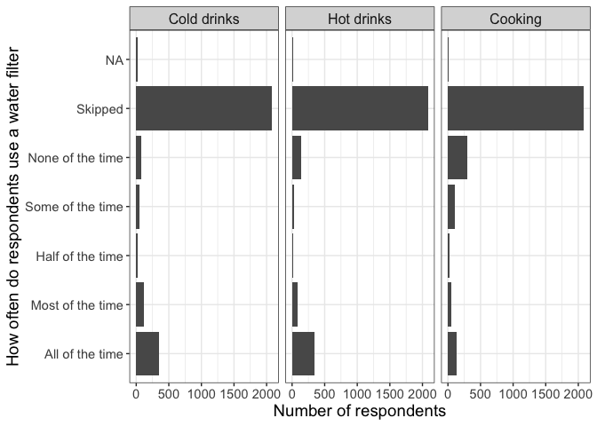
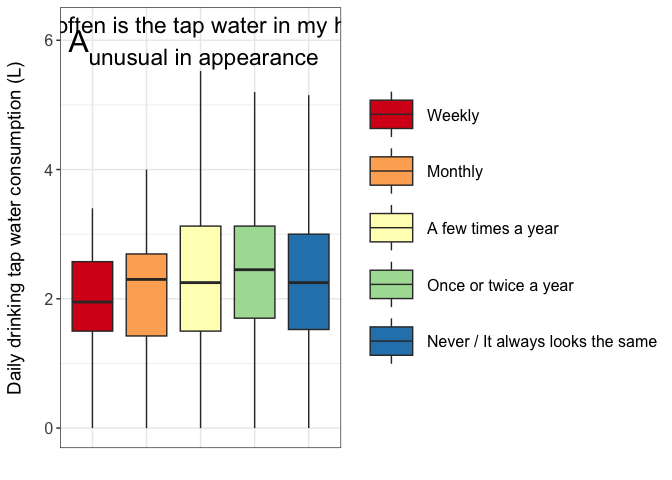

**Water Questionnaire 2 - Cleaning - Descriptives - Analysis**
================
Daniel Schillereff and Ruth CE Bowyer
2024-06-24

- [**0. About**](#0-about)
- [**1. Data**](#1-data)
- [**2. Descriptives - by question**](#2-descriptives---by-question)
  - [**2a. Figure of amount consumed in
    general**](#2a-figure-of-amount-consumed-in-general)
  - [**2b. Behaviour around water
    filtering**](#2b-behaviour-around-water-filtering)
  - [**2c. Water consumption by age**](#2c-water-consumption-by-age)
  - [**2d. Plotting drinking consumption by sex and
    ethnicity**](#2d-plotting-drinking-consumption-by-sex-and-ethnicity)
  - [**2e. Plotting consumption from cooking by
    sex**](#2e-plotting-consumption-from-cooking-by-sex)
  - [**2f. Plotting total consumption by
    sex**](#2f-plotting-total-consumption-by-sex)
  - [**2g. Water consumption for drinking by
    age**](#2g-water-consumption-for-drinking-by-age)
  - [**2h. Water consumption for drinking by sex and
    age**](#2h-water-consumption-for-drinking-by-sex-and-age)
  - [**2i. Do people who like the taste of their water drink more?
    (Question
    8)**](#2i-do-people-who-like-the-taste-of-their-water-drink-more-question-8)
  - [**2j. Do people who consider tap water to be good for health drink
    more? (Question
    7)**](#2j-do-people-who-consider-tap-water-to-be-good-for-health-drink-more-question-7)
  - [**2k. Concerns around affordability and environmental
    impact**](#2k-concerns-around-affordability-and-environmental-impact)
  - [**2l. Unusual visual appearance**](#2l-unusual-visual-appearance)

## **0. About**

This script is to clean and derive descriptive statistics from the
TwinsUK Water Consumption Questionnaire

``` r
rm(list=ls())

library(tidyverse)
library(ggplot2)
library(readxl)
library(rstatix)
library(FSA)
library(halfmoon)
library(RColorBrewer)
library(ggpubr)
```

## **1. Data**

``` r
## Define the data directory -- actual directory omitted for security
#dd <- ~/path/to/data

# Water questionnaire data 
df.q <- read_xlsx(paste0(dd,"/DS00070_WaterConsumptionStudy_Questionnaire/WaterConsumptionStudyQuestionnaire_Data.xlsx"))

#Response codes 
Responses <- read_xlsx(paste0(dd,"/DS00070_WaterConsumptionStudy_Questionnaire/WaterConsumptionStudyQuestionnaire_Data.xlsx"), sheet=2)

## Create a df with q code - row names qcode 
Qframe <- as.data.frame(t(df.q[1,]))
## Add col index for easy referencing
names(Qframe) <- "Question"
Qframe$col_index <- 1:ncol(df.q)

##Clean up df.q to remove these rows
df.q <- df.q[-1,]
df.q <- as.data.frame(df.q)


TDs <- read_excel(paste0(dd, "/TwinDetails.xlsx")) # Data on age, sex, ethnicity, zygosity 
water.consump <- read.csv(paste0(dd, "/water.consump.2024.05.07.csv")) # File derived as output from script 1.
```

## **2. Descriptives - by question**

### **2a. Figure of amount consumed in general**

``` r
qs <- df.q[c("q2_a", "q2_b", "q2_d", "q2_e")]

q2s <- as.data.frame(apply(qs,2, function(x){
  x <- as.factor(x)
  levels(x) <-  c("0.Never/Rarely", "1.Once a day", "2.Twice a day", "3.Three times a day", "4.Four times a day", "5.Five times a day", "6.Six times a day", "7.Seven times a day", NA)
  return(x)
}))


q2ss <- pivot_longer(
    q2s, 
    cols = `q2_a`:`q2_e`, 
      names_to = "Question",
      values_to = "Times_per_day", 
    cols_vary = "slowest",
      ) 

q2ss <- q2ss %>% 
    mutate(Times_per_day = Times_per_day %>% fct_relevel("7.Seven times a day", "6.Six times a day", "5.Five times a day", "4.Four times a day", "3.Three times a day", "2.Twice a day", "1.Once a day", "0.Never/Rarely"))

q2ss$Times_per_day %>% levels()
```

    ## [1] "7.Seven times a day" "6.Six times a day"   "5.Five times a day" 
    ## [4] "4.Four times a day"  "3.Three times a day" "2.Twice a day"      
    ## [7] "1.Once a day"        "0.Never/Rarely"

``` r
labels <- as_labeller(c('q2_a' = "Small glass (200 mL)", 'q2_b' = "Large glass (500 mL)", 'q2_d' = "Small mug (325 mL)", 'q2_e' = "Large mug (440 mL)"))

labels.times <- setNames(c("No response", "Rarely or never", "One", "Two", "Three", "Four", "Five", "Six", "Seven or more"), c(NA, "0.Never/Rarely", "1.Once a day", "2.Twice a day", "3.Three times a day", "4.Four times a day", "5.Five times a day", "6.Six times a day", "7.Seven times a day"))
```

``` r
p <- ggplot(q2ss, aes(y = Times_per_day)) +
    geom_bar(stat = "count") +
    theme_bw() + 
    ylab('Number of times consumed a day') +
    xlab('Number of respondents') +
    scale_y_discrete(labels = labels.times) +
    theme(axis.text=element_text(size=11), axis.title=element_text(size=14)) +
    facet_grid(. ~ Question, labeller=labeller(Question = labels), scales = "free") +
    theme(strip.text.x = element_text(size = 12))

p
```

<!-- -->

``` r
#Most and fewest drinks per day
number.glasses <- subset(qs, q2_a == "7" & q2_b == "7")
number.mugs <- subset(qs, q2_d == "3" | q2_d == "4" | q2_e == "3" | q2_e == "4")
mugs.zero <- subset(qs, q2_d > "0" | q2_e > "0")
```

### **2b. Behaviour around water filtering**

``` r
q5 <- df.q[c("q5")]
q5 <- names(df.q)[c(8)]

df.q5 <- as.data.frame(q5)

q5.yes <- sum(q5 == "1", na.rm=TRUE)
q5.no <- sum(q5 == "0", na.rm=TRUE)

#percentage who filter their water
q5.perc <- 640/2881*100

#Does the respondent filter water for cold drinks, hot drinks or when cooking?
q6 <- df.q[c("q6_a", "q6_b", "q6_c")]

sum(q6 == "999906", na.rm=TRUE)
```

    ## [1] 179

``` r
q6s <- as.data.frame(apply(q6,2, function(x){
  x <- as.factor(x)
  levels(x) <-  c("None of the time", "Some of the time", "Half of the time", "Most of the time", "All of the time", NA, "Skipped")
  return(x)
}))

sum(q6s == "All of the time", na.rm=TRUE)
```

    ## [1] 861

``` r
q6ss <- pivot_longer(
    q6s, 
    cols = `q6_a`:`q6_c`, 
      names_to = "Question",
      values_to = "How_often", 
    cols_vary = "slowest",
      ) 

q6ss <- q6ss %>% 
    mutate(How_often = How_often %>% fct_relevel("All of the time", "Most of the time", "Half of the time", "Some of the time", "None of the time"))

q6ss$How_often %>% levels()
```

    ## [1] "All of the time"  "Most of the time" "Half of the time" "Some of the time"
    ## [5] "None of the time" "Skipped"

``` r
labels <- as_labeller(c('q6_a' = "Cold drinks", 'q6_b' = "Hot drinks", 'q6_c' = "Cooking"))
```

``` r
p2 <- ggplot(q6ss, aes(y = How_often)) +
    geom_bar(stat = "count") +
    theme_bw() + 
    ylab('How often do respondents use a water filter') +
    xlab('Number of respondents') +
    theme(axis.text=element_text(size=11), axis.title=element_text(size=14)) +
    facet_grid(. ~ Question, labeller=labeller(Question = labels), scales = "free") +
    theme(strip.text.x = element_text(size = 12))

p2
```

<!-- -->

### **2c. Water consumption by age**

``` r
# Subset water.consump to remove drinking and cooking that are >3 sd from the mean
remove.outliers.twocol <- function(df, col1, col2) {
  # Calculate means and standard deviations
  mean_col1 <- mean(df[, col1], na.rm = TRUE)
  sd_col1 <- sd(df[, col1], na.rm = TRUE)
  mean_col2 <- mean(df[, col2], na.rm = TRUE)
  sd_col2 <- sd(df[, col2], na.rm = TRUE)
  
  # Define lower and upper bounds for both columns
  lower_bound_col1 <- mean_col1 - 3 * sd_col1
  upper_bound_col1 <- mean_col1 + 3 * sd_col1
  lower_bound_col2 <- mean_col2 - 3 * sd_col2
  upper_bound_col2 <- mean_col2 + 3 * sd_col2
  
  # Filter the dataframe (rows within both columns' bounds)
  filtered_df <- df[
    (df[, col1] >= lower_bound_col1 & df[, col1] <= upper_bound_col1) &
    (df[, col2] >= lower_bound_col2 & df[, col2] <= upper_bound_col2),
    ]
  
  # Return the filtered dataframe
  return(filtered_df)
}

water.consump.filtered.1 <- remove.outliers.twocol(water.consump, "total.drink.L", "total.cooking.L")

water.c.demo <- merge(water.consump.filtered.1, TDs, by.x=c("study_no"), by.y = "ParticipantID")
water.c.demo$age <- 2022 - water.c.demo$YearOfBirth

water.c.demo$age.gr <- ifelse(water.c.demo$age>=45&water.c.demo$age<=65, "2. 45 - 65",
                              ifelse(water.c.demo$age>65, "3.Over 65", "1. Under 45"))

### 
dpt <- water.c.demo %>% 
  summarise(n=length(age),
            AGE.Mean = mean(age, na.rm = T),
            AGE.SD = sd(age, na.rm = T),
            SEX.n.Fem = sum(SEX=="F",na.rm = T),
            SEX.Perc.Fem = sum(SEX=="F",na.rm = T)/length(SEX)*100,
            ZYG.n.MZ = sum(ACTUAL_ZYGOSITY=="MZ",na.rm = T),
            ZYG.Perc.MZ = sum(ACTUAL_ZYGOSITY=="MZ",na.rm=T)/length(ACTUAL_ZYGOSITY)*100,
            ETH.n.White = sum(Ethnic_Origin=="White",na.rm = T),
            ETH.Perc.White = sum(Ethnic_Origin=="White",na.rm = T)/length(Ethnic_Origin)*100)
      

dpt2 <- as.data.frame(t(dpt))

dpt2  
```

    ##                        V1
    ## n              2710.00000
    ## AGE.Mean         61.28893
    ## AGE.SD           14.71981
    ## SEX.n.Fem      2415.00000
    ## SEX.Perc.Fem     89.11439
    ## ZYG.n.MZ       1706.00000
    ## ZYG.Perc.MZ      62.95203
    ## ETH.n.White    2503.00000
    ## ETH.Perc.White   92.36162

``` r
#descriptive stats of daily water consumption for everyone who drinks more than 0 litres of water
total.drink.L.over0 <- subset(water.c.demo, water.c.demo$total.drink.L > 0)
dpt3 <- total.drink.L.over0 %>% 
  summarise(n=length(age),
            Water.Mean = mean(total.drink.L, na.rm = T),
            Water.Median = median(total.drink.L, na.rm = T),
            Water.SD = sd(total.drink.L, na.rm = T),
            Water.Min = min(total.drink.L, na.rm = T),
            Water.Max = max(total.drink.L, na.rm = T))

dpt3
```

    ##      n Water.Mean Water.Median Water.SD Water.Min Water.Max
    ## 1 2623   2.382482        2.325 1.075812       0.2      5.95

``` r
#Hot drink consumption by sex and age
total.hot.L.F <- subset(water.c.demo, water.c.demo$SEX == "F")
median(total.hot.L.F$total.hot.drink.L)
```

    ## [1] 1.25

``` r
mean(total.hot.L.F$total.hot.drink.L)
```

    ## [1] 1.282453

``` r
total.hot.L.M <- subset(water.c.demo, water.c.demo$SEX == "M")
median(total.hot.L.M$total.hot.drink.L)
```

    ## [1] 1.125

``` r
mean(total.hot.L.M$total.hot.drink.L)
```

    ## [1] 1.176695

``` r
total.hot.L.over65 <- subset(water.c.demo, water.c.demo$age.gr == "3.Over 65")
median(total.hot.L.over65$total.hot.drink.L)
```

    ## [1] 1.5

``` r
mean(total.hot.L.over65$total.hot.drink.L)
```

    ## [1] 1.391962

``` r
total.hot.L.45.65 <- subset(water.c.demo, water.c.demo$age.gr == "2. 45 - 65")
median(total.hot.L.45.65$total.hot.drink.L)
```

    ## [1] 1.375

``` r
mean(total.hot.L.45.65$total.hot.drink.L)
```

    ## [1] 1.317629

``` r
total.hot.L.under45 <- subset(water.c.demo, water.c.demo$age.gr == "1. Under 45")
median(total.hot.L.under45$total.hot.drink.L)
```

    ## [1] 0.75

``` r
mean(total.hot.L.under45$total.hot.drink.L)
```

    ## [1] 0.7943075

### **2d. Plotting drinking consumption by sex and ethnicity**

``` r
total.drink.L.F <- subset(water.c.demo, SEX == "F")
median(total.drink.L.F$total.drink.L)
```

    ## [1] 2.275

``` r
total.drink.L.M <- subset(water.c.demo, SEX == "M")
median(total.drink.L.M$total.drink.L)
```

    ## [1] 2.2

``` r
#Sex as a violin plot. Updated medians to reflect 3 sd filtered values
labels.sex <- setNames(c("Female", "Male", "NA"), c("F", "M", NA))

pp3 <- ggplot(water.c.demo, aes(SEX, total.drink.L, fill = SEX)) + geom_violin() + theme_bw() + scale_y_continuous(limits = c(0, 6.2)) + scale_x_discrete(labels = labels.sex) + ylab("Daily water consumption from drinking (L)") + xlab("") + 
  scale_fill_brewer(palette = "Dark2") +
  annotate("text", x = 0.5, y = 6, label = c("A"), colour = "black", size = 8) +
  theme(legend.position="none") +
  theme(axis.text=element_text(size=14), axis.title=element_text(size=14)) +
  geom_segment(aes(x = 0.9, y = 2.275, xend = 1.1, yend = 2.275, linewidth = 1, colour = "#cc5500")) + geom_segment(aes(x = 1.9, y = 2.2, xend = 2.1, yend = 2.2, linewidth = 1, colour = "#006400")) + geom_hline(yintercept = 2.7, linetype="dashed")  + geom_hline(yintercept = 3.7, linetype="dashed") +  
  annotate("text", x = c(1.45, 2.4), y = c(0.75, 5.5), label = c("Recommended \n daily intake \n for women \n (2.7 L)", "Recommended \n daily intake \n for men  \n (3.7 L)")) +
  annotate('curve',x = 1.25,y = 1.42, yend = 2.65, xend = 1.2, linewidth = 0.8, curvature = -0.4, arrow = arrow(length = unit(0.5, 'cm'))  ) +
  annotate('curve', x = 2.45,y = 4.8, yend = 3.8, xend = 2.4, linewidth = 0.8, curvature = -0.4, arrow = arrow(length = unit(0.5, 'cm'))  )

pp3
```

<!-- -->

``` r
pairwise.wilcox.test(water.c.demo$total.drink.L, water.c.demo$SEX)
```

    ## 
    ##  Pairwise comparisons using Wilcoxon rank sum test with continuity correction 
    ## 
    ## data:  water.c.demo$total.drink.L and water.c.demo$SEX 
    ## 
    ##   F    
    ## M 0.004
    ## 
    ## P value adjustment method: holm

``` r
#Drinking consumption by ethnicity
labels.ethnicity <- setNames(c("Asian British", "Black British", "Mixed Ethnicity", "Other Ethnic Group", "White", "NA"), c("Asian_AsianBritish", "Black_BlackBritish", "Other_Ethnic_Group", "Mixed_Ethnic_Group", "White", NA))
```

``` r
p4 <- ggplot(water.c.demo, aes(Ethnic_Origin, total.drink.L, fill=Ethnic_Origin)) + geom_boxplot() + theme_bw() + 
  scale_x_discrete(labels = labels.ethnicity) + ylab("Daily water consumption for drinking (L)") + xlab("") + 
  scale_fill_brewer(palette = "Set2") +
  theme(legend.position="none")

p4
```

<!-- -->

``` r
kruskal.test(total.drink.L ~ Ethnic_Origin,
  data = water.c.demo
)
```

    ## 
    ##  Kruskal-Wallis rank sum test
    ## 
    ## data:  total.drink.L by Ethnic_Origin
    ## Kruskal-Wallis chi-squared = 5.4605, df = 4, p-value = 0.2432

``` r
dunnTest(total.drink.L ~ Ethnic_Origin,
  data = water.c.demo,
  method = "holm"
  )
```

    ## Warning: Ethnic_Origin was coerced to a factor.

    ## Warning: Some rows deleted from 'x' and 'g' because missing data.

    ## Dunn (1964) Kruskal-Wallis multiple comparison

    ##   p-values adjusted with the Holm method.

    ##                                 Comparison          Z    P.unadj     P.adj
    ## 1  Asian_AsianBritish - Black_BlackBritish  0.4489393 0.65347545 1.0000000
    ## 2  Asian_AsianBritish - Mixed_Ethnic_Group -0.4104532 0.68147356 1.0000000
    ## 3  Black_BlackBritish - Mixed_Ethnic_Group -0.9158031 0.35977016 1.0000000
    ## 4  Asian_AsianBritish - Other_Ethnic_Group -0.3768885 0.70625650 1.0000000
    ## 5  Black_BlackBritish - Other_Ethnic_Group -0.6726698 0.50115741 1.0000000
    ## 6  Mixed_Ethnic_Group - Other_Ethnic_Group -0.1299189 0.89663057 0.8966306
    ## 7               Asian_AsianBritish - White -1.1563360 0.24754375 1.0000000
    ## 8               Black_BlackBritish - White -1.9063091 0.05661012 0.5661012
    ## 9               Mixed_Ethnic_Group - White -0.7296140 0.46562617 1.0000000
    ## 10              Other_Ethnic_Group - White -0.1854146 0.85290385 1.0000000

``` r
#Drinking consumption by ethnicity: White vs racial minoritised in the UK
water.c.demo$Ethnic_Origin_Simple <- water.c.demo$Ethnic_Origin
water.c.demo$Ethnic_Origin_Simple <- recode(water.c.demo$Ethnic_Origin_Simple, "Asian_AsianBritish" = 'Racially minoritised (in the UK)', 
                                       "Black_BlackBritish" = 'Racially minoritised (in the UK)',
                                       "Mixed_Ethnic_Group" = 'Racially minoritised (in the UK)', 
                                        "Other_Ethnic_Group" = "Racially minoritised (in the UK)")

water.c.demo.noNA <- subset(water.c.demo, !is.na(Ethnic_Origin_Simple)) 
```

``` r
pp4 <- ggplot(water.c.demo.noNA, aes(Ethnic_Origin_Simple, total.drink.L, fill=Ethnic_Origin_Simple)) + geom_boxplot(outlier.shape = NA) + theme_bw() + scale_y_continuous(limits = c(0, 6.2)) + scale_x_discrete(labels = labels.ethnicity) + ylab("Daily water consumption from drinking (L)") + xlab("") + 
  scale_fill_brewer(palette = "Dark2") +
  annotate("text", x = 0.5, y = 6, label = c("B"), colour = "black", size = 8) +
  theme(legend.position="none") +
  theme(axis.text=element_text(size=14), axis.title=element_text(size=14)) 
```

``` r
total.drink.L.White <- subset(water.c.demo.noNA, Ethnic_Origin_Simple == "White")
median(total.drink.L.White$total.drink.L)
```

    ## [1] 2.275

``` r
total.drink.L.RM <- subset(water.c.demo.noNA, Ethnic_Origin_Simple == "Racially minoritised (in the UK)")
median(total.drink.L.RM$total.drink.L)
```

    ## [1] 1.875

``` r
#Ethnicity as a violin plot. Median adjusted to reflect 3 sd filtering
pp4 <- ggplot(water.c.demo.noNA, aes(Ethnic_Origin_Simple, total.drink.L, fill=Ethnic_Origin_Simple)) + geom_violin() + theme_bw() + scale_y_continuous(limits = c(0, 6.2)) + scale_x_discrete(labels = labels.ethnicity) + ylab("Daily water consumption from drinking (L)") + xlab("") + geom_segment(aes(x = 0.9, y = 1.875, xend = 1.1, yend = 1.875, linewidth = 1, colour = "#cc5500")) + geom_segment(aes(x = 1.9, y = 2.275, xend = 2.1, yend = 2.275, linewidth = 1, colour = "#006400")) + 
  scale_fill_brewer(palette = "Dark2") +
  annotate("text", x = 0.5, y = 6, label = c("B"), colour = "black", size = 8) +
  theme(legend.position="none") +
  theme(axis.text=element_text(size=14), axis.title=element_text(size=14)) 

pp4
```

<!-- -->

``` r
pairwise.wilcox.test(water.c.demo$total.drink.L, water.c.demo$Ethnic_Origin_Simple)
```

    ## 
    ##  Pairwise comparisons using Wilcoxon rank sum test with continuity correction 
    ## 
    ## data:  water.c.demo$total.drink.L and water.c.demo$Ethnic_Origin_Simple 
    ## 
    ##       Racially minoritised (in the UK)
    ## White 0.035                           
    ## 
    ## P value adjustment method: holm

``` r
stat.test <- water.c.demo %>% 
  wilcox_test(total.drink.L ~ Ethnic_Origin_Simple) %>%
  add_significance()
stat.test
```

    ## # A tibble: 1 × 9
    ##   .y.           group1     group2    n1    n2 statistic     p p.adj p.adj.signif
    ##   <chr>         <chr>      <chr>  <int> <int>     <dbl> <dbl> <dbl> <chr>       
    ## 1 total.drink.L Racially … White     69  2503    73508. 0.035 0.035 *

### **2e. Plotting consumption from cooking by sex**

``` r
total.cooking.L.noNA <- subset(water.c.demo, !is.na(total.cooking.L)) 

total.cooking.L.F <- subset(total.cooking.L.noNA, SEX == "F")
median(total.cooking.L.F$total.cooking.L)
```

    ## [1] 0.1

``` r
mean(total.cooking.L.F$total.cooking.L)
```

    ## [1] 0.0911646

``` r
total.cook.L.M <- subset(total.cooking.L.noNA, SEX == "M")
median(total.cook.L.M$total.cooking.L)
```

    ## [1] 0.1

``` r
mean(total.cook.L.M$total.cooking.L)
```

    ## [1] 0.09080508

### **2f. Plotting total consumption by sex**

``` r
total.consump.L.noNA <- subset(water.c.demo, !is.na(total.consump.L)) 

total.consump.L.F <- subset(total.consump.L.noNA, SEX == "F")
median(total.consump.L.F$total.consump.L)
```

    ## [1] 2.4

``` r
mean(total.consump.L.F$total.consump.L)
```

    ## [1] 2.419995

``` r
total.consump.L.M <- subset(total.consump.L.noNA, SEX == "M")
median(total.consump.L.M$total.consump.L)
```

    ## [1] 2.25

``` r
mean(total.consump.L.M$total.consump.L)
```

    ## [1] 2.209873

``` r
#Total consumption by sex as a violin plot. Updated medians for 3 sd filtered values. 
labels.sex <- setNames(c("Female", "Male", "NA"), c("F", "M", NA))

p6 <- ggplot(water.c.demo, aes(SEX, total.consump.L, fill = SEX)) + geom_violin() + theme_bw() + scale_y_continuous(limits = c(0, 6.2)) + scale_x_discrete(labels = labels.sex) + ylab("Total daily tap water consumption within the home (L)") + xlab("") + 
  scale_fill_brewer(palette = "Dark2") +
  annotate("text", x = 0.5, y = 6, label = c("C"), colour = "black", size = 8) +
  theme(legend.position="none") +
  theme(axis.text=element_text(size=14), axis.title=element_text(size=14)) +
  geom_segment(aes(x = 0.9, y = 2.4, xend = 1.1, yend = 2.4, linewidth = 1, colour = "#cc5500")) + geom_segment(aes(x = 1.9, y = 2.25, xend = 2.1, yend = 2.25, linewidth = 1, colour = "#006400")) + geom_hline(yintercept = 2.7, linetype="dashed")  + geom_hline(yintercept = 3.7, linetype="dashed") +  
  annotate("text", x = c(1.45, 2.4), y = c(0.75, 5.5), label = c("Recommended \n daily intake \n for women \n (2.7 L)", "Recommended \n daily intake \n for men  \n (3.7 L)")) +
  annotate('curve',x = 1.25,y = 1.42, yend = 2.65, xend = 1.2, linewidth = 0.8, curvature = -0.4, arrow = arrow(length = unit(0.5, 'cm'))  ) +
  annotate('curve', x = 2.45,y = 4.8, yend = 3.8, xend = 2.4, linewidth = 0.8, curvature = -0.4, arrow = arrow(length = unit(0.5, 'cm'))  )

p6
```

<!-- -->

``` r
#Percentage of males and females who consume at home more than their respective recommended daily intake
#Female
total.consump.L.female <- subset(water.c.demo, water.c.demo$SEX == "F")
dim(total.consump.L.female)
```

    ## [1] 2415   15

``` r
sum(total.consump.L.female$total.consump.L < "2.7", na.rm=TRUE) #US National Academy value
```

    ## [1] 1470

``` r
sum(total.consump.L.female$total.consump.L < "2", na.rm=TRUE) #EU Food Safety Authority value
```

    ## [1] 852

``` r
100-((727/2571)*100)
```

    ## [1] 71.72306

``` r
100-((364/2571)*100)
```

    ## [1] 85.84208

``` r
total.consump.L.male <- subset(water.c.demo, water.c.demo$SEX == "M")
dim(total.consump.L.male)
```

    ## [1] 295  15

``` r
sum(total.consump.L.male$total.consump.L < "3.7", na.rm=TRUE) #US National Academy value
```

    ## [1] 270

``` r
sum(total.consump.L.male$total.consump.L < "2.5", na.rm=TRUE) #EU Food Safety Authority value
```

    ## [1] 179

``` r
100-((182/310)*100)
```

    ## [1] 41.29032

``` r
100-((89/310)*100)
```

    ## [1] 71.29032

### **2g. Water consumption for drinking by age**

``` r
 ggplot(water.c.demo, aes(age.gr, total.drink.L, fill=age.gr)) + geom_boxplot() + theme_minimal() + 
   ylab("Daily water consumption (L)") + xlab("") + scale_fill_brewer(palette = "Set2")
```

<!-- -->

``` r
pairwise.wilcox.test(water.c.demo$total.drink.L, water.c.demo$age.gr)
```

    ## 
    ##  Pairwise comparisons using Wilcoxon rank sum test with continuity correction 
    ## 
    ## data:  water.c.demo$total.drink.L and water.c.demo$age.gr 
    ## 
    ##            1. Under 45 2. 45 - 65
    ## 2. 45 - 65 0.0042      -         
    ## 3.Over 65  0.0042      0.7203    
    ## 
    ## P value adjustment method: holm

``` r
pairwise.wilcox.test(water.c.demo$total.consump.L, water.c.demo$age.gr)
```

    ## 
    ##  Pairwise comparisons using Wilcoxon rank sum test with continuity correction 
    ## 
    ## data:  water.c.demo$total.consump.L and water.c.demo$age.gr 
    ## 
    ##            1. Under 45 2. 45 - 65
    ## 2. 45 - 65 0.0052      -         
    ## 3.Over 65  0.0052      0.7967    
    ## 
    ## P value adjustment method: holm

### **2h. Water consumption for drinking by sex and age**

``` r
p5 <- ggplot(water.c.demo, aes(age.gr, total.drink.L, fill=SEX)) + geom_boxplot(outlier.shape = NA) + theme_bw() +     scale_y_continuous(limits = c(-0.6, 6.5)) +
  xlab("Daily tap water consumption for drinking (L)") +
  ylab("Daily water consumption (L)") + xlab("") + scale_fill_brewer(palette = "Dark2") +
  theme(axis.text=element_text(size=12), axis.title=element_text(size=14)) +
  theme(legend.position = c(0.1, 0.85), legend.title = element_blank(), legend.key.size = unit(1.5, "cm"), legend.text = element_text(size = 12)) +
 stat_compare_means(aes(label = paste0("p = ", ..p.format..)),
                     method = "wilcox.test", label.y = -0.5)
```

    ## Warning: A numeric `legend.position` argument in `theme()` was deprecated in ggplot2
    ## 3.5.0.
    ## ℹ Please use the `legend.position.inside` argument of `theme()` instead.
    ## This warning is displayed once every 8 hours.
    ## Call `lifecycle::last_lifecycle_warnings()` to see where this warning was
    ## generated.

``` r
p5
```

<!-- -->

``` r
total.drink.L.over65 <- subset(water.c.demo, water.c.demo$age.gr == "3.Over 65")
total.drink.L.45.65 <- subset(water.c.demo, water.c.demo$age.gr == "2. 45 - 65")
total.drink.L.under45 <- subset(water.c.demo, water.c.demo$age.gr == "1. Under 45")

pairwise.wilcox.test(total.drink.L.over65$total.drink.L, total.drink.L.over65$SEX)
```

    ## 
    ##  Pairwise comparisons using Wilcoxon rank sum test with continuity correction 
    ## 
    ## data:  total.drink.L.over65$total.drink.L and total.drink.L.over65$SEX 
    ## 
    ##   F     
    ## M 0.0072
    ## 
    ## P value adjustment method: holm

``` r
pairwise.wilcox.test(total.drink.L.45.65$total.drink.L, total.drink.L.45.65$SEX)
```

    ## 
    ##  Pairwise comparisons using Wilcoxon rank sum test with continuity correction 
    ## 
    ## data:  total.drink.L.45.65$total.drink.L and total.drink.L.45.65$SEX 
    ## 
    ##   F    
    ## M 0.038
    ## 
    ## P value adjustment method: holm

``` r
pairwise.wilcox.test(total.drink.L.under45$total.drink.L, total.drink.L.under45$SEX)
```

    ## 
    ##  Pairwise comparisons using Wilcoxon rank sum test with continuity correction 
    ## 
    ## data:  total.drink.L.under45$total.drink.L and total.drink.L.under45$SEX 
    ## 
    ##   F   
    ## M 0.55
    ## 
    ## P value adjustment method: holm

``` r
pairwise.wilcox.test(water.c.demo$total.drink.L, water.c.demo$SEX)
```

    ## 
    ##  Pairwise comparisons using Wilcoxon rank sum test with continuity correction 
    ## 
    ## data:  water.c.demo$total.drink.L and water.c.demo$SEX 
    ## 
    ##   F    
    ## M 0.004
    ## 
    ## P value adjustment method: holm

### **2i. Do people who like the taste of their water drink more? (Question 8)**

``` r
#This creates a new master dataframe that is filtered by 3 sd drinking and cooking values
df.q.filt <- merge(df.q, water.c.demo, by.x = "ParticipantID", by.y = "study_no")


q7_8 <- as.data.frame(apply(df.q.filt[c("q7" , "q8")],2,function(x){
  x <- as.factor(x)
  levels(x) <- c("1. Strongly disagree", "2. Disgree", "3. Neither agree/disagree", "4. Agree", "5. Strongly Agree", NA)
  return(x)
}))

q5.filt <- df.q.filt[c("q5")]

water.c.demo <- cbind(water.c.demo, q7_8, q5.filt)


#Do people who like their water drink more?
p7 <- ggplot(subset(water.c.demo, !is.na(q8)), aes(q8, total.drink.L, fill=q8)) + geom_boxplot(outlier.shape = NA) + theme_bw() +     scale_y_continuous(limits = c(0, 6.4)) +
  ylab("Daily water consumption (L)") + xlab("") + scale_fill_brewer(palette = "Spectral", labels = c("Strongly disagree", "Disagree", "Neither agree nor disagree", "Agree", "Strongly Agree", NA)) +  theme(axis.text.x=element_blank(), axis.ticks.x=element_blank()) +
  theme(axis.title.y = element_text(margin = margin(r=15))) +
  theme(axis.text=element_text(size=12), axis.title=element_text(size=14)) +
  theme(legend.title = element_blank(), legend.key.size = unit(1.5, "cm"), legend.text = element_text(size = 12)) +
  annotate("text", x = 3, y = 6.2, label = c("I like the taste of the \n unfiltered tap water in my home"), size = 6) +   annotate("text", x = 0.75, y = 6.2, label = c("A"), colour = "black", size = 8)

p7
```

<!-- -->

``` r
pairwise.wilcox.test(water.c.demo$total.drink.L, water.c.demo$q8)
```

    ## 
    ##  Pairwise comparisons using Wilcoxon rank sum test with continuity correction 
    ## 
    ## data:  water.c.demo$total.drink.L and water.c.demo$q8 
    ## 
    ##                           1. Strongly disagree 2. Disgree
    ## 2. Disgree                0.79870              -         
    ## 3. Neither agree/disagree 0.10269              0.04520   
    ## 4. Agree                  0.00679              0.00021   
    ## 5. Strongly Agree         0.00042              4.6e-06   
    ##                           3. Neither agree/disagree 4. Agree
    ## 2. Disgree                -                         -       
    ## 3. Neither agree/disagree -                         -       
    ## 4. Agree                  0.05416                   -       
    ## 5. Strongly Agree         0.00140                   0.12229 
    ## 
    ## P value adjustment method: holm

``` r
kruskal.test(total.drink.L ~ q8,
  data = water.c.demo
)
```

    ## 
    ##  Kruskal-Wallis rank sum test
    ## 
    ## data:  total.drink.L by q8
    ## Kruskal-Wallis chi-squared = 39.713, df = 4, p-value = 4.963e-08

``` r
dunnTest(total.drink.L ~ q8,
  data = water.c.demo,
  method = "holm"
  )
```

    ## Warning: q8 was coerced to a factor.

    ## Warning: Some rows deleted from 'x' and 'g' because missing data.

    ## Dunn (1964) Kruskal-Wallis multiple comparison

    ##   p-values adjusted with the Holm method.

    ##                                          Comparison          Z      P.unadj
    ## 1                 1. Strongly disagree - 2. Disgree -0.1262229 8.995555e-01
    ## 2  1. Strongly disagree - 3. Neither agree/disagree -2.0650514 3.891813e-02
    ## 3            2. Disgree - 3. Neither agree/disagree -2.5675876 1.024089e-02
    ## 4                   1. Strongly disagree - 4. Agree -3.3029943 9.565833e-04
    ## 5                             2. Disgree - 4. Agree -4.2322332 2.313823e-05
    ## 6              3. Neither agree/disagree - 4. Agree -2.4468205 1.441226e-02
    ## 7          1. Strongly disagree - 5. Strongly Agree -4.1535246 3.273930e-05
    ## 8                    2. Disgree - 5. Strongly Agree -5.0810114 3.754306e-07
    ## 9     3. Neither agree/disagree - 5. Strongly Agree -3.7001453 2.154760e-04
    ## 10                     4. Agree - 5. Strongly Agree -1.8543441 6.368995e-02
    ##           P.adj
    ## 1  8.995555e-01
    ## 2  1.167544e-01
    ## 3  5.120445e-02
    ## 4  5.739500e-03
    ## 5  2.082441e-04
    ## 6  5.764904e-02
    ## 7  2.619144e-04
    ## 8  3.754306e-06
    ## 9  1.508332e-03
    ## 10 1.273799e-01

``` r
#Calculating the numbers
strongly.dislike.water <- subset(water.c.demo, q8 == "1. Strongly disagree")
dislike.water <- subset(water.c.demo, q8 == "2. Disgree")
like.water <- subset(water.c.demo, q8 == "4. Agree")
strongly.like.water <- subset(water.c.demo, q8 == "5. Strongly Agree") 

Water.Median.1 <- median(strongly.dislike.water$total.drink.L, na.rm = T)
Water.Mean.1 <- mean(strongly.dislike.water$total.drink.L, na.rm = T)
Water.SD.1 <- sd(strongly.dislike.water$total.drink.L, na.rm = T)
Water.Median.2 <- median(dislike.water$total.drink.L, na.rm = T)
Water.Mean.2 <- mean(dislike.water$total.drink.L, na.rm = T)
Water.SD.2 <- sd(dislike.water$total.drink.L, na.rm = T)
Water.Median.3 <- median(like.water$total.drink.L, na.rm = T)
Water.Mean.3 <- mean(like.water$total.drink.L, na.rm = T)
Water.SD.3 <- sd(like.water$total.drink.L, na.rm = T)
Water.Median.4 <- median(strongly.like.water$total.drink.L, na.rm = T)
Water.Mean.4 <- mean(strongly.like.water$total.drink.L, na.rm = T)
Water.SD.5 <- sd(strongly.like.water$total.drink.L, na.rm = T)


#Are people who don't consume any drinks from their tap more averse to the taste of their water?
qs.filt <- df.q.filt[c("q2_a", "q2_b", "q2_d", "q2_e")]

number.drinks <- cbind(water.c.demo, qs.filt)

zero.drinks <- subset(number.drinks, q2_a == "0" & q2_b == "0" & q2_d == "0" & q2_e == "0")
some.drinks <- subset(number.drinks, q2_a > "0" | q2_b > "0" | q2_d > "0" | q2_e > "0")

s1 <- sum(zero.drinks$q8 == "1. Strongly disagree", na.rm=TRUE)
s2 <- sum(zero.drinks$q8 == "2. Disgree", na.rm=TRUE)
s3 <- sum(zero.drinks$q8 == "3. Neither agree/disagree", na.rm=TRUE)
s4 <- sum(zero.drinks$q8 == "4. Agree", na.rm=TRUE)
s5 <- sum(zero.drinks$q8 == "5. Strongly Agree", na.rm=TRUE)
s <- s1+s2+s3+s4+s5
#% disagree or strongly disagree 47%
(s1 + s2) / s * 100
```

    ## [1] 46.83544

``` r
s1 <- sum(some.drinks$q8 == "1. Strongly disagree", na.rm=TRUE)
s2 <- sum(some.drinks$q8 == "2. Disgree", na.rm=TRUE)
s3 <- sum(some.drinks$q8 == "3. Neither agree/disagree", na.rm=TRUE)
s4 <- sum(some.drinks$q8 == "4. Agree", na.rm=TRUE)
s5 <- sum(some.drinks$q8 == "5. Strongly Agree", na.rm=TRUE)
s <- s1+s2+s3+s4+s5
#% disagree or strongly disagree 14.5%
(s1 + s2) / s * 100
```

    ## [1] 14.37834

### **2j. Do people who consider tap water to be good for health drink more? (Question 7)**

``` r
#Do people who consider tap water to be good for health drink more?
p8 <- ggplot(subset(water.c.demo, !is.na(q7)), aes(q7, total.drink.L, fill=q7)) + geom_boxplot(outlier.shape = NA) + theme_bw() +     scale_y_continuous(limits = c(0, 6.4)) +
  ylab("Daily water consumption (L)") + xlab("") + scale_fill_brewer(palette = "Spectral", labels = c("Strongly disagree", "Disagree", "Neither agree nor disagree", "Agree", "Strongly Agree", NA)) +  theme(axis.text.x=element_blank(), axis.ticks.x=element_blank()) +
  theme(axis.title.y = element_text(margin = margin(r=15))) +
  theme(axis.text=element_text(size=12), axis.title=element_text(size=14)) +
  theme(legend.title = element_blank(), legend.key.size = unit(1.5, "cm"), legend.text = element_text(size = 12)) +
  annotate("text", x = 3, y = 6.2, label = c("Drinking tap water in the UK \n is good for my health"), size = 6) + 
  annotate("text", x = 0.75, y = 6.2, label = c("B"), colour = "black", size = 8)

p8
```

<!-- -->

``` r
pairwise.wilcox.test(water.c.demo$total.drink.L, water.c.demo$q7)
```

    ## 
    ##  Pairwise comparisons using Wilcoxon rank sum test with continuity correction 
    ## 
    ## data:  water.c.demo$total.drink.L and water.c.demo$q7 
    ## 
    ##                           1. Strongly disagree 2. Disgree
    ## 2. Disgree                0.7815               -         
    ## 3. Neither agree/disagree 0.3907               0.7815    
    ## 4. Agree                  0.0508               0.0663    
    ## 5. Strongly Agree         0.0043               0.0028    
    ##                           3. Neither agree/disagree 4. Agree
    ## 2. Disgree                -                         -       
    ## 3. Neither agree/disagree -                         -       
    ## 4. Agree                  0.0036                    -       
    ## 5. Strongly Agree         1.7e-07                   0.0144  
    ## 
    ## P value adjustment method: holm

``` r
kruskal.test(total.drink.L ~ q7,
  data = water.c.demo
)
```

    ## 
    ##  Kruskal-Wallis rank sum test
    ## 
    ## data:  total.drink.L by q7
    ## Kruskal-Wallis chi-squared = 44.348, df = 4, p-value = 5.433e-09

``` r
dunnTest(total.drink.L ~ q7,
  data = water.c.demo,
  method = "holm"
  )
```

    ## Warning: q7 was coerced to a factor.

    ## Warning: Some rows deleted from 'x' and 'g' because missing data.

    ## Dunn (1964) Kruskal-Wallis multiple comparison

    ##   p-values adjusted with the Holm method.

    ##                                          Comparison          Z      P.unadj
    ## 1                 1. Strongly disagree - 2. Disgree -0.3553938 7.222946e-01
    ## 2  1. Strongly disagree - 3. Neither agree/disagree -1.3672450 1.715485e-01
    ## 3            2. Disgree - 3. Neither agree/disagree -0.9943912 3.200324e-01
    ## 4                   1. Strongly disagree - 4. Agree -2.5859685 9.710582e-03
    ## 5                             2. Disgree - 4. Agree -2.3331808 1.963866e-02
    ## 6              3. Neither agree/disagree - 4. Agree -3.4543260 5.516700e-04
    ## 7          1. Strongly disagree - 5. Strongly Agree -3.6486376 2.636347e-04
    ## 8                    2. Disgree - 5. Strongly Agree -3.4979948 4.687703e-04
    ## 9     3. Neither agree/disagree - 5. Strongly Agree -5.7328290 9.876921e-09
    ## 10                     4. Agree - 5. Strongly Agree -2.9528049 3.149009e-03
    ##           P.adj
    ## 1  7.222946e-01
    ## 2  5.146456e-01
    ## 3  6.400649e-01
    ## 4  4.855291e-02
    ## 5  7.855464e-02
    ## 6  3.861690e-03
    ## 7  2.372712e-03
    ## 8  3.750162e-03
    ## 9  9.876921e-08
    ## 10 1.889406e-02

### **2k. Concerns around affordability and environmental impact**

``` r
df.q.filt <- merge(df.q, water.c.demo, by.x = "ParticipantID", by.y = "study_no")

q12_13 <- as.data.frame(apply(df.q.filt[c("q12" , "q13")],2,function(x){
  x <- as.factor(x)
  levels(x) <- c("0. Never", "1. Occasionally", "2. Sometimes", "3. Frequently", "4. Always", NA, "Fixed tariff")
  return(x)
}))


water.concerns <- cbind(water.c.demo, q12_13)


#How often
water.concerns.long <- pivot_longer(
    water.concerns, 
    cols = `q12`:`q13`, 
      names_to = "Question",
      values_to = "How_often", 
    cols_vary = "slowest",
      ) 

labels.questions <- setNames(c("Affordability", "Environmental impact"), c("q12", "q13"))

#Stacked bar chart of q12 and q13 responses
pp1 <- ggplot(water.concerns.long, aes(x = Question, fill = How_often)) + 
    geom_bar() +
    scale_fill_viridis_d(labels = c("Strongly disagree", "Disagree", "Neither agree nor disagree", "Agree", "Strongly Agree", "Fixed tariff", "")) +
    theme_bw() +
    ylab("Number of responses") +
    xlab("") +
    scale_x_discrete(labels = labels.questions) +
   guides(fill = guide_legend(title = ""))

#Percentages
pp2 <- ggplot(water.concerns.long, aes(x = Question, fill = How_often)) + 
    geom_bar(position = "fill") +
    scale_fill_viridis_d(labels = c("Strongly disagree", "Disagree", "Neither agree nor disagree", "Agree", "Strongly Agree", "Fixed tariff", "")) +
    theme_bw() +
    ylab("Number of responses (%)") +
    xlab("") +
    scale_x_discrete(labels = labels.questions) +
   guides(fill = guide_legend(title = ""))

p9 <- ggarrange(pp1, pp2, ncol = 2, nrow = 1, common.legend = TRUE)

p9
```

<!-- -->

``` r
#Question 12 - affordability vs drinking
ggplot(water.concerns, aes(q12, total.drink.L, fill=q12)) + 
  geom_boxplot(outlier.shape = NA) + theme_bw() + scale_y_continuous(limits = c(0, 6.2)) +
  ylab("Daily water consumption (L)") + xlab("") + scale_fill_brewer(palette = "Spectral") + theme(axis.text.x=element_blank(), axis.ticks.x=element_blank()) + ggtitle("Q12: Have you limited all forms of water usage in the home and garden \n because of concerns around affordability")
```

<!-- -->

``` r
#Question 13 - environmental impact vs drinking
ggplot(water.concerns, aes(q13, total.drink.L, fill=q13)) + 
  geom_boxplot(outlier.shape = NA) + theme_bw() + scale_y_continuous(limits = c(0, 6.2)) +
  ylab("Daily water consumption (L)") + xlab("") + scale_fill_brewer(palette = "Spectral") + theme(axis.text.x=element_blank(), axis.ticks.x=element_blank()) + ggtitle("Q13: Have you limited all forms of water usage in the home and garden \n because of concerns around environmental impact")
```

<!-- -->

``` r
#Question 12 - affordability vs total consumption (drinking + cooking)
ggplot(water.concerns, aes(q12, total.consump.L, fill=q12)) + 
  geom_boxplot(outlier.shape = NA) + theme_bw() + scale_y_continuous(limits = c(0, 6.2)) +
  ylab("Daily water consumption (L)") + xlab("") + scale_fill_brewer(palette = "Spectral") + theme(axis.text.x=element_blank(), axis.ticks.x=element_blank()) + ggtitle("Q12: Have you limited all forms of water usage in the home and garden \n because of concerns around affordability")
```

<!-- -->

``` r
#Question 13 - environmental impact vs total consumption (drinking + cooking)
ggplot(water.concerns, aes(q13, total.consump.L, fill=q13)) + 
  geom_boxplot(outlier.shape = NA) + theme_bw() + scale_y_continuous(limits = c(0, 6.2)) +
  ylab("Daily water consumption (L)") + xlab("") + scale_fill_brewer(palette = "Spectral") + theme(axis.text.x=element_blank(), axis.ticks.x=element_blank()) + ggtitle("Q13: Have you limited all forms of water usage in the home and garden \n because of concerns around environmental impact")
```

<!-- -->

### **2l. Unusual visual appearance**

``` r
q10 <- df.q.filt[c("q10")]

df.q10 <- as.data.frame(q10)

water.visual.concerns <- cbind(water.c.demo, q10)

q10.yes <- sum(q10 == "1", na.rm=TRUE)
q10.no <- sum(q10 == "0", na.rm=TRUE)

#percentage who consider their tap water to be unusual in appearance at least once a year
q10.perc <- (q10.yes/q10.no)*100

q10s <- as.data.frame(apply(q10,2, function(x){
  x <- as.factor(x)
  levels(x) <-  c("Never/ It always looks the same", "Once or twice a year", "A few times a year", "Monthly", "Weekly", NA)
  return(x)
}))

q10s <- q10s %>% 
    mutate(q10 = q10 %>% fct_relevel("Weekly", "Monthly", "A few times a year", "Once or twice a year",  "Never/ It always looks the same"))

ggplot(q10s, aes(y = q10)) +
    geom_bar(stat = "count") +
    theme_bw() + 
    ylab('How often do respondents consider their water to be unusual in appearance') +
    xlab('Number of respondents')  
```

<!-- -->

``` r
#Summarise how often
visual.responses <- table(q10s$q10)
total.responses <- sum(visual.responses)
visual.responses.percentages <- (visual.responses / total.responses) * 100

#How often
howoften.long <- pivot_longer(
    q10s, 
    cols = `q10`, 
      names_to = "Question",
      values_to = "How_often", 
    cols_vary = "slowest",
      ) 
```

``` r
#Stacked bar chart of q10 responses about unusual visual appearance
ppp3 <- ggplot(subset(howoften.long, !is.na(How_often)), aes(x = Question, fill = How_often)) + 
    geom_bar() +
    scale_fill_viridis_d(direction = -1, labels = c("Weekly", "Monthly", "A few times a year",  "Once or twice a year", "Never / it always looks the same")) +
    theme_bw() +
    ylab("Number of responses") +
    xlab("") +
    scale_x_discrete(labels = "How often is your water unusual in appearance") +
   guides(fill = guide_legend(title = ""))
```

``` r
#Percentages
ppp4 <- ggplot(subset(howoften.long, !is.na(How_often)), aes(x = Question, fill = How_often)) + 
    geom_bar(position = "fill") +
    scale_fill_viridis_d(direction = -1, labels = c("Strongly disagree", "Disagree", "Neither agree nor disagree", "Agree", "Strongly Agree", "Fixed tariff", "")) +
    theme_bw() +
    ylab("Number of responses (%)") +
    xlab("") +
    scale_x_discrete(labels = "How often is your water unusual in appearance") +
   guides(fill = guide_legend(title = ""))

p10 <- ggarrange(ppp3, ppp4, ncol = 2, nrow = 1, common.legend = TRUE)

p10
```

<!-- -->

``` r
water.c.demo.q10s <- cbind(water.c.demo, q10s)
water.c.demo.q10s <- as.data.frame(water.c.demo.q10s)

#Question 10 - unusual appearance vs drinking 
p11 <- ggplot(subset(water.c.demo.q10s, !is.na(q10)), aes(q10, total.drink.L, fill=q10)) + 
  geom_boxplot(outlier.shape = NA) + theme_bw() + scale_y_continuous(limits = c(0, 6.2)) +
  ylab("Daily drinking tap water consumption (L)") + xlab("") + scale_fill_brewer(palette = "Spectral", labels = c("Weekly", "Monthly", "A few times a year", "Once or twice a year", "Never / It always looks the same")) +  theme(axis.text.x=element_blank(), axis.ticks.x=element_blank()) +
  annotate("text", x = 0.75, y = 6, label = c("A"), colour = "black", size = 8) +
  theme(axis.title.y = element_text(margin = margin(r=15))) +
  theme(axis.text=element_text(size=12), axis.title=element_text(size=14)) +
  theme(legend.title = element_blank(), legend.key.size = unit(1.5, "cm"), legend.text = element_text(size = 12)) + 
  annotate("text", x = 3, y = 6, label = c("How often is the tap water in my home \n unusual in appearance"), size = 6) 

p11
```

<!-- -->

``` r
pairwise.wilcox.test(water.c.demo.q10s$total.drink.L, water.c.demo.q10s$q10)
```

    ## 
    ##  Pairwise comparisons using Wilcoxon rank sum test with continuity correction 
    ## 
    ## data:  water.c.demo.q10s$total.drink.L and water.c.demo.q10s$q10 
    ## 
    ##                                 Weekly Monthly A few times a year
    ## Monthly                         1.00   -       -                 
    ## A few times a year              1.00   1.00    -                 
    ## Once or twice a year            1.00   1.00    1.00              
    ## Never/ It always looks the same 1.00   1.00    1.00              
    ##                                 Once or twice a year
    ## Monthly                         -                   
    ## A few times a year              -                   
    ## Once or twice a year            -                   
    ## Never/ It always looks the same 0.19                
    ## 
    ## P value adjustment method: holm

``` r
kruskal.test(total.drink.L ~ q10,
  data = water.c.demo.q10s
)
```

    ## 
    ##  Kruskal-Wallis rank sum test
    ## 
    ## data:  total.drink.L by q10
    ## Kruskal-Wallis chi-squared = 7.2566, df = 4, p-value = 0.1229

``` r
dunnTest(total.drink.L ~ q10,
  data = water.c.demo.q10s,
  method = "holm"
  )
```

    ## Dunn (1964) Kruskal-Wallis multiple comparison

    ##   p-values adjusted with the Holm method.

    ##                                                Comparison          Z    P.unadj
    ## 1                            A few times a year - Monthly  0.3971565 0.69125207
    ## 2    A few times a year - Never/ It always looks the same  0.2204141 0.82554865
    ## 3               Monthly - Never/ It always looks the same -0.3383034 0.73513454
    ## 4               A few times a year - Once or twice a year -1.0510433 0.29323872
    ## 5                          Monthly - Once or twice a year -0.8443593 0.39846867
    ## 6  Never/ It always looks the same - Once or twice a year -2.3460805 0.01897201
    ## 7                             A few times a year - Weekly  1.1950695 0.23205988
    ## 8                                        Monthly - Weekly  0.6796834 0.49670493
    ## 9                Never/ It always looks the same - Weekly  1.1770516 0.23917489
    ## 10                          Once or twice a year - Weekly  1.6006168 0.10946182
    ##        P.adj
    ## 1  1.0000000
    ## 2  0.8255486
    ## 3  1.0000000
    ## 4  1.0000000
    ## 5  1.0000000
    ## 6  0.1897201
    ## 7  1.0000000
    ## 8  1.0000000
    ## 9  1.0000000
    ## 10 0.9851564

``` r
#Question 10 - unusual appearance vs total consumption (drinking + cooking)
p12 <- ggplot(subset(water.c.demo.q10s, !is.na(q10)), aes(q10, total.consump.L, fill=q10)) + 
  geom_boxplot(outlier.shape = NA) + theme_bw() + scale_y_continuous(limits = c(0, 6.2)) +
  ylab("Daily total tap water consumption (L)") + xlab("") + scale_fill_brewer(palette = "Spectral", labels = c("Weekly", "Monthly", "A few times a year", "Once or twice a year", "Never / It always looks the same")) +  theme(axis.text.x=element_blank(), axis.ticks.x=element_blank()) +
  theme(axis.title.y = element_text(margin = margin(r=15))) +
  theme(axis.text=element_text(size=12), axis.title=element_text(size=14)) +
  theme(legend.title = element_blank(), legend.key.size = unit(1.5, "cm"), legend.text = element_text(size = 12)) + 
  annotate("text", x = 3, y = 6, label = c("How often is the tap water in my home \n unusual in appearance"), size = 6) 

p12
```

<!-- -->

``` r
pairwise.wilcox.test(water.c.demo.q10s$total.consump.L, water.c.demo.q10s$q10)
```

    ## Warning in wilcox.test.default(xi, xj, paired = paired, ...): cannot compute
    ## exact p-value with ties

    ## 
    ##  Pairwise comparisons using Wilcoxon rank sum test with continuity correction 
    ## 
    ## data:  water.c.demo.q10s$total.consump.L and water.c.demo.q10s$q10 
    ## 
    ##                                 Weekly Monthly A few times a year
    ## Monthly                         1.00   -       -                 
    ## A few times a year              1.00   1.00    -                 
    ## Once or twice a year            1.00   1.00    1.00              
    ## Never/ It always looks the same 1.00   1.00    1.00              
    ##                                 Once or twice a year
    ## Monthly                         -                   
    ## A few times a year              -                   
    ## Once or twice a year            -                   
    ## Never/ It always looks the same 0.16                
    ## 
    ## P value adjustment method: holm

``` r
kruskal.test(total.consump.L ~ q10,
  data = water.c.demo.q10s
)
```

    ## 
    ##  Kruskal-Wallis rank sum test
    ## 
    ## data:  total.consump.L by q10
    ## Kruskal-Wallis chi-squared = 7.4997, df = 4, p-value = 0.1117

``` r
dunnTest(total.consump.L ~ q10,
  data = water.c.demo.q10s,
  method = "holm"
  )
```

    ## Warning: Some rows deleted from 'x' and 'g' because missing data.

    ## Dunn (1964) Kruskal-Wallis multiple comparison

    ##   p-values adjusted with the Holm method.

    ##                                                Comparison          Z    P.unadj
    ## 1                            A few times a year - Monthly  0.4304182 0.66689148
    ## 2    A few times a year - Never/ It always looks the same  0.2277150 0.81986782
    ## 3               Monthly - Never/ It always looks the same -0.3708225 0.71076974
    ## 4               A few times a year - Once or twice a year -1.0800638 0.28011375
    ## 5                          Monthly - Once or twice a year -0.8909386 0.37296210
    ## 6  Never/ It always looks the same - Once or twice a year -2.4129174 0.01582541
    ## 7                             A few times a year - Weekly  1.1540485 0.24848027
    ## 8                                        Monthly - Weekly  0.6240245 0.53261152
    ## 9                Never/ It always looks the same - Weekly  1.1319037 0.25767493
    ## 10                          Once or twice a year - Weekly  1.5684292 0.11678101
    ##        P.adj
    ## 1  1.0000000
    ## 2  0.8198678
    ## 3  1.0000000
    ## 4  1.0000000
    ## 5  1.0000000
    ## 6  0.1582541
    ## 7  1.0000000
    ## 8  1.0000000
    ## 9  1.0000000
    ## 10 1.0000000
