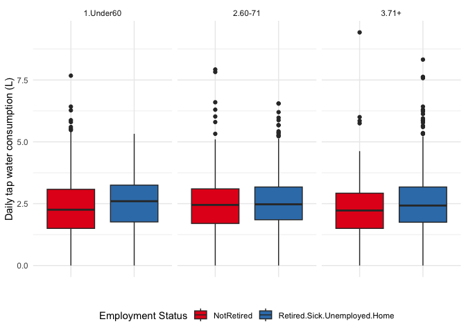

**Water Questionnaire 3 - h2 of water consumption**
================
Ruth CE Bowyer
June 24, 2024

- [**About**](#about)
- [**Data**](#data)
  - [**ACE models**](#ace-models)
  - [**ACE models stratified by retirement
    status**](#ace-models-stratified-by-retirement-status)
  - [**ACE models stratified by retirement status +
    age**](#ace-models-stratified-by-retirement-status--age)

``` r
library(mets)
library(dplyr)
library(mets)
library(ggplot2)
library(viridis)
library(readxl)
```

## **About**

A script to estimate h2 via twin (ACE) models on deciles of water
consumption

## **Data**

``` r
## Define the data directory -- actual directory omitted for security
#dd <- ~/path/to/data


TwinDetails <- read_excel(paste0(dd, "/TwinDetails.xlsx")) # Data on age, sex, ethnicity, zygosity 
water <- read.csv(paste0(dd, "/water.consump.2024.05.07.csv")) # File derived as output from script 1.

source(paste0(dd2,"/estimate.heritability.alessia.r")) ## Script to run h2 analysis via mets, thanks to Alessia Visconti, now wrapped as an R package: https://github.com/alesssia/timesaveR

df <- merge(water, TwinDetails, by.x="study_no", by.y="ParticipantID", sort=F)

### Data on employment from the TwinsUK Covid Personal Experience surveys
cope1 <- read.csv(paste0(dd3,"/TWINSUK_COPE1_v0001_20211005.csv"))

cope4 <- read.csv(paste0(dd4,"/TWINSUK_COPE4_v0001_20230201.csv"))
```

``` r
### Retirement status codes
##TWINSUK_COPE1_v0001_20211005,E97,1,Employed
##TWINSUK_COPE1_v0001_20211005,E97,2,Self-employed
##TWINSUK_COPE1_v0001_20211005,E97,3,In unpaid/ voluntary work
##TWINSUK_COPE1_v0001_20211005,E97,5,Unemployed
##TWINSUK_COPE1_v0001_20211005,E97,4,"In education at school/college/university, or in an apprenticeship"
##TWINSUK_COPE1_v0001_20211005,E97,6,Permanently sick or disabled
##TWINSUK_COPE1_v0001_20211005,E97,7,Looking after home or family
##TWINSUK_COPE1_v0001_20211005,E97,8,Retired
##TWINSUK_COPE1_v0001_20211005,E97,9,Other
##TWINSUK_COPE1_v0001_20211005,E97,999906,Question seen but not answered

cope1_employment <- cope1[c("study_no", "E97")]

## Add more from cope 4
#1  Employed
#2  Self-employed
#3  In unpaid/ voluntary work
#5  Unemployed
#6  Permanently sick or disabled
#7  Looking after home or family
#8  In education at school/college/university, or in an apprenticeship
#9  Retired
#10 Other (Please specify)
cope4_employment <- cope4[c("STUDY_ID", "Q_G_2")]
names(cope4_employment)[1] <- "study_no"

df <- left_join(df, cope1_employment, by="study_no")

df <- left_join(df, cope4_employment, by="study_no")
```

``` r
df$Employ_bin1 <- ifelse(is.na(df$E97), NA,
                           ifelse(df$E97==999906, NA,
                       ifelse(df$E97==8|df$E97==6|df$E97==5|df$E97==7, "Retired.Sick.Unemployed.Home", "NotRetired")))


df$Employ_bin2 <- ifelse(is.na(df$Q_G_2), NA,
                           ifelse(df$Q_G_2==999906, NA,
                                  ifelse(df$Q_G_2==9|df$Q_G_2==6|df$Q_G_2==7|df$Q_G_2==5, "Retired.Sick.Unemployed.Home", "NotRetired")))


table(df$Employ_bin1, df$Employ_bin2, useNA = "ifany") ### Theres a bit of difference between the two, using the latest measure if two are available
```

    ##                               
    ##                                NotRetired Retired.Sick.Unemployed.Home <NA>
    ##   NotRetired                          762                          126  159
    ##   Retired.Sick.Unemployed.Home         66                          946   76
    ##   <NA>                                303                          224  219

``` r
df$Employ_bin <- ifelse(is.na(df$Employ_bin2), df$Employ_bin1, df$Employ_bin2)
table(df$Employ_bin, useNA="ifany")
```

    ## 
    ##                   NotRetired Retired.Sick.Unemployed.Home 
    ##                         1290                         1372 
    ##                         <NA> 
    ##                          219

``` r
pairwise.wilcox.test(df$total.consump.L, df$Employ_bin)
```

    ## 
    ##  Pairwise comparisons using Wilcoxon rank sum test with continuity correction 
    ## 
    ## data:  df$total.consump.L and df$Employ_bin 
    ## 
    ##                              NotRetired
    ## Retired.Sick.Unemployed.Home 0.00035   
    ## 
    ## P value adjustment method: holm

``` r
##Create age strata
df$Agein2022 <- 2022- df$YearOfBirth


df <- subset(df, Agein2022 > 18)
age <- quantile(df$Agein2022, probs=c(1/3,2/3,1))

df$Agein2022.gr <- ifelse(df$Agein2022>=71,"3.71+",
                    ifelse(df$Agein2022>=60, "2.60-71",
                           ifelse(df$Agein2022<60, "1.Under60",NA)))


df$Agein2022.gr <- as.factor(df$Agein2022.gr)

table(df$Agein2022.gr)
```

    ## 
    ## 1.Under60   2.60-71     3.71+ 
    ##      1087       891       901

``` r
table(df$Agein2022.gr, df$Employ_bin)
```

    ##            
    ##             NotRetired Retired.Sick.Unemployed.Home
    ##   1.Under60        861                           88
    ##   2.60-71          342                          504
    ##   3.71+             85                          780

``` r
dfg <- subset(df, !is.na(Employ_bin)) #Dropping NAs for fig
ggplot(dfg, aes(Employ_bin, total.consump.L, group=Employ_bin, fill=Employ_bin)) + 
  geom_boxplot() + theme_minimal() +
  facet_wrap(.~Agein2022.gr) + 
  theme(axis.text.x=element_blank(),
        axis.ticks.x=element_blank(), 
        legend.position = "bottom") + 
  scale_fill_brewer(palette="Set1", name = "Employment Status") + 
  ylab("Daily tap water consumption (L)") + xlab("")
```

    ## Warning: Removed 106 rows containing non-finite outside the scale range
    ## (`stat_boxplot()`).

<!-- -->

Check significance between the ages and strata

``` r
i <- c("Retired.Sick.Unemployed.Home", "NotRetired")

lapply(i, function(ii){
  dfa <- subset(df, df$Employ_bin == ii)
  pairwise.wilcox.test(dfa$total.consump.L, dfa$Agein2022.gr)
  
})
```

    ## [[1]]
    ## 
    ##  Pairwise comparisons using Wilcoxon rank sum test with continuity correction 
    ## 
    ## data:  dfa$total.consump.L and dfa$Agein2022.gr 
    ## 
    ##         1.Under60 2.60-71
    ## 2.60-71 1         -      
    ## 3.71+   1         1      
    ## 
    ## P value adjustment method: holm 
    ## 
    ## [[2]]
    ## 
    ##  Pairwise comparisons using Wilcoxon rank sum test with continuity correction 
    ## 
    ## data:  dfa$total.consump.L and dfa$Agein2022.gr 
    ## 
    ##         1.Under60 2.60-71
    ## 2.60-71 0.16      -      
    ## 3.71+   0.76      0.32   
    ## 
    ## P value adjustment method: holm

``` r
### create appropriate df for ACE model in mets
table(duplicated(df$study_no))
```

    ## 
    ## FALSE 
    ##  2879

``` r
df <- subset(df, ACTUAL_ZYGOSITY!="UZ")
dupes <- subset(df, duplicated(Family_No))
df <- subset(df, Family_No %in% dupes$Family_No)

table(df$ACTUAL_ZYGOSITY)
```

    ## 
    ##   DZ   MZ 
    ##  532 1138

### **ACE models**

``` r
### Defing total consumption as decile 
  df$decvar <- as.numeric(ggplot2::cut_number(df$total.consump.L, n = 10))

  form <- formula(paste0("decvar ~ 1"))
  alltwins <- estimate.heritability(form, df, DZ="DZ", zyg="ACTUAL_ZYGOSITY", fid="Family_No")
```

``` r
alltwins$estimate.best
```

    ##   Estimate 2.5% 97.5%
    ## A       29 21.3  36.6
    ## E       71 63.4  78.7

``` r
alltwins$aics
```

    ##      ACE       AE       CE        E 
    ## 7634.994 7632.994 7644.766 7679.959

``` r
alltwins$models$ACE
```

    ##           Estimate  Std. Error Z value Pr(>|z|)
    ## decvar  5.4822e+00  8.1468e-02  67.293   <2e-16
    ## sd(A)   1.5503e+00  1.1464e-01  13.523   <2e-16
    ## sd(C)  -4.9201e-08  5.0804e-01   0.000        1
    ## sd(E)   2.4278e+00  7.0300e-02  34.535   <2e-16
    ## 
    ## MZ-pairs DZ-pairs 
    ##      528      247 
    ## 
    ## Variance decomposition:
    ##   Estimate 2.5%    97.5%  
    ## A 0.28964  0.21347 0.36581
    ## C 0.00000  0.00000 0.00000
    ## E 0.71036  0.63419 0.78653
    ## 
    ## 
    ##                          Estimate 2.5%    97.5%  
    ## Broad-sense heritability 0.28964  0.21347 0.36581
    ## 
    ##                        Estimate 2.5%    97.5%  
    ## Correlation within MZ: 0.28964  0.21177 0.36385
    ## Correlation within DZ: 0.14482  0.10654 0.18267
    ## 
    ## 'log Lik.' -3813.497 (df=4)
    ## AIC: 7634.994 
    ## BIC: 7653.605

``` r
alltwins$models$AE
```

    ##        Estimate Std. Error Z value  Pr(>|z|)
    ## decvar 5.482239   0.081468  67.293 < 2.2e-16
    ## sd(A)  1.550280   0.114641  13.523 < 2.2e-16
    ## sd(E)  2.427843   0.070300  34.535 < 2.2e-16
    ## 
    ## MZ-pairs DZ-pairs 
    ##      528      247 
    ## 
    ## Variance decomposition:
    ##   Estimate 2.5%    97.5%  
    ## A 0.28964  0.21347 0.36581
    ## E 0.71036  0.63419 0.78653
    ## 
    ## 
    ##                          Estimate 2.5%    97.5%  
    ## Broad-sense heritability 0.28964  0.21347 0.36581
    ## 
    ##                        Estimate 2.5%    97.5%  
    ## Correlation within MZ: 0.28964  0.21177 0.36385
    ## Correlation within DZ: 0.14482  0.10654 0.18267
    ## 
    ## 'log Lik.' -3813.497 (df=3)
    ## AIC: 7632.994 
    ## BIC: 7646.953

### **ACE models stratified by retirement status**

``` r
i <- c("Retired.Sick.Unemployed.Home", "NotRetired")

strata <- lapply(i, function(ii){
  dfa <- subset(df, df$Employ_bin == ii)
  form <- formula(paste0("decvar ~ 1"))
  alltwins <- estimate.heritability(form, dfa, DZ="DZ", zyg="ACTUAL_ZYGOSITY", fid="Family_No")})

names(strata) <- i
```

#### **Retired.Sick.Unemployed.Home**

``` r
strata$Retired.Sick.Unemployed.Home$estimate.best
```

    ##   Estimate 2.5% 97.5%
    ## A     19.3  5.8  32.9
    ## E     80.7 67.1  94.2

``` r
strata$Retired.Sick.Unemployed.Home$aics
```

    ##      ACE       AE       CE        E 
    ## 3006.459 3004.459 3006.677 3009.896

``` r
strata$Retired.Sick.Unemployed.Home$models$ACE
```

    ##          Estimate Std. Error Z value  Pr(>|z|)
    ## decvar 5.6447e+00 1.2262e-01 46.0334 < 2.2e-16
    ## sd(A)  1.2412e+00 2.3054e-01  5.3837 7.295e-08
    ## sd(C)  1.2447e-07 8.7177e-01  0.0000         1
    ## sd(E)  2.5349e+00 1.2023e-01 21.0844 < 2.2e-16
    ## 
    ## MZ-pairs DZ-pairs 
    ##      191      115 
    ## 
    ## Variance decomposition:
    ##   Estimate 2.5%    97.5%  
    ## A 0.19338  0.05802 0.32874
    ## C 0.00000  0.00000 0.00000
    ## E 0.80662  0.67126 0.94198
    ## 
    ## 
    ##                          Estimate 2.5%    97.5%  
    ## Broad-sense heritability 0.19338  0.05802 0.32874
    ## 
    ##                        Estimate 2.5%    97.5%  
    ## Correlation within MZ: 0.19338  0.05517 0.32431
    ## Correlation within DZ: 0.09669  0.02866 0.16382
    ## 
    ## 'log Lik.' -1499.23 (df=4)
    ## AIC: 3006.459 
    ## BIC: 3021.353

``` r
strata$Retired.Sick.Unemployed.Home$models$AE
```

    ##        Estimate Std. Error Z value  Pr(>|z|)
    ## decvar  5.64467    0.12262 46.0334 < 2.2e-16
    ## sd(A)   1.24117    0.23054  5.3838 7.292e-08
    ## sd(E)   2.53492    0.12023 21.0844 < 2.2e-16
    ## 
    ## MZ-pairs DZ-pairs 
    ##      191      115 
    ## 
    ## Variance decomposition:
    ##   Estimate 2.5%    97.5%  
    ## A 0.19338  0.05802 0.32874
    ## E 0.80662  0.67126 0.94198
    ## 
    ## 
    ##                          Estimate 2.5%    97.5%  
    ## Broad-sense heritability 0.19338  0.05802 0.32874
    ## 
    ##                        Estimate 2.5%    97.5%  
    ## Correlation within MZ: 0.19338  0.05517 0.32431
    ## Correlation within DZ: 0.09669  0.02867 0.16382
    ## 
    ## 'log Lik.' -1499.23 (df=3)
    ## AIC: 3004.459 
    ## BIC: 3015.63

#### **NotRetired**

``` r
strata$NotRetired$estimate.best
```

    ##   Estimate 2.5% 97.5%
    ## A     30.6 18.0  43.2
    ## E     69.4 56.8  82.0

``` r
strata$NotRetired$aics
```

    ##      ACE       AE       CE        E 
    ## 2457.804 2455.804 2461.049 2473.430

``` r
strata$NotRetired$models$ACE
```

    ##           Estimate  Std. Error Z value Pr(>|z|)
    ## decvar  5.2385e+00  1.4947e-01 35.0464   <2e-16
    ## sd(A)   1.6305e+00  1.9372e-01  8.4168   <2e-16
    ## sd(C)  -6.1599e-08  7.5333e-01  0.0000        1
    ## sd(E)   2.4562e+00  1.2052e-01 20.3797   <2e-16
    ## 
    ## MZ-pairs DZ-pairs 
    ##      194       53 
    ## 
    ## Variance decomposition:
    ##   Estimate 2.5%    97.5%  
    ## A 0.30588  0.17952 0.43224
    ## C 0.00000  0.00000 0.00000
    ## E 0.69412  0.56776 0.82048
    ## 
    ## 
    ##                          Estimate 2.5%    97.5%  
    ## Broad-sense heritability 0.30588  0.17952 0.43224
    ## 
    ##                        Estimate 2.5%    97.5%  
    ## Correlation within MZ: 0.30588  0.17478 0.42633
    ## Correlation within DZ: 0.15294  0.08922 0.21541
    ## 
    ## 'log Lik.' -1224.902 (df=4)
    ## AIC: 2457.804 
    ## BIC: 2471.841

``` r
strata$NotRetired$models$AE
```

    ##        Estimate Std. Error Z value  Pr(>|z|)
    ## decvar  5.23848    0.14947 35.0464 < 2.2e-16
    ## sd(A)   1.63051    0.19372  8.4168 < 2.2e-16
    ## sd(E)   2.45622    0.12052 20.3797 < 2.2e-16
    ## 
    ## MZ-pairs DZ-pairs 
    ##      194       53 
    ## 
    ## Variance decomposition:
    ##   Estimate 2.5%    97.5%  
    ## A 0.30588  0.17952 0.43224
    ## E 0.69412  0.56776 0.82048
    ## 
    ## 
    ##                          Estimate 2.5%    97.5%  
    ## Broad-sense heritability 0.30588  0.17952 0.43224
    ## 
    ##                        Estimate 2.5%    97.5%  
    ## Correlation within MZ: 0.30588  0.17478 0.42633
    ## Correlation within DZ: 0.15294  0.08922 0.21541
    ## 
    ## 'log Lik.' -1224.902 (df=3)
    ## AIC: 2455.804 
    ## BIC: 2466.332

### **ACE models stratified by retirement status + age**

``` r
i <- c("Retired.Sick.Unemployed.Home", "NotRetired")

strata2 <- lapply(i, function(ii){
  dfa <- subset(df, df$Employ_bin == ii)
  form <- formula(paste0("decvar ~ Agein2022.gr"))
  alltwins <- estimate.heritability(form, dfa, DZ="DZ", zyg="ACTUAL_ZYGOSITY", fid="Family_No")})

names(strata2) <- i
```

#### **Retired.Sick.Unemployed.Home**

``` r
strata2$Retired.Sick.Unemployed.Home$estimate.best
```

    ##   Estimate 2.5% 97.5%
    ## A       19  5.4  32.5
    ## E       81 67.5  94.6

``` r
strata2$Retired.Sick.Unemployed.Home$aics
```

    ##      ACE       AE       CE        E 
    ## 3008.623 3006.623 3008.783 3011.759

``` r
strata2$Retired.Sick.Unemployed.Home$models$ACE
```

    ##                              Estimate Std. Error Z value  Pr(>|z|)
    ## decvar                     4.8776e+00 1.0749e+00  4.5378 5.684e-06
    ## sd(A)                      1.2268e+00 2.3252e-01  5.2760 1.321e-07
    ## sd(C)                      4.3874e-07 8.6850e-01  0.0000    1.0000
    ## sd(E)                      2.5364e+00 1.2025e-01 21.0920 < 2.2e-16
    ## decvar~Agein2022.gr2.60-71 5.9005e-01 1.0940e+00  0.5393    0.5897
    ## decvar~Agein2022.gr3.71+   8.8442e-01 1.0859e+00  0.8144    0.4154
    ## 
    ## MZ-pairs DZ-pairs 
    ##      191      115 
    ## 
    ## Variance decomposition:
    ##   Estimate 2.5%    97.5%  
    ## A 0.18958  0.05396 0.32521
    ## C 0.00000  0.00000 0.00000
    ## E 0.81042  0.67479 0.94604
    ## 
    ## 
    ##                          Estimate 2.5%    97.5%  
    ## Broad-sense heritability 0.18958  0.05396 0.32521
    ## 
    ##                        Estimate 2.5%    97.5%  
    ## Correlation within MZ: 0.18958  0.05118 0.32085
    ## Correlation within DZ: 0.09479  0.02664 0.16206
    ## 
    ## 'log Lik.' -1498.311 (df=6)
    ## AIC: 3008.623 
    ## BIC: 3030.964

``` r
strata2$Retired.Sick.Unemployed.Home$models$AE
```

    ##                            Estimate Std. Error Z value  Pr(>|z|)
    ## decvar                      4.87765    1.07489  4.5378 5.684e-06
    ## sd(A)                       1.22676    0.23252  5.2760 1.321e-07
    ## sd(E)                       2.53638    0.12025 21.0920 < 2.2e-16
    ## decvar~Agein2022.gr2.60-71  0.59005    1.09403  0.5393    0.5897
    ## decvar~Agein2022.gr3.71+    0.88442    1.08592  0.8144    0.4154
    ## 
    ## MZ-pairs DZ-pairs 
    ##      191      115 
    ## 
    ## Variance decomposition:
    ##   Estimate 2.5%    97.5%  
    ## A 0.18958  0.05396 0.32521
    ## E 0.81042  0.67479 0.94604
    ## 
    ## 
    ##                          Estimate 2.5%    97.5%  
    ## Broad-sense heritability 0.18958  0.05396 0.32521
    ## 
    ##                        Estimate 2.5%    97.5%  
    ## Correlation within MZ: 0.18958  0.05118 0.32085
    ## Correlation within DZ: 0.09479  0.02664 0.16206
    ## 
    ## 'log Lik.' -1498.311 (df=5)
    ## AIC: 3006.623 
    ## BIC: 3025.241

#### **NotRetired**

``` r
strata2$NotRetired$estimate.best
```

    ##   Estimate 2.5% 97.5%
    ## A     30.4 17.7  43.1
    ## E     69.6 56.9  82.3

``` r
strata2$NotRetired$aics
```

    ##      ACE       AE       CE        E 
    ## 2461.041 2459.041 2464.200 2476.379

``` r
strata2$NotRetired$models$ACE
```

    ##                               Estimate  Std. Error Z value Pr(>|z|)
    ## decvar                      5.1698e+00  1.6863e-01 30.6569   <2e-16
    ## sd(A)                       1.6237e+00  1.9421e-01  8.3610   <2e-16
    ## sd(C)                      -2.3549e-07  7.5678e-01  0.0000   1.0000
    ## sd(E)                       2.4570e+00  1.2059e-01 20.3749   <2e-16
    ## decvar~Agein2022.gr2.60-71  3.1674e-01  3.7083e-01  0.8541   0.3930
    ## decvar~Agein2022.gr3.71+    3.0999e-01  1.3271e+00  0.2336   0.8153
    ## 
    ## MZ-pairs DZ-pairs 
    ##      194       53 
    ## 
    ## Variance decomposition:
    ##   Estimate 2.5%    97.5%  
    ## A 0.30398  0.17736 0.43059
    ## C 0.00000  0.00000 0.00000
    ## E 0.69602  0.56941 0.82264
    ## 
    ## 
    ##                          Estimate 2.5%    97.5%  
    ## Broad-sense heritability 0.30398  0.17736 0.43059
    ## 
    ##                        Estimate 2.5%    97.5%  
    ## Correlation within MZ: 0.30398  0.17264 0.42469
    ## Correlation within DZ: 0.15199  0.08814 0.21459
    ## 
    ## 'log Lik.' -1224.521 (df=6)
    ## AIC: 2461.041 
    ## BIC: 2482.098

``` r
strata2$NotRetired$models$AE
```

    ##                            Estimate Std. Error Z value Pr(>|z|)
    ## decvar                      5.16980    0.16863 30.6569   <2e-16
    ## sd(A)                       1.62375    0.19421  8.3610   <2e-16
    ## sd(E)                       2.45703    0.12059 20.3749   <2e-16
    ## decvar~Agein2022.gr2.60-71  0.31674    0.37083  0.8541   0.3930
    ## decvar~Agein2022.gr3.71+    0.30999    1.32706  0.2336   0.8153
    ## 
    ## MZ-pairs DZ-pairs 
    ##      194       53 
    ## 
    ## Variance decomposition:
    ##   Estimate 2.5%    97.5%  
    ## A 0.30398  0.17736 0.43059
    ## E 0.69602  0.56941 0.82264
    ## 
    ## 
    ##                          Estimate 2.5%    97.5%  
    ## Broad-sense heritability 0.30398  0.17736 0.43059
    ## 
    ##                        Estimate 2.5%    97.5%  
    ## Correlation within MZ: 0.30398  0.17264 0.42469
    ## Correlation within DZ: 0.15199  0.08814 0.21459
    ## 
    ## 'log Lik.' -1224.521 (df=5)
    ## AIC: 2459.041 
    ## BIC: 2476.588
