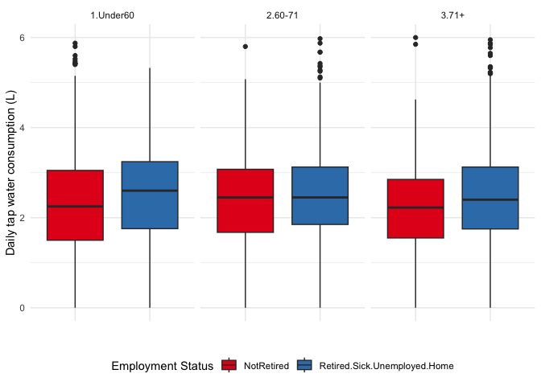

**Water Questionnaire 3 - h2 of water consumption**
================
Ruth CE Bowyer
August 06, 2025

- [**About**](#about)
- [**Data**](#data)
  - [Check how many complete twin pairs we
    have](#check-how-many-complete-twin-pairs-we-have)
  - [**ACE models**](#ace-models)
  - [**ACE models stratified by retirement
    status**](#ace-models-stratified-by-retirement-status)
  - [**ACE models stratified by retirement status +
    age**](#ace-models-stratified-by-retirement-status--age)

``` r
library(mets)
library(dplyr)
library(mets)
library(ggplot2)
library(viridis)
library(readxl)
```

## **About**

A script to estimate h2 via twin (ACE) models on deciles of water
consumption

## **Data**

``` r
## Define the data directory -- actual directory omitted for security
#dd <- ~/path/to/data


TwinDetails <- read_excel(paste0(dd, "/TwinDetails.xlsx")) # Data on age, sex, ethnicity, zygosity 
water <- read.csv(paste0(dd, "/water.consump.filter.2025.07.28.csv")) # File derived as output from script 1. This csv file has been filtered in Script 1. 

source(paste0(dd2,"/estimate.heritability.alessia.r")) ## Script to run h2 analysis via mets, thanks to Alessia Visconti, now wrapped as an R package: https://github.com/alesssia/timesaveR

df <- merge(water, TwinDetails, by.x="study_no", by.y="ParticipantID", sort=F)

### Data on employment from the TwinsUK Covid Personal Experience surveys
cope1 <- read.csv(paste0(dd3,"/TWINSUK_COPE1_v0001_20211005.csv"))

cope4 <- read.csv(paste0(dd4,"/TWINSUK_COPE4_v0001_20230201.csv"))
```

### Check how many complete twin pairs we have

``` r
table(duplicated(df$Family_No), df$ACTUAL_ZYGOSITY)
```

    ##        
    ##           DZ   MZ   UZ
    ##   FALSE  749 1199   11
    ##   TRUE   239  507    4

``` r
### Retirement status codes
##TWINSUK_COPE1_v0001_20211005,E97,1,Employed
##TWINSUK_COPE1_v0001_20211005,E97,2,Self-employed
##TWINSUK_COPE1_v0001_20211005,E97,3,In unpaid/ voluntary work
##TWINSUK_COPE1_v0001_20211005,E97,5,Unemployed
##TWINSUK_COPE1_v0001_20211005,E97,4,"In education at school/college/university, or in an apprenticeship"
##TWINSUK_COPE1_v0001_20211005,E97,6,Permanently sick or disabled
##TWINSUK_COPE1_v0001_20211005,E97,7,Looking after home or family
##TWINSUK_COPE1_v0001_20211005,E97,8,Retired
##TWINSUK_COPE1_v0001_20211005,E97,9,Other
##TWINSUK_COPE1_v0001_20211005,E97,999906,Question seen but not answered

cope1_employment <- cope1[c("study_no", "E97")]

## Add more from cope 4
#1  Employed
#2  Self-employed
#3  In unpaid/ voluntary work
#5  Unemployed
#6  Permanently sick or disabled
#7  Looking after home or family
#8  In education at school/college/university, or in an apprenticeship
#9  Retired
#10 Other (Please specify)
cope4_employment <- cope4[c("STUDY_ID", "Q_G_2")]
names(cope4_employment)[1] <- "study_no"

df <- left_join(df, cope1_employment, by="study_no")

df <- left_join(df, cope4_employment, by="study_no")
```

``` r
df$Employ_bin1 <- ifelse(is.na(df$E97), NA,
                           ifelse(df$E97==999906, NA,
                       ifelse(df$E97==8|df$E97==6|df$E97==5|df$E97==7, "Retired.Sick.Unemployed.Home", "NotRetired")))


df$Employ_bin2 <- ifelse(is.na(df$Q_G_2), NA,
                           ifelse(df$Q_G_2==999906, NA,
                                  ifelse(df$Q_G_2==9|df$Q_G_2==6|df$Q_G_2==7|df$Q_G_2==5, "Retired.Sick.Unemployed.Home", "NotRetired")))


table(df$Employ_bin1, df$Employ_bin2, useNA = "ifany") ### Theres a bit of difference between the two, using the latest measure if two are available
```

    ##                               
    ##                                NotRetired Retired.Sick.Unemployed.Home <NA>
    ##   NotRetired                          727                          114  151
    ##   Retired.Sick.Unemployed.Home         62                          893   69
    ##   <NA>                                283                          209  202

``` r
df$Employ_bin <- ifelse(is.na(df$Employ_bin2), df$Employ_bin1, df$Employ_bin2)
table(df$Employ_bin, useNA="ifany")
```

    ## 
    ##                   NotRetired Retired.Sick.Unemployed.Home 
    ##                         1223                         1285 
    ##                         <NA> 
    ##                          202

``` r
pairwise.wilcox.test(df$total.consump.L, df$Employ_bin)
```

    ## 
    ##  Pairwise comparisons using Wilcoxon rank sum test with continuity correction 
    ## 
    ## data:  df$total.consump.L and df$Employ_bin 
    ## 
    ##                              NotRetired
    ## Retired.Sick.Unemployed.Home 0.00061   
    ## 
    ## P value adjustment method: holm

``` r
##Create age strata
df$Agein2022 <- 2022- df$YearOfBirth


df <- subset(df, Agein2022 > 18)
age <- quantile(df$Agein2022, probs=c(1/3,2/3,1))

df$Agein2022.gr <- ifelse(df$Agein2022>=71,"3.71+",
                    ifelse(df$Agein2022>=60, "2.60-71",
                           ifelse(df$Agein2022<60, "1.Under60",NA)))


df$Agein2022.gr <- as.factor(df$Agein2022.gr)

table(df$Agein2022.gr)
```

    ## 
    ## 1.Under60   2.60-71     3.71+ 
    ##      1042       836       830

``` r
table(df$Agein2022.gr, df$Employ_bin)
```

    ##            
    ##             NotRetired Retired.Sick.Unemployed.Home
    ##   1.Under60        829                           82
    ##   2.60-71          319                          475
    ##   3.71+             73                          728

Save for running I-MAIHDA analysis

``` r
write.csv(df, paste0(dd, "/water.consump.filter.with.employ.tds.01.08.2025.csv"), row.names = F)
```

``` r
dfg <- subset(df, !is.na(Employ_bin)) #Dropping NAs for fig
ggplot(dfg, aes(Employ_bin, total.consump.L, group=Employ_bin, fill=Employ_bin)) + 
  geom_boxplot() + theme_minimal() +
  facet_wrap(.~Agein2022.gr) + 
  theme(axis.text.x=element_blank(),
        axis.ticks.x=element_blank(), 
        legend.position = "bottom") + 
  scale_fill_brewer(palette="Set1", name = "Employment Status") + 
  ylab("Daily tap water consumption (L)") + xlab("")
```

<!-- -->

Number of twin pairs with employment data

``` r
table(duplicated(dfg$Family_No), dfg$ACTUAL_ZYGOSITY)
```

    ##        
    ##           DZ   MZ   UZ
    ##   FALSE  707 1111    9
    ##   TRUE   212  462    4

Check significance between the ages and strata

``` r
i <- c("Retired.Sick.Unemployed.Home", "NotRetired")

lapply(i, function(ii){
  dfa <- subset(df, df$Employ_bin == ii)
  pairwise.wilcox.test(dfa$total.consump.L, dfa$Agein2022.gr)
  
})
```

    ## [[1]]
    ## 
    ##  Pairwise comparisons using Wilcoxon rank sum test with continuity correction 
    ## 
    ## data:  dfa$total.consump.L and dfa$Agein2022.gr 
    ## 
    ##         1.Under60 2.60-71
    ## 2.60-71 1         -      
    ## 3.71+   1         1      
    ## 
    ## P value adjustment method: holm 
    ## 
    ## [[2]]
    ## 
    ##  Pairwise comparisons using Wilcoxon rank sum test with continuity correction 
    ## 
    ## data:  dfa$total.consump.L and dfa$Agein2022.gr 
    ## 
    ##         1.Under60 2.60-71
    ## 2.60-71 0.36      -      
    ## 3.71+   0.74      0.41   
    ## 
    ## P value adjustment method: holm

``` r
### create appropriate df for ACE model in mets
table(duplicated(df$study_no))
```

    ## 
    ## FALSE 
    ##  2708

``` r
df <- subset(df, ACTUAL_ZYGOSITY!="UZ")

table(df$ACTUAL_ZYGOSITY)
```

    ## 
    ##   DZ   MZ 
    ##  986 1706

### **ACE models**

``` r
### Defing total consumption as decile 
  df$decvar <- as.numeric(ggplot2::cut_number(df$total.consump.L, n = 10))

  form <- formula(paste0("decvar ~ 1"))
  alltwins <- estimate.heritability(form, df, DZ="DZ", zyg="ACTUAL_ZYGOSITY", fid="Family_No")
```

``` r
alltwins$estimate.best
```

    ##   Estimate 2.5% 97.5%
    ## A     29.8 22.0  37.5
    ## E     70.2 62.5  78.0

``` r
alltwins$aics
```

    ##      ACE       AE       CE        E 
    ## 7286.655 7284.655 7297.729 7332.036

``` r
alltwins$models$ACE
```

    ##          Estimate Std. Error Z value Pr(>|z|)
    ## decvar 5.4882e+00 8.1916e-02  66.998   <2e-16
    ## sd(A)  1.5453e+00 1.1406e-01  13.548   <2e-16
    ## sd(C)  1.0664e-07 4.6773e-01   0.000        1
    ## sd(E)  2.3738e+00 7.0434e-02  33.702   <2e-16
    ## 
    ## MZ-pairs DZ-pairs 
    ##      507      238 
    ## 
    ## Variance decomposition:
    ##   Estimate 2.5%    97.5%  
    ## A 0.29764  0.21992 0.37537
    ## C 0.00000  0.00000 0.00000
    ## E 0.70236  0.62463 0.78008
    ## 
    ## 
    ##                          Estimate 2.5%    97.5%  
    ## Broad-sense heritability 0.29764  0.21992 0.37537
    ## 
    ##                        Estimate 2.5%    97.5%  
    ## Correlation within MZ: 0.29764  0.21810 0.37326
    ## Correlation within DZ: 0.14882  0.10975 0.18743
    ## 
    ## 'log Lik.' -3639.328 (df=4)
    ## AIC: 7286.655 
    ## BIC: 7305.109

``` r
alltwins$models$AE
```

    ##        Estimate Std. Error Z value  Pr(>|z|)
    ## decvar 5.488203   0.081916  66.998 < 2.2e-16
    ## sd(A)  1.545285   0.114059  13.548 < 2.2e-16
    ## sd(E)  2.373762   0.070434  33.702 < 2.2e-16
    ## 
    ## MZ-pairs DZ-pairs 
    ##      507      238 
    ## 
    ## Variance decomposition:
    ##   Estimate 2.5%    97.5%  
    ## A 0.29765  0.21992 0.37537
    ## E 0.70235  0.62463 0.78008
    ## 
    ## 
    ##                          Estimate 2.5%    97.5%  
    ## Broad-sense heritability 0.29765  0.21992 0.37537
    ## 
    ##                        Estimate 2.5%    97.5%  
    ## Correlation within MZ: 0.29765  0.21810 0.37326
    ## Correlation within DZ: 0.14882  0.10975 0.18743
    ## 
    ## 'log Lik.' -3639.328 (df=3)
    ## AIC: 7284.655 
    ## BIC: 7298.495

### **ACE models stratified by retirement status**

``` r
i <- c("Retired.Sick.Unemployed.Home", "NotRetired")

strata <- lapply(i, function(ii){
  dfa <- subset(df, df$Employ_bin == ii)
  form <- formula(paste0("decvar ~ 1"))
  alltwins <- estimate.heritability(form, dfa, DZ="DZ", zyg="ACTUAL_ZYGOSITY", fid="Family_No")})

names(strata) <- i
```

#### **Retired.Sick.Unemployed.Home**

``` r
strata$Retired.Sick.Unemployed.Home$estimate.best
```

    ##   Estimate 2.5% 97.5%
    ## A     23.4  9.7  37.1
    ## E     76.6 62.9  90.3

``` r
strata$Retired.Sick.Unemployed.Home$aics
```

    ##      ACE       AE       CE        E 
    ## 2834.743 2832.743 2835.588 2841.066

``` r
strata$Retired.Sick.Unemployed.Home$models$ACE
```

    ##          Estimate Std. Error Z value  Pr(>|z|)
    ## decvar 5.6651e+00 1.2521e-01 45.2456 < 2.2e-16
    ## sd(A)  1.3406e+00 2.1241e-01  6.3113 2.767e-10
    ## sd(C)  9.5242e-08 8.6089e-01  0.0000         1
    ## sd(E)  2.4264e+00 1.1926e-01 20.3450 < 2.2e-16
    ## 
    ## MZ-pairs DZ-pairs 
    ##      182      109 
    ## 
    ## Variance decomposition:
    ##   Estimate 2.5%    97.5%  
    ## A 0.23386  0.09679 0.37093
    ## C 0.00000  0.00000 0.00000
    ## E 0.76614  0.62907 0.90321
    ## 
    ## 
    ##                          Estimate 2.5%    97.5%  
    ## Broad-sense heritability 0.23386  0.09679 0.37093
    ## 
    ##                        Estimate 2.5%    97.5%  
    ## Correlation within MZ: 0.23386  0.09300 0.36554
    ## Correlation within DZ: 0.11693  0.04794 0.18480
    ## 
    ## 'log Lik.' -1413.372 (df=4)
    ## AIC: 2834.743 
    ## BIC: 2849.437

``` r
strata$Retired.Sick.Unemployed.Home$models$AE
```

    ##        Estimate Std. Error Z value  Pr(>|z|)
    ## decvar  5.66513    0.12521 45.2456 < 2.2e-16
    ## sd(A)   1.34058    0.21241  6.3114 2.766e-10
    ## sd(E)   2.42643    0.11926 20.3451 < 2.2e-16
    ## 
    ## MZ-pairs DZ-pairs 
    ##      182      109 
    ## 
    ## Variance decomposition:
    ##   Estimate 2.5%    97.5%  
    ## A 0.23386  0.09679 0.37093
    ## E 0.76614  0.62907 0.90321
    ## 
    ## 
    ##                          Estimate 2.5%    97.5%  
    ## Broad-sense heritability 0.23386  0.09679 0.37093
    ## 
    ##                        Estimate 2.5%    97.5%  
    ## Correlation within MZ: 0.23386  0.09300 0.36554
    ## Correlation within DZ: 0.11693  0.04795 0.18481
    ## 
    ## 'log Lik.' -1413.372 (df=3)
    ## AIC: 2832.743 
    ## BIC: 2843.763

#### **Employed**

``` r
strata$NotRetired$estimate.best
```

    ##   Estimate 2.5% 97.5%
    ## A     31.2 18.4  44.0
    ## E     68.8 56.0  81.6

``` r
strata$NotRetired$aics
```

    ##      ACE       AE       CE        E 
    ## 2394.549 2392.549 2398.270 2410.369

``` r
strata$NotRetired$models$ACE
```

    ##          Estimate Std. Error Z value Pr(>|z|)
    ## decvar 5.2814e+00 1.5117e-01 34.9361   <2e-16
    ## sd(A)  1.6416e+00 1.9456e-01  8.4379   <2e-16
    ## sd(C)  2.4797e-07 7.1684e-01  0.0000        1
    ## sd(E)  2.4380e+00 1.2151e-01 20.0637   <2e-16
    ## 
    ## MZ-pairs DZ-pairs 
    ##      189       52 
    ## 
    ## Variance decomposition:
    ##   Estimate 2.5%    97.5%  
    ## A 0.31196  0.18400 0.43993
    ## C 0.00000  0.00000 0.00000
    ## E 0.68804  0.56007 0.81600
    ## 
    ## 
    ##                          Estimate 2.5%    97.5%  
    ## Broad-sense heritability 0.31196  0.18400 0.43993
    ## 
    ##                        Estimate 2.5%    97.5%  
    ## Correlation within MZ: 0.31196  0.17901 0.43373
    ## Correlation within DZ: 0.15598  0.09143 0.21923
    ## 
    ## 'log Lik.' -1193.275 (df=4)
    ## AIC: 2394.549 
    ## BIC: 2408.488

``` r
strata$NotRetired$models$AE
```

    ##        Estimate Std. Error Z value  Pr(>|z|)
    ## decvar  5.28139    0.15117 34.9361 < 2.2e-16
    ## sd(A)   1.64165    0.19456  8.4379 < 2.2e-16
    ## sd(E)   2.43801    0.12151 20.0637 < 2.2e-16
    ## 
    ## MZ-pairs DZ-pairs 
    ##      189       52 
    ## 
    ## Variance decomposition:
    ##   Estimate 2.5%    97.5%  
    ## A 0.31196  0.18400 0.43993
    ## E 0.68804  0.56007 0.81600
    ## 
    ## 
    ##                          Estimate 2.5%    97.5%  
    ## Broad-sense heritability 0.31196  0.18400 0.43993
    ## 
    ##                        Estimate 2.5%    97.5%  
    ## Correlation within MZ: 0.31196  0.17901 0.43373
    ## Correlation within DZ: 0.15598  0.09143 0.21923
    ## 
    ## 'log Lik.' -1193.275 (df=3)
    ## AIC: 2392.549 
    ## BIC: 2403.004

### **ACE models stratified by retirement status + age**

``` r
i <- c("Retired.Sick.Unemployed.Home", "NotRetired")

strata2 <- lapply(i, function(ii){
  dfa <- subset(df, df$Employ_bin == ii)
  form <- formula(paste0("decvar ~ Agein2022.gr"))
  alltwins <- estimate.heritability(form, dfa, DZ="DZ", zyg="ACTUAL_ZYGOSITY", fid="Family_No")})

names(strata2) <- i
```

#### **Retired.Sick.Unemployed.Home**

``` r
strata2$Retired.Sick.Unemployed.Home$estimate.best
```

    ##   Estimate 2.5% 97.5%
    ## A     23.1  9.4  36.9
    ## E     76.9 63.1  90.6

``` r
strata2$Retired.Sick.Unemployed.Home$aics
```

    ##      ACE       AE       CE        E 
    ## 2837.707 2835.707 2838.494 2843.799

``` r
strata2$Retired.Sick.Unemployed.Home$models$ACE
```

    ##                               Estimate  Std. Error Z value  Pr(>|z|)
    ## decvar                      4.8782e+00  1.0726e+00  4.5479 5.418e-06
    ## sd(A)                       1.3322e+00  2.1340e-01  6.2428 4.297e-10
    ## sd(C)                      -2.3236e-07  8.6313e-01  0.0000    1.0000
    ## sd(E)                       2.4276e+00  1.1932e-01 20.3452 < 2.2e-16
    ## decvar~Agein2022.gr2.60-71  6.8425e-01  1.0920e+00  0.6266    0.5309
    ## decvar~Agein2022.gr3.71+    8.6655e-01  1.0844e+00  0.7991    0.4242
    ## 
    ## MZ-pairs DZ-pairs 
    ##      182      109 
    ## 
    ## Variance decomposition:
    ##   Estimate 2.5%    97.5%  
    ## A 0.23146  0.09414 0.36878
    ## C 0.00000  0.00000 0.00000
    ## E 0.76854  0.63122 0.90586
    ## 
    ## 
    ##                          Estimate 2.5%    97.5%  
    ## Broad-sense heritability 0.23146  0.09414 0.36878
    ## 
    ##                        Estimate 2.5%    97.5%  
    ## Correlation within MZ: 0.23146  0.09039 0.36342
    ## Correlation within DZ: 0.11573  0.04662 0.18373
    ## 
    ## 'log Lik.' -1412.853 (df=6)
    ## AIC: 2837.707 
    ## BIC: 2859.747

``` r
strata2$Retired.Sick.Unemployed.Home$models$AE
```

    ##                            Estimate Std. Error Z value  Pr(>|z|)
    ## decvar                      4.87816    1.07261  4.5479 5.418e-06
    ## sd(A)                       1.33221    0.21340  6.2428 4.297e-10
    ## sd(E)                       2.42756    0.11932 20.3452 < 2.2e-16
    ## decvar~Agein2022.gr2.60-71  0.68425    1.09200  0.6266    0.5309
    ## decvar~Agein2022.gr3.71+    0.86655    1.08439  0.7991    0.4242
    ## 
    ## MZ-pairs DZ-pairs 
    ##      182      109 
    ## 
    ## Variance decomposition:
    ##   Estimate 2.5%    97.5%  
    ## A 0.23146  0.09414 0.36878
    ## E 0.76854  0.63122 0.90586
    ## 
    ## 
    ##                          Estimate 2.5%    97.5%  
    ## Broad-sense heritability 0.23146  0.09414 0.36878
    ## 
    ##                        Estimate 2.5%    97.5%  
    ## Correlation within MZ: 0.23146  0.09039 0.36342
    ## Correlation within DZ: 0.11573  0.04662 0.18373
    ## 
    ## 'log Lik.' -1412.853 (df=5)
    ## AIC: 2835.707 
    ## BIC: 2854.073

#### **Employed**

``` r
strata2$NotRetired$estimate.best
```

    ##   Estimate 2.5% 97.5%
    ## A     31.1 18.2  43.9
    ## E     68.9 56.1  81.8

``` r
strata2$NotRetired$aics
```

    ##      ACE       AE       CE        E 
    ## 2397.939 2395.939 2401.618 2413.562

``` r
strata2$NotRetired$models$ACE
```

    ##                              Estimate Std. Error Z value Pr(>|z|)
    ## decvar                     5.2219e+00 1.6983e-01 30.7476   <2e-16
    ## sd(A)                      1.6366e+00 1.9484e-01  8.3998   <2e-16
    ## sd(C)                      2.4517e-08 7.1677e-01  0.0000   1.0000
    ## sd(E)                      2.4384e+00 1.2154e-01 20.0633   <2e-16
    ## decvar~Agein2022.gr2.60-71 2.9486e-01 3.7742e-01  0.7813   0.4346
    ## decvar~Agein2022.gr3.71+   2.8057e-02 1.5874e+00  0.0177   0.9859
    ## 
    ## MZ-pairs DZ-pairs 
    ##      189       52 
    ## 
    ## Variance decomposition:
    ##   Estimate 2.5%    97.5%  
    ## A 0.31057  0.18245 0.43869
    ## C 0.00000  0.00000 0.00000
    ## E 0.68943  0.56131 0.81755
    ## 
    ## 
    ##                          Estimate 2.5%    97.5%  
    ## Broad-sense heritability 0.31057  0.18245 0.43869
    ## 
    ##                        Estimate 2.5%    97.5%  
    ## Correlation within MZ: 0.31057  0.17748 0.43250
    ## Correlation within DZ: 0.15528  0.09066 0.21861
    ## 
    ## 'log Lik.' -1192.97 (df=6)
    ## AIC: 2397.939 
    ## BIC: 2418.848

``` r
strata2$NotRetired$models$AE
```

    ##                            Estimate Std. Error Z value Pr(>|z|)
    ## decvar                     5.221942   0.169833 30.7476   <2e-16
    ## sd(A)                      1.636614   0.194840  8.3998   <2e-16
    ## sd(E)                      2.438444   0.121537 20.0633   <2e-16
    ## decvar~Agein2022.gr2.60-71 0.294863   0.377417  0.7813   0.4346
    ## decvar~Agein2022.gr3.71+   0.028058   1.587383  0.0177   0.9859
    ## 
    ## MZ-pairs DZ-pairs 
    ##      189       52 
    ## 
    ## Variance decomposition:
    ##   Estimate 2.5%    97.5%  
    ## A 0.31057  0.18245 0.43869
    ## E 0.68943  0.56131 0.81755
    ## 
    ## 
    ##                          Estimate 2.5%    97.5%  
    ## Broad-sense heritability 0.31057  0.18245 0.43869
    ## 
    ##                        Estimate 2.5%    97.5%  
    ## Correlation within MZ: 0.31057  0.17748 0.43250
    ## Correlation within DZ: 0.15528  0.09066 0.21861
    ## 
    ## 'log Lik.' -1192.97 (df=5)
    ## AIC: 2395.939 
    ## BIC: 2413.363
