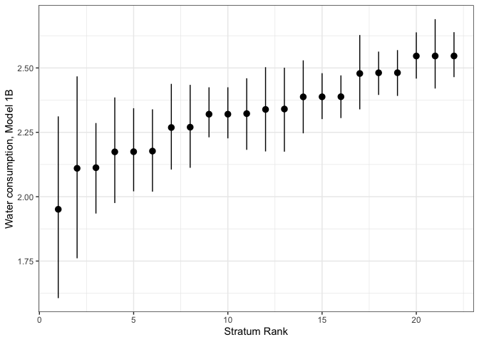

I-MAHDA
================
Ruth CE Bowyer
August 06, 2025

- [**0.Overview**](#0overview)
- [**1.Data**](#1data)
  - [Stratum derivation](#stratum-derivation)
  - [**Estimate linear model 1A**](#estimate-linear-model-1a)
  - [**Estimate Linear model 1B**](#estimate-linear-model-1b)
  - [create a data frame at the strata level (with the means of each
    variable)](#create-a-data-frame-at-the-strata-level-with-the-means-of-each-variable)
  - [**Calculate stratum-level descriptive
    statistics**](#calculate-stratum-level-descriptive-statistics)
  - [**Create a table that includes all model estimates, including the
    Variance**](#create-a-table-that-includes-all-model-estimates-including-the-variance)
- [**Figures**](#figures)
  - [Sample distribution](#sample-distribution)
  - [histogram of the observed stratum
    means](#histogram-of-the-observed-stratum-means)
  - [histogram of the predicted stratum
    means](#histogram-of-the-predicted-stratum-means)
  - [Stratum ranking](#stratum-ranking)
  - [Random effects](#random-effects)

## **0.Overview**

This script has been modified with thanks from that provided as
supplementary material in the following paper:

*Evans, C.R., G. Leckie, S.V. Subramanian, A. Bell, & J. Merlo. (2024.).
A Tutorial for Conducting Intersectional Multilevel Analysis of
Individual Heterogeneity and Discriminatory Accuracy (MAIHDA). SSM -
Population Health <https://doi.org/10.1016/j.ssmph.2024.101664>*

``` r
library(tidyverse)
library(ggeffects)
library(lme4)
library(merTools)
library(labelled)
library(sjPlot)
library(Metrics)
```

## **1.Data**

``` r
watdf <- read.csv(paste0(dd, "I1194/water.consump.filter.with.employ.tds.01.08.2025.csv")) # File derived as output from script 3. This csv file has been filtered in Script 1, and then mapped to employment data in script 3. 

### Add in details on ethnicity, education, IMD
add <-  read.csv(paste0(dd,"TUKsocioeconomics_from_descriptives_2021_eth_edu_imd.csv"))
add$X <- NULL
watdf <- merge(watdf, add, by.x="study_no", by.y="sn",all.x=T)
```

Recode the additional varaibles

``` r
watdf$Ethnic_Origin <- ifelse(is.na(watdf$ethnicity_cat_combined), NA, ifelse(watdf$ethnicity_cat_combined== "White", 1, 2))
watdf$SEX <- ifelse(is.na(watdf$SEX), NA, ifelse(watdf$SEX=="F",1,2))
watdf$Agein2022.gr <- ifelse(is.na(watdf$Agein2022), NA, 
                           ifelse(watdf$Agein2022.gr == "1.Under60", 1, ifelse(watdf$Agein2022.gr == "2.60-71", 2,3)))
watdf$Employ_bin <- ifelse(is.na(watdf$Employ_bin), NA, ifelse(watdf$Employ_bin=="NotRetired",1,2))
watdf$edu_bin_combined <- ifelse(is.na(watdf$edu_bin_combined), NA, ifelse(watdf$edu_bin_combined=="All else",1,2))
```

### Stratum derivation

``` r
# Generate the stratum ID
watdf$stratum <-  10000*watdf$SEX + 1000*watdf$Ethnic_Origin + 100*watdf$Employ_bin + 
                10*watdf$edu_bin_combined + 1*watdf$Agein2022.gr

# Turn the stratum identifier into a factor variable
watdf$stratum <- as.factor(watdf$stratum)

# reattach factor labels from original Stata dataset
watdf <- unlabelled(watdf)

# sort data by stratum
watdf <- watdf[order(watdf$stratum),]

# tabulate stratum
table(watdf$stratum)
```

    ## 
    ## 11111 11112 11113 11121 11122 11123 11211 11212 11213 11221 11222 11223 12111 
    ##   182   124    29   440   150    33    23   207   375    40   197   263     4 
    ## 12112 12113 12121 12122 12213 12221 12222 12223 21111 21112 21113 21121 21122 
    ##     2     1    30     3     3     2     9     1    19     3     1    52    24 
    ## 21123 21211 21212 21213 21221 21222 21223 22121 22223 
    ##     8     3    15    31     2    30    45     2     1

``` r
# Generate a new variabe which records stratum size
watdf <- watdf %>%
  group_by(stratum) %>%
  mutate(strataN = n())
```

Subsetting to strata where n \> 5

``` r
watdfx <- subset(watdf, strataN > 5)
```

Running as a complete case analysis for stratum and water consumption

``` r
watdfx <- subset(watdfx, !is.na(stratum))
watdfx <- subset(watdfx, !is.na(total.consump.L))
```

**The following analysis is therefore run on this many individuals:**

``` r
nrow(watdfx)
```

    ## [1] 2326

### **Estimate linear model 1A**

``` r
# Fit the two-level linear regression with no covariates
model1A <- lmer(total.consump.L ~ (1|stratum), data=watdfx)
summary(model1A)
```

    ## Linear mixed model fit by REML ['lmerMod']
    ## Formula: total.consump.L ~ (1 | stratum)
    ##    Data: watdfx
    ## 
    ## REML criterion at convergence: 7165.6
    ## 
    ## Scaled residuals: 
    ##     Min      1Q  Median      3Q     Max 
    ## -2.2240 -0.6198 -0.0365  0.6087  3.2673 
    ## 
    ## Random effects:
    ##  Groups   Name        Variance Std.Dev.
    ##  stratum  (Intercept) 0.01233  0.111   
    ##  Residual             1.26588  1.125   
    ## Number of obs: 2326, groups:  stratum, 22
    ## 
    ## Fixed effects:
    ##             Estimate Std. Error t value
    ## (Intercept)  2.38837    0.03854   61.97

``` r
# This produces a model output showing the level 2 variance (or, alternatively,
# it's standard deviation) and the same for level 1 (labelled 
# "stratum (Intercept)" and "Residual", respectively)

# predict the mean outcome
watdfx$m1Am <- predict(model1A)
# Calculated as the fixed-portion linear prediction plus contributions based on 
# predicted random effects.
```

### **Estimate Linear model 1B**

``` r
# Fit the two-level linear regression with covariates
model1B <- lmer(total.consump.L ~ SEX + Ethnic_Origin + Employ_bin + edu_bin_combined + Agein2022.gr + (1|stratum), 
                data=watdfx)
```

    ## boundary (singular) fit: see help('isSingular')

``` r
summary(model1B)
```

    ## Linear mixed model fit by REML ['lmerMod']
    ## Formula: 
    ## total.consump.L ~ SEX + Ethnic_Origin + Employ_bin + edu_bin_combined +  
    ##     Agein2022.gr + (1 | stratum)
    ##    Data: watdfx
    ## 
    ## REML criterion at convergence: 7163.4
    ## 
    ## Scaled residuals: 
    ##     Min      1Q  Median      3Q     Max 
    ## -2.2654 -0.6273 -0.0299  0.6122  3.2169 
    ## 
    ## Random effects:
    ##  Groups   Name        Variance Std.Dev.
    ##  stratum  (Intercept) 0.000    0.000   
    ##  Residual             1.264    1.124   
    ## Number of obs: 2326, groups:  stratum, 22
    ## 
    ## Fixed effects:
    ##                   Estimate Std. Error t value
    ## (Intercept)       2.751401   0.236621  11.628
    ## SEX              -0.212289   0.079549  -2.669
    ## Ethnic_Origin    -0.442473   0.183903  -2.406
    ## Employ_bin        0.163565   0.064187   2.548
    ## edu_bin_combined  0.066664   0.048876   1.364
    ## Agein2022.gr     -0.003403   0.039316  -0.087
    ## 
    ## Correlation of Fixed Effects:
    ##             (Intr) SEX    Ethn_O Emply_ ed_bn_
    ## SEX         -0.365                            
    ## Ethnic_Orgn -0.799  0.050                     
    ## Employ_bin  -0.209  0.006 -0.013              
    ## ed_bn_cmbnd -0.277 -0.105 -0.095  0.072       
    ## Agen2022.gr -0.143 -0.034  0.081 -0.667  0.112
    ## optimizer (nloptwrap) convergence code: 0 (OK)
    ## boundary (singular) fit: see help('isSingular')

``` r
# predict the mean outcome and confidence intervals of prediction
m1Bm <- predictInterval(model1B, level=0.95, include.resid.var=FALSE)
```

    ## Warning in chol.default(sigma, pivot = TRUE): the matrix is either
    ## rank-deficient or not positive definite
    ## Warning in chol.default(sigma, pivot = TRUE): the matrix is either
    ## rank-deficient or not positive definite
    ## Warning in chol.default(sigma, pivot = TRUE): the matrix is either
    ## rank-deficient or not positive definite
    ## Warning in chol.default(sigma, pivot = TRUE): the matrix is either
    ## rank-deficient or not positive definite
    ## Warning in chol.default(sigma, pivot = TRUE): the matrix is either
    ## rank-deficient or not positive definite
    ## Warning in chol.default(sigma, pivot = TRUE): the matrix is either
    ## rank-deficient or not positive definite
    ## Warning in chol.default(sigma, pivot = TRUE): the matrix is either
    ## rank-deficient or not positive definite
    ## Warning in chol.default(sigma, pivot = TRUE): the matrix is either
    ## rank-deficient or not positive definite
    ## Warning in chol.default(sigma, pivot = TRUE): the matrix is either
    ## rank-deficient or not positive definite
    ## Warning in chol.default(sigma, pivot = TRUE): the matrix is either
    ## rank-deficient or not positive definite
    ## Warning in chol.default(sigma, pivot = TRUE): the matrix is either
    ## rank-deficient or not positive definite
    ## Warning in chol.default(sigma, pivot = TRUE): the matrix is either
    ## rank-deficient or not positive definite
    ## Warning in chol.default(sigma, pivot = TRUE): the matrix is either
    ## rank-deficient or not positive definite
    ## Warning in chol.default(sigma, pivot = TRUE): the matrix is either
    ## rank-deficient or not positive definite
    ## Warning in chol.default(sigma, pivot = TRUE): the matrix is either
    ## rank-deficient or not positive definite
    ## Warning in chol.default(sigma, pivot = TRUE): the matrix is either
    ## rank-deficient or not positive definite
    ## Warning in chol.default(sigma, pivot = TRUE): the matrix is either
    ## rank-deficient or not positive definite
    ## Warning in chol.default(sigma, pivot = TRUE): the matrix is either
    ## rank-deficient or not positive definite
    ## Warning in chol.default(sigma, pivot = TRUE): the matrix is either
    ## rank-deficient or not positive definite
    ## Warning in chol.default(sigma, pivot = TRUE): the matrix is either
    ## rank-deficient or not positive definite
    ## Warning in chol.default(sigma, pivot = TRUE): the matrix is either
    ## rank-deficient or not positive definite
    ## Warning in chol.default(sigma, pivot = TRUE): the matrix is either
    ## rank-deficient or not positive definite

    ## Warning: executing %dopar% sequentially: no parallel backend registered

``` r
# note that, unlike the stata code, this code combines the fixed and random part
# uncertainty. This saves a step later in comparison to the stata code. It also
# creates a new dataframe for these predictions, with one row per stratum.

# Create an identifier variable in the new dataframe, called "id"
m1Bm <- mutate(m1Bm, id=row_number())

# predict the stratum random effects and associated SEs
m1Bu <- REsim(model1B)
```

### create a data frame at the strata level (with the means of each variable)

``` r
# first, merge predictions with original data

# create an id variable for merging in the watdf dataframe
watdfx$id <- seq.int(nrow(watdfx))

# create a new dataframe, watdf2, that merges watdf and m1Bm
watdf2 <- merge(watdfx, m1Bm, by="id")

# rename the variables from m1Bm
watdf2 <- watdf2 %>%
  rename(
    m1Bmfit=fit,
    m1Bmupr= upr,
    m1Bmlwr=lwr
  )


# Collapse the data down to a stratum-level dataset 
stratum_level <- aggregate(x=watdf2[c("total.consump.L")], 
                  by=watdf2[c("SEX", "Ethnic_Origin", "Employ_bin", "edu_bin_combined", "Agein2022.gr",
                  "stratum", "strataN", "m1Am", "m1Bmfit", "m1Bmupr", "m1Bmlwr")],
                  FUN=mean)
```

### **Calculate stratum-level descriptive statistics**

As in table 2 in Evans et al.,

``` r
# generate binary indicators for whether each stratum has more than X individuals
summary(stratum_level$strataN)
```

    ##    Min. 1st Qu.  Median    Mean 3rd Qu.    Max. 
    ##    8.00   25.25   36.50  105.73  174.00  440.00

``` r
stratum_level$n100plus <- ifelse(stratum_level$strataN>=100, 1,0)
stratum_level$n50plus <- ifelse(stratum_level$strataN>=50, 1,0)
stratum_level$n30plus <- ifelse(stratum_level$strataN>=30, 1,0)
stratum_level$n20plus <- ifelse(stratum_level$strataN>=20, 1,0)
stratum_level$n10plus <- ifelse(stratum_level$strataN>=10, 1,0)
stratum_level$nlessthan10 <- ifelse(stratum_level$strataN<10, 1,0)

# tabulate the binary indicators
table(stratum_level$n100plus)
```

    ## 
    ##  0  1 
    ## 14  8

``` r
table(stratum_level$n50plus)
```

    ## 
    ##  0  1 
    ## 13  9

``` r
table(stratum_level$n30plus)
```

    ## 
    ##  0  1 
    ##  7 15

``` r
table(stratum_level$n20plus)
```

    ## 
    ##  0  1 
    ##  4 18

``` r
table(stratum_level$n10plus)
```

    ## 
    ##  0  1 
    ##  2 20

``` r
table(stratum_level$nlessthan10)
```

    ## 
    ##  0  1 
    ## 20  2

``` r
# summmarise the observed stratum means
summary(stratum_level$total.consump.L)
```

    ##    Min. 1st Qu.  Median    Mean 3rd Qu.    Max. 
    ##   1.668   2.275   2.373   2.358   2.499   3.040

``` r
sd(stratum_level$total.consump.L)
```

    ## [1] 0.267757

``` r
#Note: mean of the observed stratum means = "grand mean"
```

``` r
# summarise the predicted stratum means
summary(stratum_level$m1Am)
```

    ##    Min. 1st Qu.  Median    Mean 3rd Qu.    Max. 
    ##   2.225   2.363   2.385   2.388   2.436   2.515

``` r
sd(stratum_level$m1Am)
```

    ## [1] 0.06751922

``` r
#Note: mean of the predicted stratum means = "precision weighted grand mean"
```

### **Create a table that includes all model estimates, including the Variance**

As in **Table 3** of Evans et al

``` r
# Create a table that includes all model estimates, including the Variance 
# Partitioning Coefficients (VPC)
tab_model(model1A, model1B, p.style="stars")
```

<table style="border-collapse:collapse; border:none;">

<tr>

<th style="border-top: double; text-align:center; font-style:normal; font-weight:bold; padding:0.2cm;  text-align:left; ">

 
</th>

<th colspan="2" style="border-top: double; text-align:center; font-style:normal; font-weight:bold; padding:0.2cm; ">

total consump L
</th>

<th colspan="2" style="border-top: double; text-align:center; font-style:normal; font-weight:bold; padding:0.2cm; ">

total consump L
</th>

</tr>

<tr>

<td style=" text-align:center; border-bottom:1px solid; font-style:italic; font-weight:normal;  text-align:left; ">

Predictors
</td>

<td style=" text-align:center; border-bottom:1px solid; font-style:italic; font-weight:normal;  ">

Estimates
</td>

<td style=" text-align:center; border-bottom:1px solid; font-style:italic; font-weight:normal;  ">

CI
</td>

<td style=" text-align:center; border-bottom:1px solid; font-style:italic; font-weight:normal;  ">

Estimates
</td>

<td style=" text-align:center; border-bottom:1px solid; font-style:italic; font-weight:normal;  ">

CI
</td>

</tr>

<tr>

<td style=" padding:0.2cm; text-align:left; vertical-align:top; text-align:left; ">

(Intercept)
</td>

<td style=" padding:0.2cm; text-align:left; vertical-align:top; text-align:center;  ">

2.39 <sup>\*\*\*</sup>
</td>

<td style=" padding:0.2cm; text-align:left; vertical-align:top; text-align:center;  ">

2.31 – 2.46
</td>

<td style=" padding:0.2cm; text-align:left; vertical-align:top; text-align:center;  ">

2.75 <sup>\*\*\*</sup>
</td>

<td style=" padding:0.2cm; text-align:left; vertical-align:top; text-align:center;  ">

2.29 – 3.22
</td>

</tr>

<tr>

<td style=" padding:0.2cm; text-align:left; vertical-align:top; text-align:left; ">

SEX
</td>

<td style=" padding:0.2cm; text-align:left; vertical-align:top; text-align:center;  ">

</td>

<td style=" padding:0.2cm; text-align:left; vertical-align:top; text-align:center;  ">

</td>

<td style=" padding:0.2cm; text-align:left; vertical-align:top; text-align:center;  ">

-0.21 <sup>\*\*</sup>
</td>

<td style=" padding:0.2cm; text-align:left; vertical-align:top; text-align:center;  ">

-0.37 – -0.06
</td>

</tr>

<tr>

<td style=" padding:0.2cm; text-align:left; vertical-align:top; text-align:left; ">

Ethnic Origin
</td>

<td style=" padding:0.2cm; text-align:left; vertical-align:top; text-align:center;  ">

</td>

<td style=" padding:0.2cm; text-align:left; vertical-align:top; text-align:center;  ">

</td>

<td style=" padding:0.2cm; text-align:left; vertical-align:top; text-align:center;  ">

-0.44 <sup>\*</sup>
</td>

<td style=" padding:0.2cm; text-align:left; vertical-align:top; text-align:center;  ">

-0.80 – -0.08
</td>

</tr>

<tr>

<td style=" padding:0.2cm; text-align:left; vertical-align:top; text-align:left; ">

Employ bin
</td>

<td style=" padding:0.2cm; text-align:left; vertical-align:top; text-align:center;  ">

</td>

<td style=" padding:0.2cm; text-align:left; vertical-align:top; text-align:center;  ">

</td>

<td style=" padding:0.2cm; text-align:left; vertical-align:top; text-align:center;  ">

0.16 <sup>\*</sup>
</td>

<td style=" padding:0.2cm; text-align:left; vertical-align:top; text-align:center;  ">

0.04 – 0.29
</td>

</tr>

<tr>

<td style=" padding:0.2cm; text-align:left; vertical-align:top; text-align:left; ">

edu bin combined
</td>

<td style=" padding:0.2cm; text-align:left; vertical-align:top; text-align:center;  ">

</td>

<td style=" padding:0.2cm; text-align:left; vertical-align:top; text-align:center;  ">

</td>

<td style=" padding:0.2cm; text-align:left; vertical-align:top; text-align:center;  ">

0.07 <sup></sup>
</td>

<td style=" padding:0.2cm; text-align:left; vertical-align:top; text-align:center;  ">

-0.03 – 0.16
</td>

</tr>

<tr>

<td style=" padding:0.2cm; text-align:left; vertical-align:top; text-align:left; ">

Agein2022 gr
</td>

<td style=" padding:0.2cm; text-align:left; vertical-align:top; text-align:center;  ">

</td>

<td style=" padding:0.2cm; text-align:left; vertical-align:top; text-align:center;  ">

</td>

<td style=" padding:0.2cm; text-align:left; vertical-align:top; text-align:center;  ">

-0.00 <sup></sup>
</td>

<td style=" padding:0.2cm; text-align:left; vertical-align:top; text-align:center;  ">

-0.08 – 0.07
</td>

</tr>

<tr>

<td colspan="5" style="font-weight:bold; text-align:left; padding-top:.8em;">

Random Effects
</td>

</tr>

<tr>

<td style=" padding:0.2cm; text-align:left; vertical-align:top; text-align:left; padding-top:0.1cm; padding-bottom:0.1cm;">

σ<sup>2</sup>
</td>

<td style=" padding:0.2cm; text-align:left; vertical-align:top; padding-top:0.1cm; padding-bottom:0.1cm; text-align:left;" colspan="2">

1.27
</td>

<td style=" padding:0.2cm; text-align:left; vertical-align:top; padding-top:0.1cm; padding-bottom:0.1cm; text-align:left;" colspan="2">

1.26
</td>

</tr>

<tr>

<td style=" padding:0.2cm; text-align:left; vertical-align:top; text-align:left; padding-top:0.1cm; padding-bottom:0.1cm;">

τ<sub>00</sub>
</td>

<td style=" padding:0.2cm; text-align:left; vertical-align:top; padding-top:0.1cm; padding-bottom:0.1cm; text-align:left;" colspan="2">

0.01 <sub>stratum</sub>
</td>

<td style=" padding:0.2cm; text-align:left; vertical-align:top; padding-top:0.1cm; padding-bottom:0.1cm; text-align:left;" colspan="2">

0.00 <sub>stratum</sub>
</td>

<tr>

<td style=" padding:0.2cm; text-align:left; vertical-align:top; text-align:left; padding-top:0.1cm; padding-bottom:0.1cm;">

ICC
</td>

<td style=" padding:0.2cm; text-align:left; vertical-align:top; padding-top:0.1cm; padding-bottom:0.1cm; text-align:left;" colspan="2">

0.01
</td>

<td style=" padding:0.2cm; text-align:left; vertical-align:top; padding-top:0.1cm; padding-bottom:0.1cm; text-align:left;" colspan="2">

 
</td>

<tr>

<td style=" padding:0.2cm; text-align:left; vertical-align:top; text-align:left; padding-top:0.1cm; padding-bottom:0.1cm;">

N
</td>

<td style=" padding:0.2cm; text-align:left; vertical-align:top; padding-top:0.1cm; padding-bottom:0.1cm; text-align:left;" colspan="2">

22 <sub>stratum</sub>
</td>

<td style=" padding:0.2cm; text-align:left; vertical-align:top; padding-top:0.1cm; padding-bottom:0.1cm; text-align:left;" colspan="2">

22 <sub>stratum</sub>
</td>

<tr>

<td style=" padding:0.2cm; text-align:left; vertical-align:top; text-align:left; padding-top:0.1cm; padding-bottom:0.1cm; border-top:1px solid;">

Observations
</td>

<td style=" padding:0.2cm; text-align:left; vertical-align:top; padding-top:0.1cm; padding-bottom:0.1cm; text-align:left; border-top:1px solid;" colspan="2">

2326
</td>

<td style=" padding:0.2cm; text-align:left; vertical-align:top; padding-top:0.1cm; padding-bottom:0.1cm; text-align:left; border-top:1px solid;" colspan="2">

2326
</td>

</tr>

<tr>

<td style=" padding:0.2cm; text-align:left; vertical-align:top; text-align:left; padding-top:0.1cm; padding-bottom:0.1cm;">

Marginal R<sup>2</sup> / Conditional R<sup>2</sup>
</td>

<td style=" padding:0.2cm; text-align:left; vertical-align:top; padding-top:0.1cm; padding-bottom:0.1cm; text-align:left;" colspan="2">

0.000 / 0.010
</td>

<td style=" padding:0.2cm; text-align:left; vertical-align:top; padding-top:0.1cm; padding-bottom:0.1cm; text-align:left;" colspan="2">

0.010 / NA
</td>

</tr>

<tr>

<td colspan="5" style="font-style:italic; border-top:double black; text-align:right;">

- p\<0.05   \*\* p\<0.01   \*\*\* p\<0.001
  </td>

  </tr>

</table>

Calculate the Proportional Change in Variance (PCV) (as a percentage)
for model 1

``` r
# first extract variance matrices from the model object
vc1a <-as.data.frame(VarCorr(model1A))
vc1b <-as.data.frame(VarCorr(model1B))

# calculate PCVs using components of these variance matrices (as percentages)
PCV1 <- ((vc1a[1,4] - vc1b[1,4]) / vc1a[1,4])*100
PCV1
```

    ## [1] 100

## **Figures**

### Sample distribution

``` r
# panel A - histogram of the individual outcome
mean = round(mean(watdfx$total.consump.L),2)
#min = min(stratum_level$total.consump.L)
#max = max(stratum_level$total.consump.L)

ggplot(watdf, aes(x=total.consump.L)) + 
  geom_histogram(aes(y = after_stat(count / sum(count))), binwidth=0.2) + 
  scale_y_continuous(labels=scales::percent) +
  ylab("Percent of Individuals") + xlab("water cosumption L/day") +
  geom_vline(aes(xintercept=mean)) + #this is the sample mean
  annotate("text", x=mean, y=0.1, label= paste0("Sample Mean=", mean, " L/day"))
```

<!-- -->

### histogram of the observed stratum means

``` r
# Panel B - histogram of the observed stratum means
mean = round(mean(stratum_level$total.consump.L),2)

ggplot(stratum_level, aes(x=total.consump.L)) + 
  geom_histogram(aes(y = after_stat(count / sum(count))), binwidth=0.2) + 
  scale_y_continuous(labels=scales::percent) +
  ylab("Percent of Strata")  +
  geom_vline(aes(xintercept=mean)) + #this is the sample mean
  annotate("text", x=mean, y=0.5, label= paste0("Grand Mean=", mean, " L/day")) 
```

<!-- -->

### histogram of the predicted stratum means

``` r
mean = round(mean(stratum_level$m1Am),2)

ggplot(stratum_level, aes(x=m1Am)) + 
  geom_histogram(aes(y = after_stat(count / sum(count))), binwidth=0.2) + 
  scale_y_continuous(labels=scales::percent) +
  ylab("Percent of Strata") +
  xlab("Predicted total.consump.L") +
 geom_vline(aes(xintercept=mean))+ #this is the precision weighted grand mean
     annotate("text", x=mean, y=0.9, 
        label=paste0("Precision Weighted Grand Mean=",mean," L/day"))
```

<!-- -->

``` r
#  annotate("text", x=34, y=0.03, label="Min =
#           34.2 mmol/mol") +
#  annotate("text", x=48.2, y=0.03, label="Max =
 #          48.1 mmol/mol")
```

``` r
# Rank the predicted stratum means
stratum_level <- stratum_level %>%
  mutate(rank=rank(m1Bmfit))
```

### Stratum ranking

``` r
# Panel A - Plot the caterpillar plot of the predicted stratum means
# use predictions and uncertainty generated previously
ggplot(stratum_level, aes(y=m1Bmfit, x=rank)) +
  geom_point() +
  geom_pointrange(aes(ymin=m1Bmlwr, ymax=m1Bmupr)) +
  ylab("Water consumption, Model 1B") +
  xlab("Stratum Rank") + 
  theme_bw()
```

<!-- -->

``` r
# Generate list of 6 highest and 6 lowest predicted stratum means (for Table 4)
stratum_level <- stratum_level[order(stratum_level$rank),]

#Relabel to have each level as text label
x <- stratum_level$Ethnic_Origin
stratum_level$Ethnic_Origin <- ifelse(x==1, "White", "RacialisedInUK")

x <- stratum_level$SEX
stratum_level$SEX <- ifelse(x==1, "Female", "Male")

x <- stratum_level$Agein2022.gr 
stratum_level$Agein2022.gr <- ifelse(x == 1, "1.Under60", 
                                     ifelse(x == 2 ,"2.60-71", "71+"))

x <- stratum_level$Employ_bin
stratum_level$Employ_bin <- ifelse(x == 1, "Employed", "Retired_NotEmployed")

x <- stratum_level$edu_bin_combined
stratum_level$edu_bin_combined <- ifelse(x==1, "All else", "Degree_or_equiv")


head(stratum_level)
```

    ##      SEX  Ethnic_Origin          Employ_bin edu_bin_combined Agein2022.gr
    ## 1 Female RacialisedInUK            Employed  Degree_or_equiv    1.Under60
    ## 2 Female RacialisedInUK Retired_NotEmployed  Degree_or_equiv      2.60-71
    ## 3   Male          White            Employed         All else    1.Under60
    ## 4   Male          White            Employed  Degree_or_equiv          71+
    ## 6   Male          White            Employed  Degree_or_equiv      2.60-71
    ## 5   Male          White            Employed  Degree_or_equiv    1.Under60
    ##   stratum strataN     m1Am  m1Bmfit  m1Bmupr  m1Bmlwr total.consump.L n100plus
    ## 1   12121      30 2.225499 1.951067 2.311882 1.606029        1.667917        0
    ## 2   12222       9 2.440890 2.110226 2.467239 1.760767        3.040278        0
    ## 3   21111      19 2.364917 2.112585 2.286014 1.934602        2.238158        0
    ## 4   21123       8 2.387401 2.174148 2.385470 1.975431        2.375000        0
    ## 6   21122      24 2.301585 2.174711 2.343524 2.020907        1.930208        0
    ## 5   21121      52 2.382420 2.177075 2.339311 2.019663        2.370673        0
    ##   n50plus n30plus n20plus n10plus nlessthan10 rank
    ## 1       0       1       1       1           0    1
    ## 2       0       0       0       0           1    2
    ## 3       0       0       0       1           0    3
    ## 4       0       0       0       0           1    4
    ## 6       0       0       1       1           0    5
    ## 5       1       1       1       1           0    6

``` r
tail(stratum_level)
```

    ##       SEX Ethnic_Origin          Employ_bin edu_bin_combined Agein2022.gr
    ## 17 Female         White Retired_NotEmployed         All else    1.Under60
    ## 19 Female         White Retired_NotEmployed         All else          71+
    ## 18 Female         White Retired_NotEmployed         All else      2.60-71
    ## 21 Female         White Retired_NotEmployed  Degree_or_equiv          71+
    ## 20 Female         White Retired_NotEmployed  Degree_or_equiv    1.Under60
    ## 22 Female         White Retired_NotEmployed  Degree_or_equiv      2.60-71
    ##    stratum strataN     m1Am  m1Bmfit  m1Bmupr  m1Bmlwr total.consump.L n100plus
    ## 17   11211      23 2.418139 2.478431 2.627836 2.339130        2.551087        0
    ## 19   11213     375 2.444128 2.481197 2.563498 2.395155        2.459400        1
    ## 18   11212     207 2.458984 2.481446 2.569262 2.391432        2.494022        1
    ## 21   11223     263 2.502248 2.546378 2.638249 2.458633        2.546721        1
    ## 20   11221      40 2.420883 2.546516 2.689491 2.420056        2.504375        0
    ## 22   11222     197 2.514880 2.546536 2.638956 2.464344        2.580838        1
    ##    n50plus n30plus n20plus n10plus nlessthan10 rank
    ## 17       0       0       1       1           0   17
    ## 19       1       1       1       1           0   18
    ## 18       1       1       1       1           0   19
    ## 21       1       1       1       1           0   20
    ## 20       0       1       1       1           0   21
    ## 22       1       1       1       1           0   22

Write for results

### Random effects

This does not fit well for our data

``` r
# repeating step from above - generate u0j values and uncertainty
m1Bu <- REsim(model1B)

# Plot the caterpillar plot of the predicted stratum random effects
p <-plotREsim(m1Bu) +
  xlab("Stratum Rank") +
  ylab("Predicted stratum Random Effect in total.consump.L") +
  ggtitle("") +
  theme(
    strip.background=element_blank(),
    strip.text.x = element_blank()
  )
p
```

<!-- -->

``` r
# Here we use the data embedded in the ggplot p object above, since it has 
# already created what we need to subset the data.

m1Bucut <- p[["data"]]

# filter the data based on significance
m1Bucut <- m1Bucut %>%
  filter(sig=="TRUE") %>%
  mutate(xvar=as.factor(xvar))

# plot the caterpillar plot of the significant predicted stratum random effects
ggplot(m1Bucut, aes(x=xvar, y=median, label=groupID)) +
  geom_point(size=3) +
  geom_pointrange(aes(ymin=ymin, ymax=ymax)) + 
  geom_hline(yintercept=0, color="red", linewidth=1) +
  geom_text(hjust=0, vjust=5) +
  xlab("Stratum Rank") +
  ylab("Predicted stratum Random Effect in total.consump.L (mmol/mol)") +
  theme_bw()
```

<!-- -->
